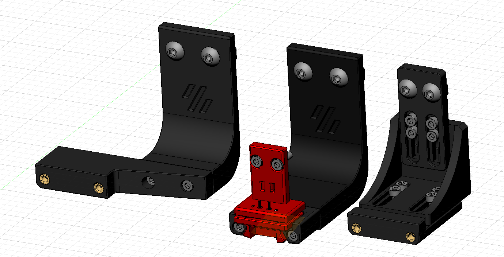
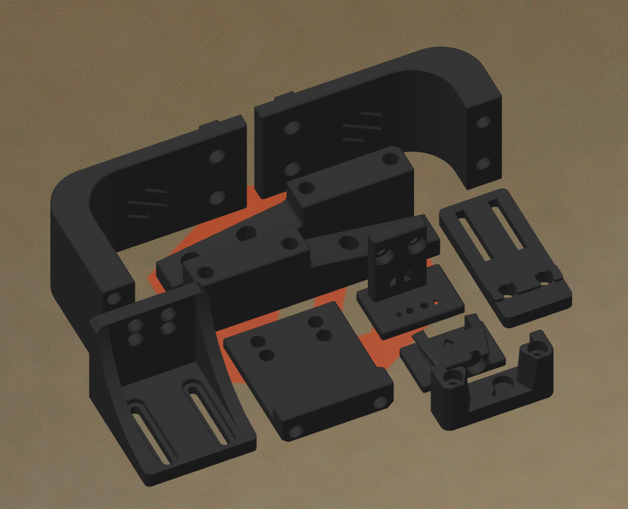
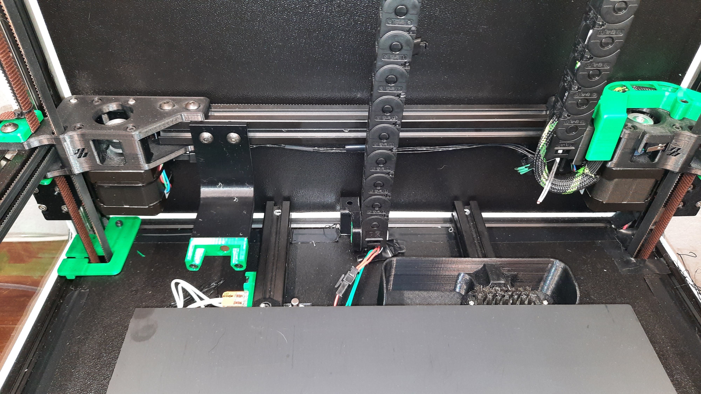

# Klicky Probe
Microswitch probe with magnetic attachment, primarily aimed at CoreXY 3d printers.

Initially it was focused on the [Voron printers](https://vorondesign.com/) (V2.4, V1.8, Trident, V0) and derivatives, now it's been restructured to better allow other printers to be documented [on the main repository](https://github.com/jlas1/Klicky-Probe)

The objectives for this project are:

- drop in replacement for Omron TL-Q5MC2 or PL-08N2 (you don't need to replace the toolhead), replacement of BLtouch probes
- soldering not required
- minimal adjustments required
- be able to detect all the print surfaces
- be as close to the hotend tip as possible
- highly repeatable and accurate probes
- less temperature variations
- no melting of its parts
- cheap to build
- reuse spare parts if possible

Most of the Klicky probe users are using klipper, there are some macros in here that ease the probing process, by automating the attach, dock and use of the probe.

Some work has been developed to have the same functionality on RRF.

It can also be used with the [automatic Z calibration](https://github.com/protoloft/klipper_z_calibration) klipper plugin to effectively calculate the Z offset from the probe and from the Z endstop if your printers supports a Z endstop triggered by the nozzle (like most Voron's do)

The inspiration for the Klicky Probe comes from the [Quickdraw](https://github.com/Annex-Engineering/Quickdraw_Probe) and the [Euclid probe](https://github.com/nionio6915/Euclid_Probe), it uses some concepts from each of the projects.

Updated instructions provided by StefanRaatz.
oc_geek and TurBoxxs were also a great help in refining and testing the CAD files.
Garrettwp provided the initial revised macro files.
User richardjm revised the macro variables and added some functions.
Mental created the initial macro and one of the first magnetically attached microswitch probes.

Without them, and some others this effort would not be in the current state, many thanks to them all.

If you want to donate something regarding this project, use this [link](https://paypal.me/Josar154) or [__Buy me some ABS!__](https://www.buymeacoffee.com/JosAr), thank

klicky early version.

# Upgrading from an earlier version

If you are upgrading from an earlier version, check the [klipper macros](https://github.com/jlas1/Klicky-Probe/tree/main/Klipper_macros) folder, it contains update instructions.

# Klicky components

All the compatible printers require:

* Toolhead mount (the thing that the probe attached to when it's being used)
* Klicky probe (there are three versions, all are interchangeable and compatible, more information on the specific printer page), what actually is used to probe the bed
* Probe dock (all the printers use the same)
* Probe dock mount (what attaches to the printer to dock the probe when not in use)

The CAD with all the files is located [Here](./CAD)

Common Klicky STL's (parts that are common to all the printers)  are located [here](./Base_STL).
Printer specific STL are in each printer directory.

The klipper macros are [here](https://github.com/jlas1/Klicky-Probe/tree/main/Klipper_macros), the RRF [here](https://github.com/jlas1/Klicky-Probe/tree/main/RRF_macros).

## Probe accuracy

The probe accuracy output is better than a range of 0.025mm (difference between highest and lowest), and a standard deviation of 0.01mm.

## Print Settings

There are no need for supports, recommended settings are 4 perimeters/top/bottom, at least 23% infill, the STL's are already oriented, you only need to send them to the slicer.

Each printer family/version has it's own mounting options, Bill of Materials, assembly instructions and dock/attach setup.

# General Bill of Materials (BOM)

Tools:

- 1.5mm Drill (optional)
- Multimeter to check for Continuity 
- Super Glue
- Soldering Iron for the heat inserts

Probe BOM:

- 1x microswitch (the omron D2F-5 or D2F-5L (removing the lever) is recommended), D2F-1 and similar sizes microswitch also work
- 2x M2x10 mm self tapping
- some 6 mm x 3 mm magnets (it ranges from 8 to 10)
- some m5 screws
- some m3 screws
- some m3 heat inserts
- some m3 nuts

# Printers Supported (by support order) 

## Directly on this repository

[Voron v2.4](./Printers/v1.8_v2.4_Legacy_Trident)

[Voron v1.8](./Printers/v1.8_v2.4_Legacy_Trident)

[Voron Legacy](./Printers/v1.8_v2.4_Legacy_Trident)

[Voron Trident](./Printers/v1.8_v2.4_Legacy_Trident)

[Voron v0](./Printers/v0)

## Printers supported on other locations

There are several micro sized Voron variants, most also support klicky, you can find more information on the site https://3dprintersforants.com/

# Assembled Klicky Probe on a Voron v2.4

# 

# Dock and undock video

https://user-images.githubusercontent.com/16675722/122302371-eb9c4e00-cef9-11eb-91d3-3aded131bae0.mp4

It is working very well, if you decide to use it, give me feedback, either here, or on Voron discord, my discord user is JosAr#0517.

By standing on the shoulders of giants, lets see if we can see further.
