# Klicky-Probe
Microswitch probe with magnetic attachement, primarily aimed at CoreXY 3d printers with a focus on the Voron printers, should work on other printers with the variable mount.

The objectives for this project are:
- drop in replacement for Omron TL-Q5MC2 or PL-08N2 (you don't need to replace the toolhead)
- easier and faster to build that similiar probe types
  - does not require soldering
  - fixed probe dock mount (for the printers that are suported), less variables to adjust
- be able to detect all the print surfaces
- be as close to the hotend tip as possible
- high repetitive and accurate probes
- less temperature variations
- no melting of its parts
- cheap to built

It can also be used with the new  klipper plugin to efectively calculate the Z offset from the probe and from the Z endstop.

The inspiration for the Klicky Probe comes from the  and the , it uses some concepts from each of the projects.

There are no need for supports, recommended settings are 4 perimeters/top/bottom, 13% infill.

The probe dock is mounted on the gantry, allowing it to be use as a Z endstop if desired (i use it that way).

There are three gantry extrusion mounts possible:
- one fixed to be used on the Voron V2.4 or V1.8 AB with MGN12 or MGN9

- one that has some variance for other toolheads
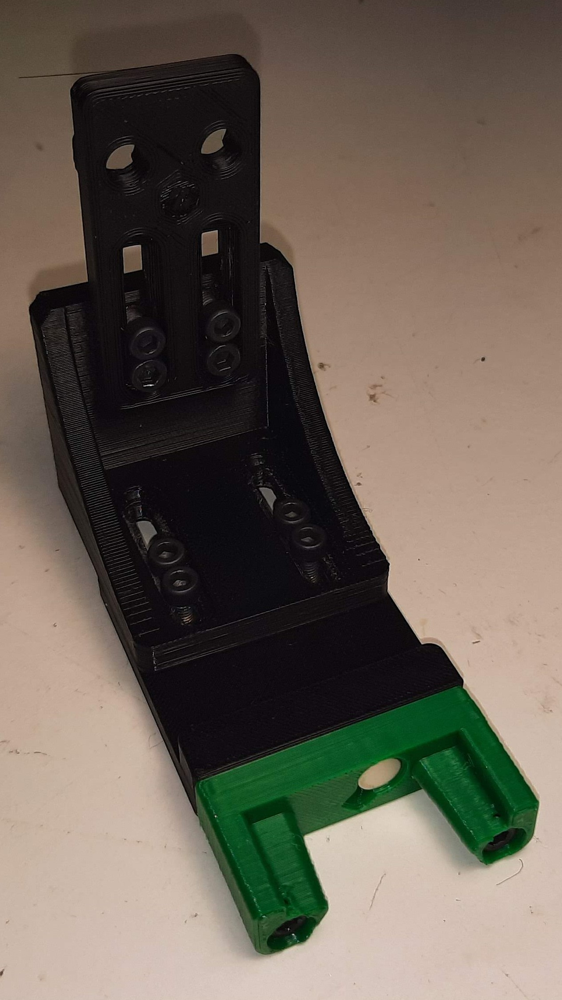
- one fixed sidemount dock to allow a purge/scrub bucket on the left side of the bed
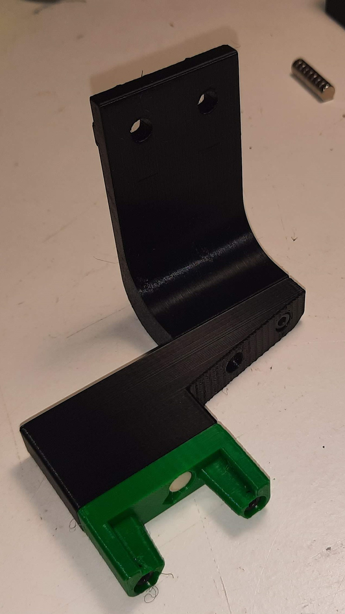

The fixed gantry extrusion mounts have been confirmed to work on the Voron V2.4 and V1.8

The normal magnet installation is that the two magnets that attach to the microswitch are installed with the same polarity, the 3rd magnet should have the inverse polarity.
There is however the possibility that the magnets will demagnetize over time due to the alternating magnetic fields thay may result in a slow but sure demagnetization of the magnets, the magnets are so strong that may take a long time to show the effects of demagnetization YMMV.

It is not necessary any soldering the probe microswitch connectors are also press-fit on the magnets.

  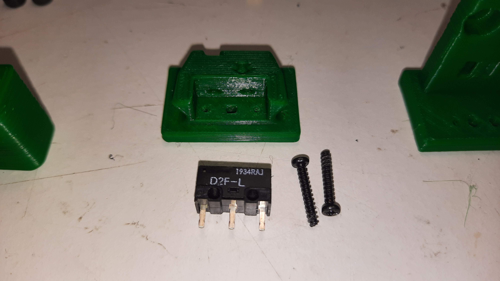
  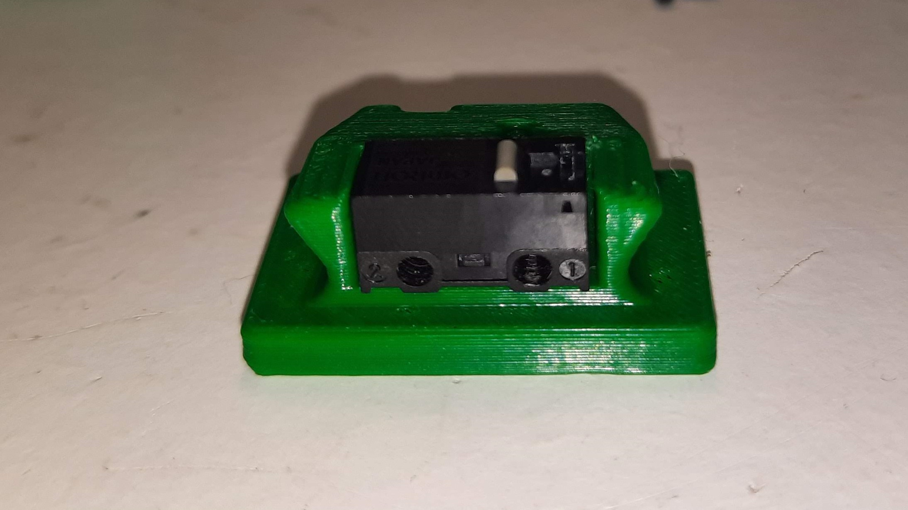
  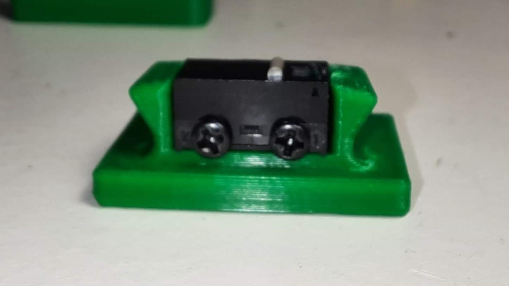
  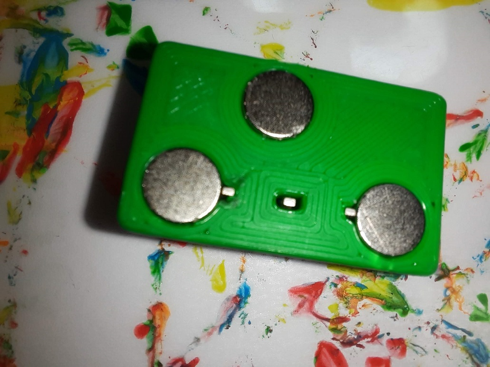
  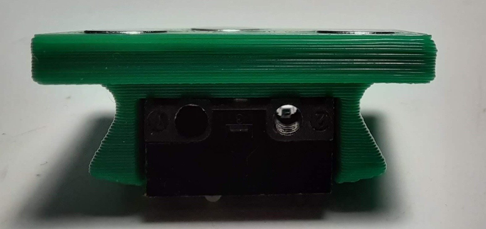

The AB mount wires are also connected with pressure from the magnets, you can use the probe magnets as a template to insert the AB mount magnets, it is easier that way to don't insert the magnets the wrong way.

  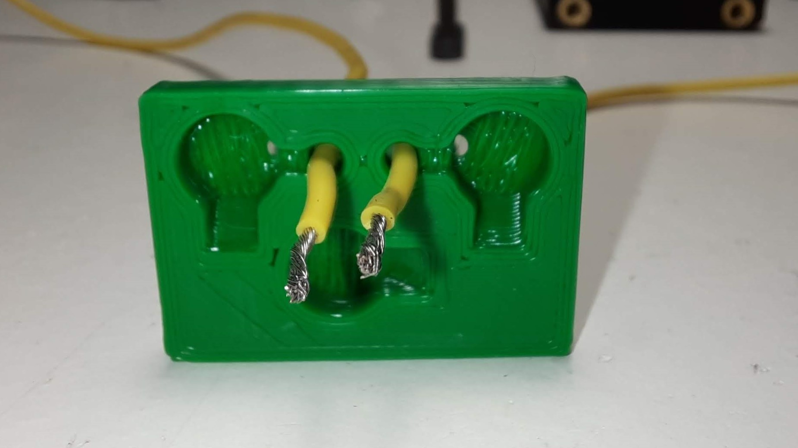
  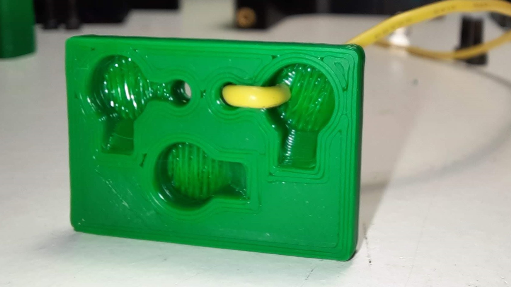
  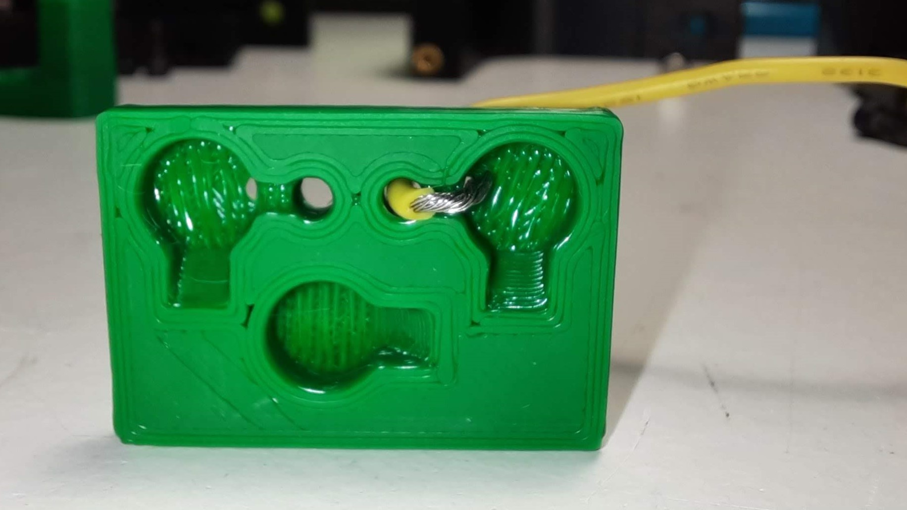
  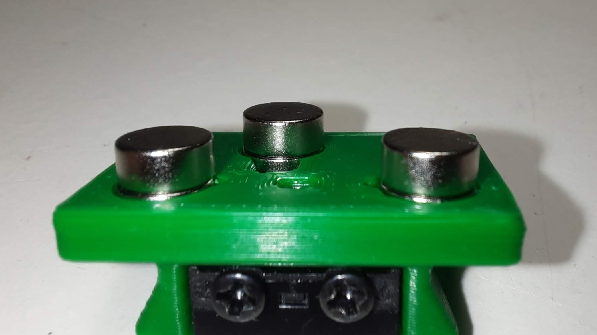
  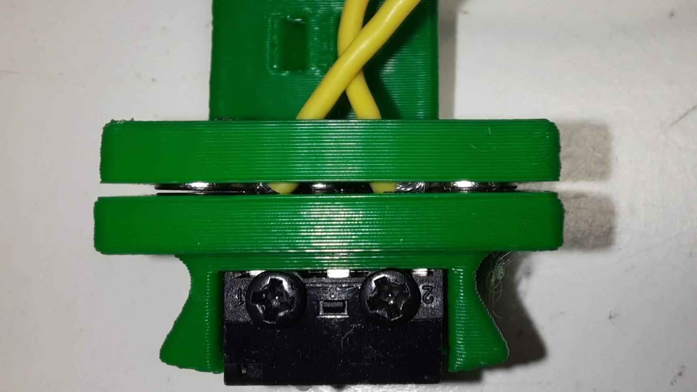 

You will not lose Y travel on any configuration in the tests that were done.

It is also recommended to glue the magnets in place, superglue is good.

You will need to add macros to klipper to be able to dock and undock the probe as necessary to do the Endstop (if necessary) and Quad Gantry Level, it is in the Klipper Macro directory.

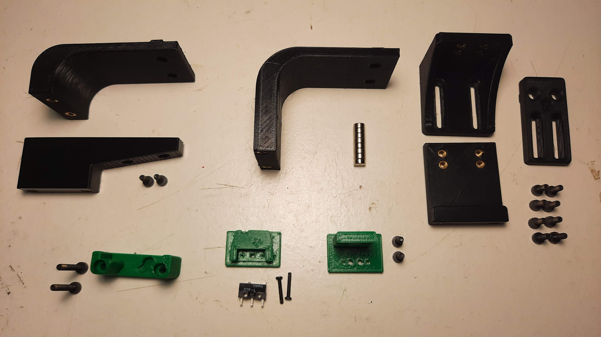

Probe BOM:
- 1x microswitch (the omron D2F-5 or D2F-5L (removing the lever) is recommended)
- 2x M2x10 self tapping
- 4x 6x3 magnets

AB mount BOM:
- 3x 6x3 magnets

Probe Dock:
- 1x 6x3 magnets
- 2x M3x20

Fixed Dock mount:
- 2x M3 threaded insert M3x5x4
- 2x M5x10
- 2x M5 t-nut or equivalent

or 

variable Dock mount:
- 10x M3 threaded insert M3x5x4
- 8x M3x8
- 2x M5x10
- 2x M5 t-nut or equivalent

I will add more detail to this repository as we go along.

The macro is based on a version provided by the user garrettwp on Discord, many thanks to him.
I have tweaked it a lot.
It is also originally  based on the great Annex magnet dockable probe macros "#Originally developed by Mental, modified for better use on K-series printers by RyanG and Trails" and can be found 

Would also like to thank the Voron discord community and VoronDesign for all the work that was and still is being made to maintain the Voron ecosystem.

The probe accuracy output is something like this:
probe accuracy results: maximum 6.430000, minimum 6.426250, range 0.003750, average 6.428750, median 6.428750, standard deviation 0.000791

There is now a arrow on the probe telling you where should the switch pole be to have the correct offset.
The probe offsets are:
- z_offset = 6.42
- x_offset: 0
- y_offset: 19.75

Assembled Klicky Probe

Dock and undock video

https://user-images.githubusercontent.com/16675722/122302371-eb9c4e00-cef9-11eb-91d3-3aded131bae0.mp4

It is working very well, if you decide to use it, give me feedback, either here, or on discord, my discord user is JosAr#0517.

By standing on the shoulders of giants, lets see if we can see further.
