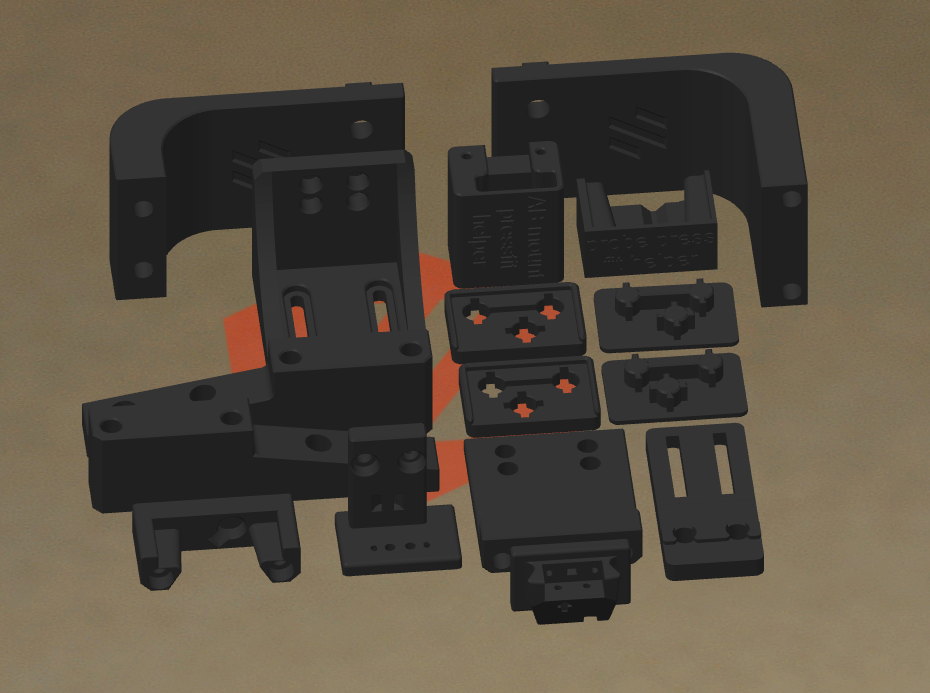
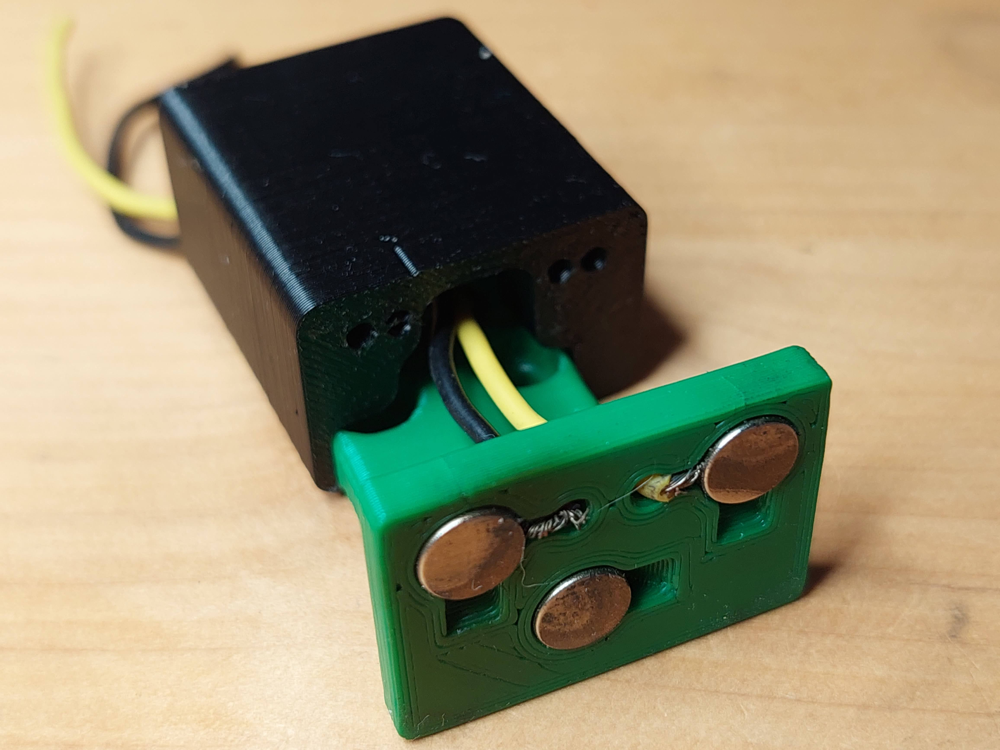

# Klicky Probe
Microswitch probe with magnetic attachment, primarily aimed at CoreXY 3d printers with a focus on the Voron printers, should work on other printers with the variable mount.

The objectives for this project are:
- drop in replacement for Omron TL-Q5MC2 or PL-08N2 (you don't need to replace the toolhead)
- easier and faster to build than similar probe types
  - does not require soldering
  - fixed probe dock mount (for the printers that are suported), less variables to adjust
- be able to detect all the print surfaces
- be as close to the hotend tip as possible
- highly repeatable and accurate probes
- less temperature variations
- no melting of its parts
- cheap to build

It can also be used with the new [automatic Z calibration](https://github.com/protoloft/klipper_z_calibration) klipper plugin to effectively calculate the Z offset from the probe and from the Z endstop.

The inspiration for the Klicky Probe comes from the [Quickdraw](https://github.com/Annex-Engineering/Quickdraw_Probe) and the [Euclid probe](https://github.com/nionio6915/Euclid_Probe), it uses some concepts from each of the projects.

Updated instructions provided by StefanRaatz.
oc_geek and TurBoxxs were also a great help in refining and testing the CAD files.
Garrettwp provided the initial revised macro files.
Mental created the initial macro and one of the first magnetically attached microswitch probes.

Without them, and some others this effort would not be in the current state, many thanks to them all.

If you want to donate something regarding this project, use this [link](https://paypal.me/Josar154), thanks


# Probe Accuracy

The probe accuracy output is something like this:
probe accuracy results: maximum 6.430000, minimum 6.426250, range 0.003750, average 6.428750, median 6.428750, standard deviation 0.000791


# Print Settings

There is no need for supports, recommended settings are 4 perimeters/top/bottom, 13% infill, the STL's are already oriented



# Mounting Options
The probe dock is mounted on the gantry, allowing it to be used as a Z endstop if desired (I use it that way).

There are three "official" (developed by me) gantry extrusion mounts possible:
- one fixed to be used on the Voron Trident, V2.4, V1.8 AB with MGN12 or MGN9

- one that has some variance for other toolheads

- one fixed sidemount dock (also for Trident, V2.4 or V1.8) to allow a purge/scrub bucket on the left/right side of the bed


There are also some more mounting options on [Usermods](./Usermods/), for other printers (Voron Legacy), integrated magnets in the AfterBurner toolhead and some complementary items. ***Check it out***
	

If you would like to check a possibly more up to date repository, check [here](https://github.com/jlas1/Klicky-Probe)

# Bill of Materials (BOM)

Tools:

- 1.5mm Drill (optional)
- Multimeter to check for Continuity 
- Super Glue
- Soldering Iron for the heat inserts

Probe BOM:

- 1x microswitch (the omron D2F-5 or D2F-5L (removing the lever) is recommended)
- 2x M2x10 mm self tapping
- 4x 6 mm x 3 mm magnets

AB mount BOM:

- 3x 6 mm x 3 mm magnets
- 2x M3x8 mm SHC Screws
- 2x 10cm 22AWG cable to connect the Klicky Probe to the terminal

Probe Dock:

- 1x 6 mm x 3 mm magnets
- 2x M3x20 mm

Fixed Dock mount:

- 2x M3 threaded insert M3x5 mmx4 mm
- 2x M5x10 mm
- 2x M5 t-nut or equivalent

or 

variable Dock mount:

- 10x M3 threaded insert M3x5 mmx4 mm
- 8x M3x8 mm
- 2x M5x10 mm
- 2x M5 t-nut or equivalent


I will add more detail to this repository as we go along.


# Assembly

## Step 1 - Dock mount and Probe Dock assembly (fixed Dock mount)

- [ ] 2x M3 threaded insert M3x5 mmx 4 mm
- [ ] 2x M5x10 mm
- [ ] 2x M5 t-nut or equivalent

Install your heat set threaded inserts like you did within your Voron build. 


Install the magnet in the Probe dock and screw it onto the Dock mount with the two M3x20mm SHC screws.

Secure the magnet with a dab of super glue.


Mount the Probe Dock to the back rail of your gantry with the two M5x10 and the two roll in nuts.

## Step 2: Probe Assembly

For the probe assembly you need the following parts:

- [ ] 1x microswitch (the omron D2F-5 or D2F-5L (removing the lever) is recommended)
- [ ] 2x M2x10 mm self tapping
- [ ] 4x 6 mm x 3 mm magnets
- [ ] 1.5mm Drill (optional)
- [ ] Multimeter to check for Continuity 
- [ ] Super Glue


Maybe you need to clear the holes for the microswitch, a 1.5mm drill bit should work fine.

Install the microswitch so that the arrow on the probe body is pointing to the little switch.


Then take your self tapping screws and screw the microswitch in place.


You want to install the magnets in the way that the two, which are connected to the microswitch, have the same polarity  The 3rd magnet should have the inverse polarity.

However there is the possibility that the magnets will demagnetize over time due to the alternating magnetic fields thay may result in a slow but sure demagnetization of the magnets, the magnets are so strong that may take a long time to show the effects of demagnetization YMMV.

There is no need for soldering, the probe microswitch connectors are press-fit on the magnets.


Don't forget to install the magnet which holds the probe to the probe dock.

Secure the magnets with some super glue.

As the last step of the probe assembly check if you have continuity between these two magnets


If you have a normally open switch, then no current should flow, so no continuity. When you press the switch you should have continuity. When you have a normally closed switch then the behavior is the other way around.


## Step 3: AB Mount Assembly

For the AB Mount assembly you need the following parts

- [ ] 3x 6 mm x 3 mm magnets
- [ ] 2 x 10cm 20AWG cable to connect the Klicky Probe to the Mircofit Terminal
- [ ] Multimeter to check for Continuity 
- [ ] Super Glue


The AB mount wires are also connected with pressure from the magnets, you can use the probe magnets as a template to insert the AB mount magnets, it is easier that way to don't insert the magnets the wrong way.
<p float="left">
  
  
  
  
   
</p>


You will not lose Y travel on any configuration in the tests that were done.

It is also recommended to glue the magnets in place, superglue is good.

After everything is assembled let's check again for continuity.


## Step 3.1: Press-fit the magnets

You can now press fit the magnets in place, with the AB_mount_press_Helper and Klicky_probe_press_Helper parts:

<p float="left">
  
  
</p>

Insert the AB mount and probe in the helper parts and you can then press fit with a vice or on a hard surface.

<p float="left">
  
  
  
</p>


## Step 4: AB Mount installation and wiring

For the installation you need the following parts:

- [ ] 2x M3x8 mm SHC Screws


Connect the two wires from the Klicky Probe to the GND and Signal of the recommended Probe signal for your board, you can even leave the BAT85 that is necessary for the 24v inductive probes.
Just take care to leave the +24V of the inductive probe disconnected.

## Step 5: klipper configuration

This example uses the default Voron V2 SKR1.4 configuration, with the probe connected to the P0.10 pin.
```python
[probe]
pin: ^P0.10
x_offset: 0
y_offset: 21.00
z_offset: 6.42
speed: 5
samples:3 
samples_result: median
samples_retract_dist: 2.0
samples_tolerance: 0.01
samples_tolerance_retries: 3
```

Also, make sure that the horizontal_move_z on the bed mesh and QGL is high enought that the probe will not hit the bed (needs to be at least 8mm)

```python
[bed_mesh]
horizontal_move_z: 10

[quad_gantry_level]
horizontal_move_z: 10
```

Please confirm that if you are using the probe input, that the pull-up is enabled by using the ^ sign.
Normally the endstop pin have a hardware solution.

## Assembled Klicky Probe


## Step 6: klipper configuration Dock/Undock Macro
You will need to add macros to klipper to be able to dock and undock the probe as necessary to do the Endstop (if necessary) and Quad Gantry Level, it is in the klipper Macro directory.

The macro is based on a version provided by the user garrettwp on Discord, many thanks to him.
I have tweaked it a lot.
It is also originally  based on the great Annex magnet dockable probe macros "#Originally developed by Mental, modified for better use on K-series printers by RyanG and Trails" and can be found [here](https://github.com/Annex-Engineering/Annex-Engineering_Other_Printer_Mods/blob/master/All_Printers/Microswitch_Probe/klipper_Macros/dockable_probe_macros.cfg)

Would also like to thank the Voron discord community and VoronDesign for all the work that was and still is being made to maintain the Voron ecosystem.


### klipper Configuration and Probe offset

Download the appropriate klicky-probe.cfg and upload it to your klipper Config folder.

Then open your printer.cfg file and add the following line before the "Macros" Section.

`[include klicky-probe.cfg]`

Within your printer.cfg file search for the `[probe]` section and change the pin assignment to the new one `z:P1.28` or the ID where you connected your Klicky Probe to. Depending on your switch you may need to add a `!` to invert that pin (normally open vs. normally closed).

Within the `[probe]` section also adjust your probe offset to the following values.

You need to set the probe offset within your `printer.cfg`  

There is now an arrow on the probe telling you where should the switch pole be to have the correct offset.
The probe offsets are:
```python
z_offset = 6.42
x_offset: 0 
y_offset: 19.75
```

### Z endstop and Probe configuration

If you want to use the Klicky Probe as your Z endstop, you need to change the `endstop_pin:` under the `[stepper_z]` section to `probe:z_virtual_endstop` . Just comment out the old one and add a new line `endstop_pin: probe:z_virtual_endstop`. 

You don't need to change anything else in the printer.cfg, so leave it as it is, you can easily revert back to the original setup.

### Use Klicky Probe with/without Z endstop switch (Voron)

If you want to use the Z endstop switch of the Voron you also need to set the following two lines, this is the Z endstop Location from your `printer.cfg`.

```python
variable_z_endstop_x:
variable_z_endstop_y:
```

If you want to use your Klicky Probe as a Z endstop, then you need to set the two lines to, `0`.

```python
variable_z_endstop_x:     0
variable_z_endstop_y:     0
```

### Adjust Probe Pickup Position

One of the last things we need to do is to adjust the probe pickup position.

For this we need to make sure that the gantry is [deracked](https://www.youtube.com/watch?v=cOn6u9kXvy0), the x and y axis are homed and the probe is manually attached to the AB-Mount.

Now manually move the toolhead to the probe dock and move it so far to the back that the probe docks, note the Y-Position.
Next, again manually, move the toolhead left and right until the probe it is perfectly aligned with the mount, note the X.Position.

Open your `klicky-probe.cfg` and find the `#dock location` section and edit the following two lines

```python
variable_docklocation_x:
variable_docklocation_y:
```

If you have your Dock mounted to the bed then you need to adjust the `variable_docklocation_z:`, too.

#### Hall sensors as Y endstop

If you are using a hall sensor as endstop, you need to make sure that on your Y maximum, the gantry is almost hitting the AB motor mounts, you can have a Y position maximum "behind" the Y endstop position, like this:
```python
[stepper_y]
position_endstop: 303
position_max: 305
```

### Automatic Z Calibration

If you want to use the Z endstop switch of the Voron to calculate the Z-Offset, use the new [automatic Z calibration](https://github.com/protoloft/klipper_z_calibration).

Most of necessary macros are already included in the klicky-probe.cfg, what is missing is the specific z_calibration configuration and the macro that is called to do the actual calibration.
All of this is included in the [Klicky automatic Z calibration configuration](./Klipper_macro/z_calibration.cfg)

You should then add a call to CALIBRATE_Z at the end of your PRINTER_START (before any purge line).

If you do not have a [bed mesh] section, klipper will give an error, you need to enable the [bed_mesh] section.

I recommend doing all the tests with no PEI sheet and with a cool toolhead and bed.

Congratulations, you're done :).

***WARNING when you are doing PROBE_ACCURACY, make sure that the probe is above the bed, the PROBE_ACCURACY macro does not move the toolhead in X or Y.***

Enjoy your Klicky Probe!


# Dock and undock video

https://user-images.githubusercontent.com/16675722/122302371-eb9c4e00-cef9-11eb-91d3-3aded131bae0.mp4

It is working very well, if you decide to use it, give me feedback, either here, or on discord, my discord user is JosAr#0517.

By standing on the shoulders of giants, lets see if we can see further.
