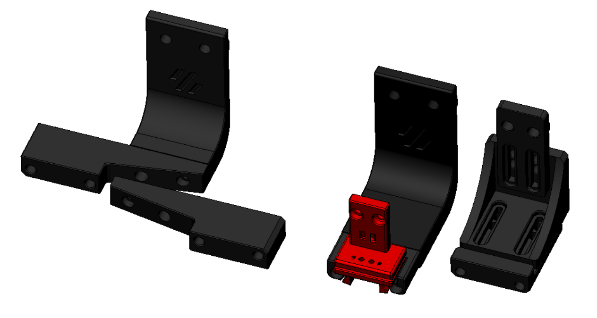

STL files

There is no need for supports, recommended settings are 4 perimeters/top/bottom, 13% infill.
All the files are ready to print, they are in the recommended orientation.

- Version 0.1 - initial release
- Version 0.2 - Revised probe and dock to improve the docking fit, remaining components are compatible
  - Thanks to oc_geek for improving the probing of a badly tilted gantry (10º) and the probe and dock attachment, it's much better now
  
The Klicky Probe consists on four different components:
- Afterburner (AB) mount
- the probe itself
- probe dock

- there is also the probe dock mount, of which there are currently three versions
  - gantry fixed dock mount (center) (usable on Voron V2.4 or V1.8)
  - gantry variable dock mount (right) (allow some variance to support custom toolheads)
  - gantry fixed dock sidemount (left) (tested for now on Voron V2.4 to allow a purge/scrub bucket on the left side of the bed)

