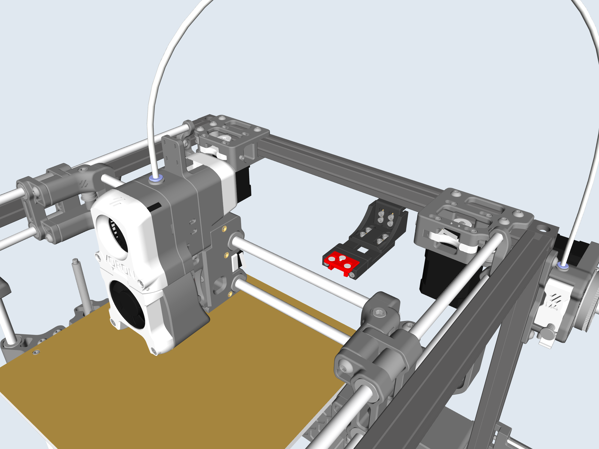
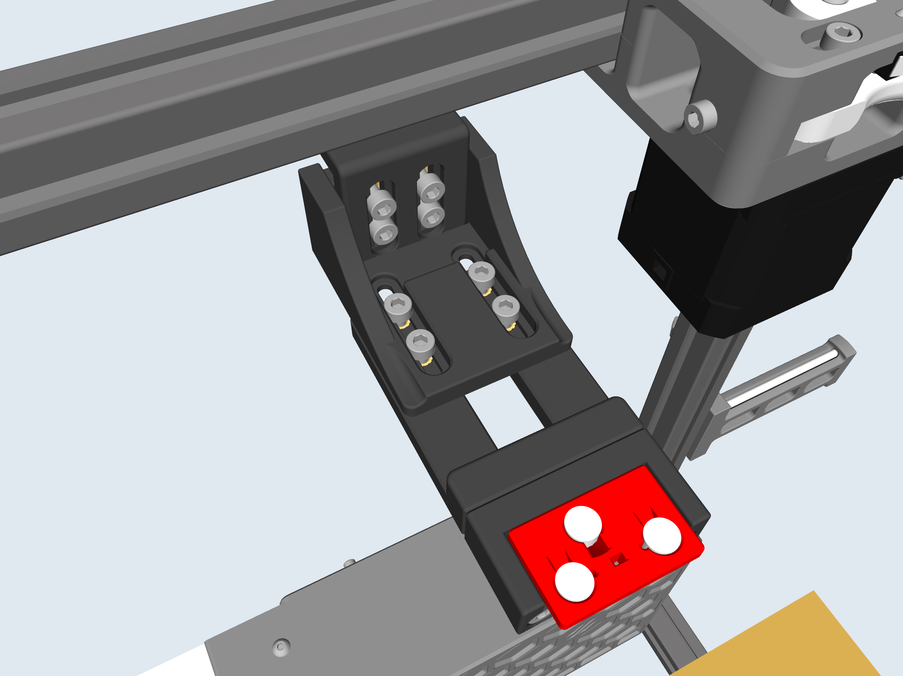
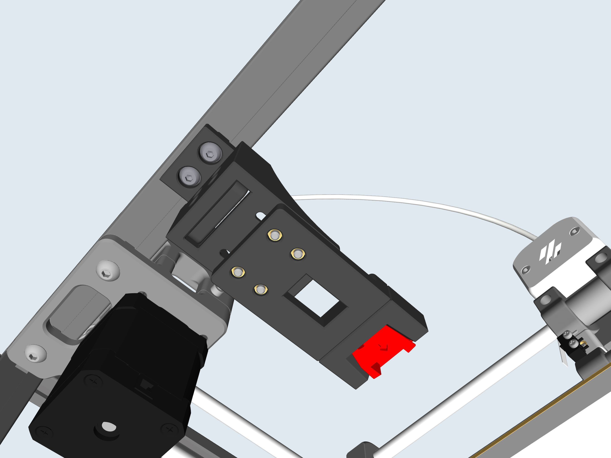
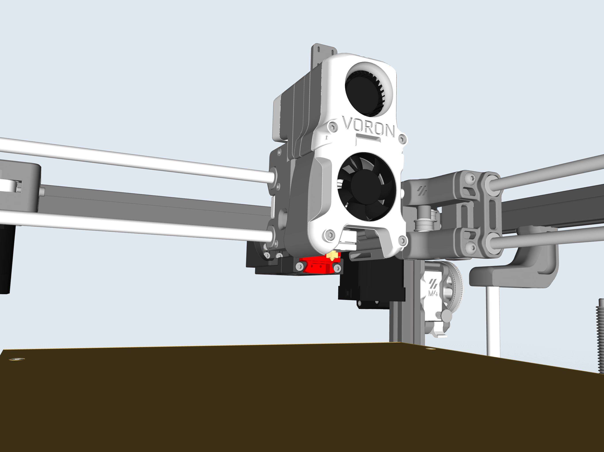
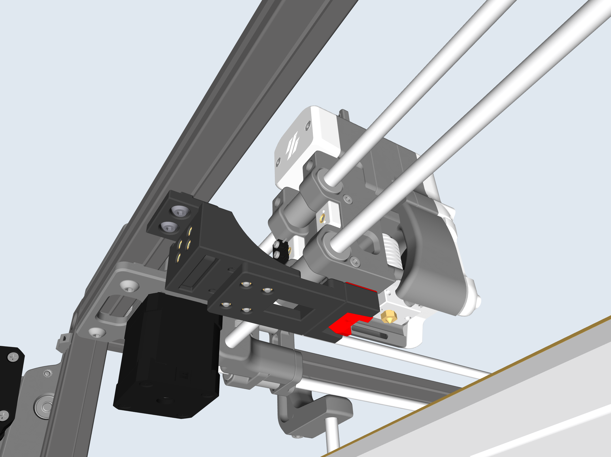

## Klicky-Probe for Voron Legacy

Modified Klicky-Probe to mount on a Voron Legacy. Docking components are designed to allow for adjustments on the Z and Y axis. 

## Pertinent Info

**Parts** Oriented for printing

**CAD** Included should you want to modify

**Tested** Currently using on a Legacy with no issues 

