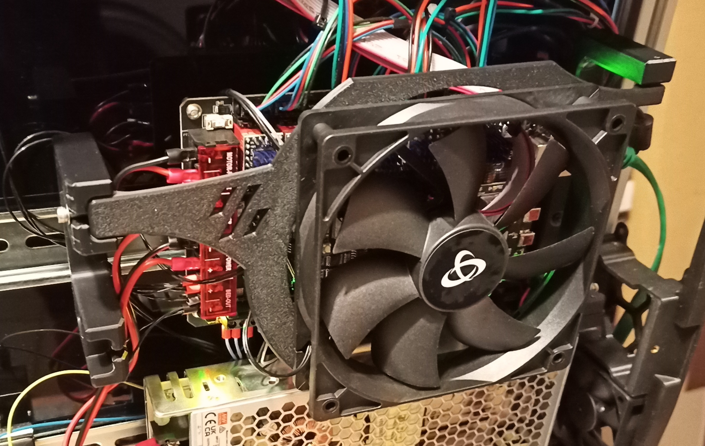
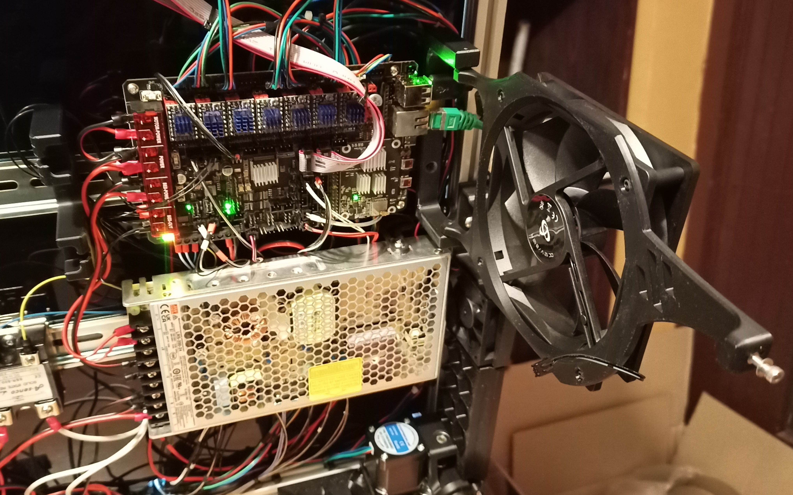
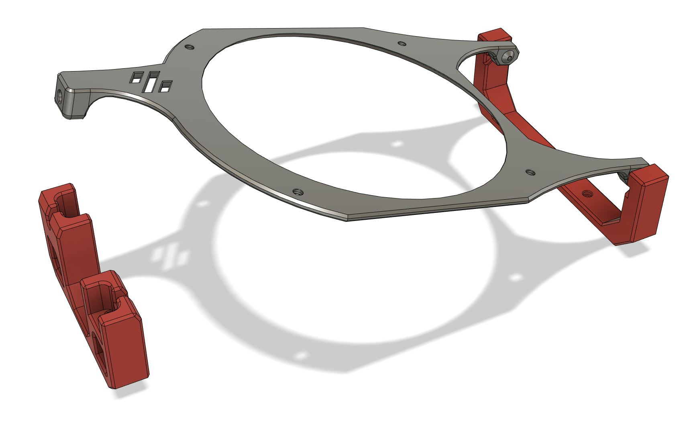
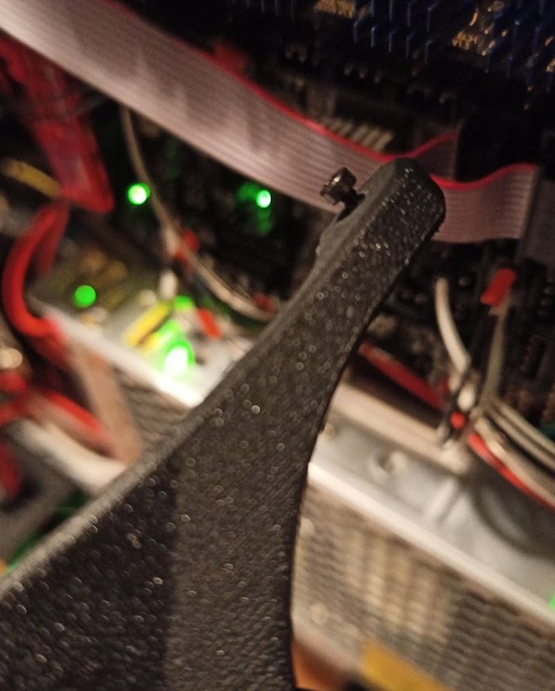
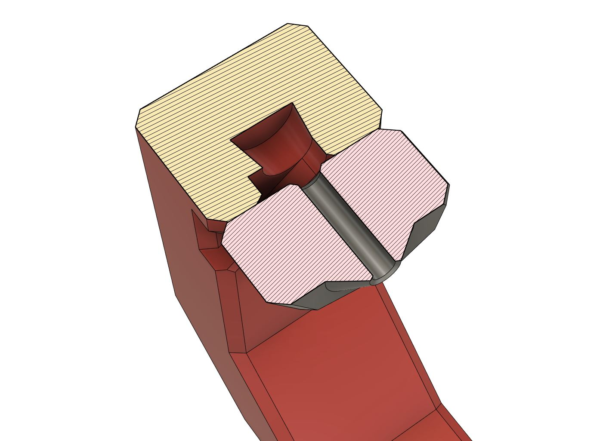

# Removable Electronics Fan

I don't use a bottom panel so a standard 120x25mm fan can fit with plenty of
space bellow it. Use a 120x15mm slim fan if you have a bottom panel, but you'll
probably need to drill/cut air holes in the panel. The hinge and stay mount to
the DIN rail using standard Voron PCB clips and the fan plate is removable for
easy access. Depending on the orientation of the din clips, you can mount the
fan centered or offset it to the top or bottom.

I tested it with a BTT Manta M8P board. The fan plate clears the standard
heatsinks mounted on the motor drivers. If you try it with other boards, feel
free to report back.

## Print settings
The fan plate is quite thin because of height clearance, but the fan will add
structure once in place. Use slightly beefier print settings for it.

* nozzle: 0.4 (100% line width, so 0.4)
* layer height: 0.2 
* top/bottom layers: at least 5 for the fan plate, 3-4 for the rest
* walls: at least 4 for the plate, 3-4 for the rest 
* infill: 40% for the plate, 20% for the rest
* no supports, they are built in
* filament: any normal structural material will do

Adjust your settings if needed based on your preferred print setup.

## BOM
* 6 x M2 10mm self-tapping
* 4 x M3 6mm BHCS or bigger
* 1 x M3 12mm BHCS or SHCS or bigger
* 5 x M3 heat insert
* 2 x standard printed Voron PCB DIN clip
* 1 x 120mm fan with 105mm bolt hole spacing (most standard 120 fans)

## Assembly
One heat insert goes to the front of the fan plate and the rest into the fan
itself. Keep in mind to double check the direction of the fan. Insert the heat
inserts into the holes of the blowing side and mount it to the plate using the
6mm BHCS or bigger. Use two self-tapping M2 screws and thread them into the the
two fan plate hinge arms from the outside, but keep about 3-4 mm of the screw
sticking out.

Now flex the parts and get the ends of the M2's to snap into the intended holes
on the hinge.

Use a 12mm (or bigger) M3 BHCS or a SHCS with a shim to fixate the plate to the
stay. Optionaly you could print out a knob for a M3 screw to hand-tighten the
assembly. 

Check how you want to position the fan (centered or off-center), orient the DIN
clips accordingly and use four M2 self tapping screws for the hinge and stay.
