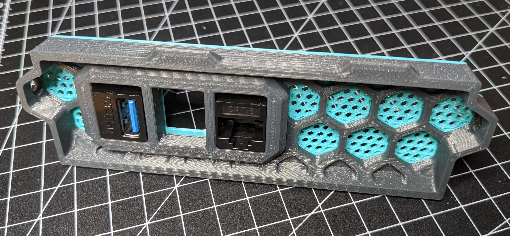
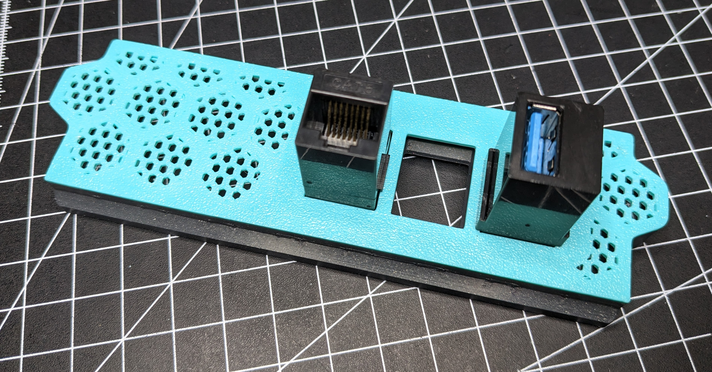

rear skirt for Voron 0.2 with keystone panel for 3 keystone inserts

Print `STL/Rear Keystone x3 Skirt.stl` if you want the skirt with an added keystone panel.

Print `STEP/Rear Keystone x3 Skirt with inserts.step` if you want a skirt with meshed inserts. Use current Prusaslicer which can open STEP files and add honeycomb infill to the inserts object. Also remove top, bottom and perimeters from the object and rotate infill to 90°.

