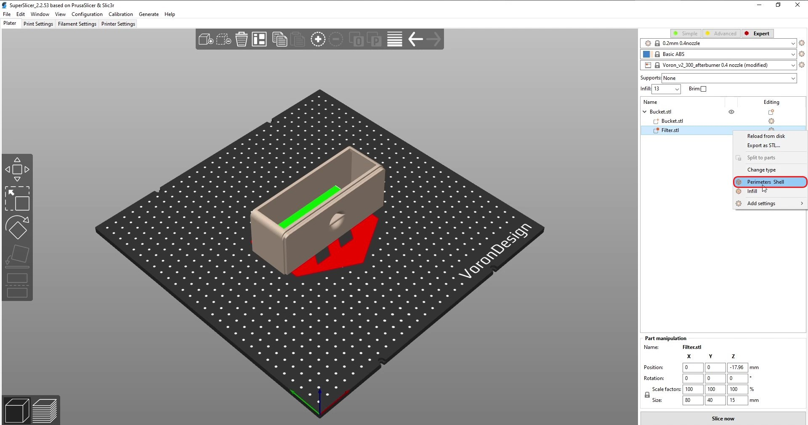

# VEFACH - Voron Exhaust Filter Activated Coal + Hepa

 

 

### Why?
Since the printer produces many small particles, the goal is to filter out as many of them as possible. A few months ago my friend Deutherius had the idea to equip the original exhaust fan with activated coal and a Hepa filter, so I designed these filter inserts. The activated coal removes e.g. the smell of ABS and the Hepa filter catches most of the small particles.
 
### How does it work?
The air first blows through activated coal particles and then through the Hepa filter. This still doesn't remove all particles, but it is better than nothing. This mod is fully compatible with the stock exhaust fan housing, except original M3x30mm screws that hold the fan are too long and need to be replaced with M3x25mm. The filter materials can be removed and replaced very easily via the original cover.

### Which version?
You just need to print the two inserts for the housing. There are two versions for the activated coal insert: One with a modeled-in mesh and one without. The insert without mesh is for creating your own mesh by using the infill. **You need a custom mesh if you use particles smaller than 0.8 mm.**

#### STLs needed:
1: with modeled mesh        |  2: with custom mesh
:-------------------------:|:-------------------------:
1x 1_hepa.stl  |  1x 1_hepa.stl
1x 1_lid.stl   |  1x 1_lid.stl
1x 1_coal_with_mesh.stl  |  1x 1_coal_for_infill_mesh.stl
 /  | 1x 0_filterdummy_dont_print.stl (as modifier)

### How to print a custom mesh?
There are two ways to create a custom mesh:
#### 1. Use the filter dummy as modifier:
I have attached a few screenshots of how to prepare the print with the filter dummy file. The green options shown in the last two screenshots are optional. Either you set the infill of the whole bucket higher or you add another setting for the filter dummy. Except for the top end, the print consists of walls only. Make sure that the filter dummy and the bucket are centered. If you want to move them, then select both at the same time so you don't change the cropping area.

1: Select filter dummy as modifier        |  2: Select settings for modifier
:-------------------------:|:-------------------------:
  |  
3: Select Perimeters Shell        |  4: Set Top-/Bottom-Layer to 0
  |  
5: Set infill density + Type to Grid        |  6: (Optional) Set different infill density for modifier
  |  

#### 2. No modifier:
Just set the top and bottom layers of the bucket to 0, so the whole bottom of the insert becomes a mesh. (Please take a look at '*Why use the Infill?*' for more information)

For both variants you should choose the infill density so that the coal particles can not fall out, but also not too high, so as not to close the airflow too much. Please test before printing. The settings given are for demonstration purposes only!

### Why use the infill?
1. **Variability of the design.** Depending on local access, the activated coal particles may differ in size, so some will need a finer grid and others can use a coarser one. Therefore, the filter must be adjustable to the different materials.
2. **Different print settings.** Depending on the print settings, a drawn mesh might not be printable. If the line width changes, e.g. due to a larger nozzle or adapted slicer settings, it may happen that the mesh is no longer recognized by the slicer. In order to support as many print settings as possible, a finished mesh was deliberately omitted.
3. **Possibilities for improvements.** On the one hand I uploaded the step file, so that everybody could add their own mesh if they want to. For another, my idea is surely not perfect and can be improved.  Changing the infill pattern or the infill density is a good way to improve it, which can also be done by users without any CAD knowledge. With a given mesh this possibility would be denied to them.
4. **Modifiers are handy, but not necessary.** When designing, I made sure that the bucket can be printed without modifiers. In this case, you set the top and bottom layers of the bucket to 0, so the whole bottom of the insert becomes a mesh. Since the rest of the insert is only printed as wall lines, this does not affect the aesthetics and function of the insert. The insert for the Hepa filter closes flush with the one for the activated coal, so that the air is still directed through the Hepa filter in case of a full-surface mesh without modifier. Nevertheless, I think the variant with the cutout/modifier is the more elegant solution, because it prevents air from flowing into dead ends. This truly filters all of the drawn-in air and minimizes the possibilities of escape through grooves on the sides of the inserts.

### What do I need?
4x M3x25mm screws

2x M3x6mm BHCS

2x M3 Brass Heatset Inserts - Short M3x5x4

1x 40mmx80mm Hepa filter (https://www.aliexpress.com/item/1005001615722382.html)

~500g activated coal particles (>1mm) 

### Credits:
Idea by Deutherius.

Thanks to Jon for the name.

Thanks to Kevin Rahhal for the lid design.

### Changelog
01.11.2021: A new coal container with lid to avoid mess when moving the printer. The printing instructions are still the same as before.

##### Contact:
Discord: kevinakasam#2097
