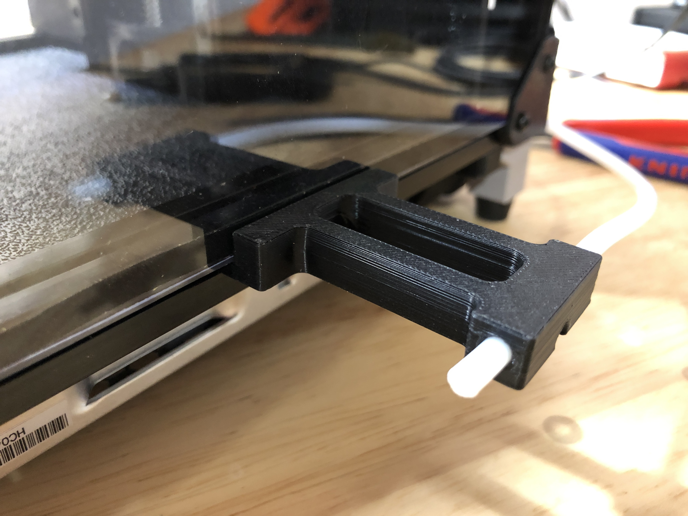
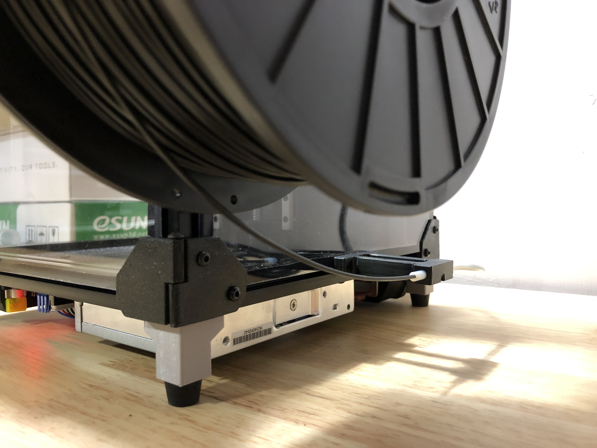
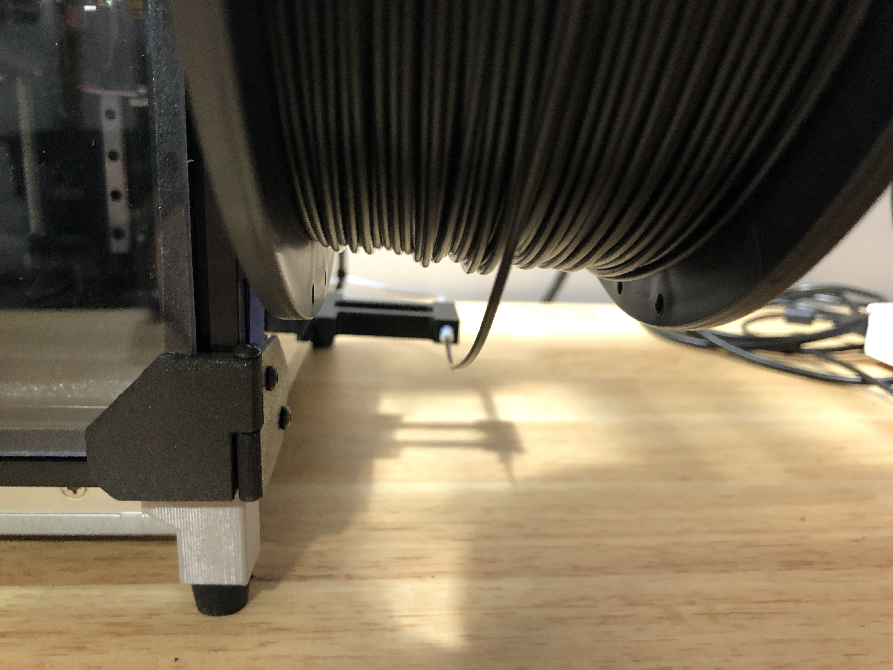

VORON 0 Reverse Bowden Mount
============================

This mount holds your reverse bowden PTFE tube near the bottom center of the spool to ensure the filament doesn't come off the spool during printing.
Replace the bottom center clip of the right panel with this mount.

BOM
---

- 1x M3x12 BHCS
- 1x M3 nut (same one that was used for the panel clip you're replacing)
