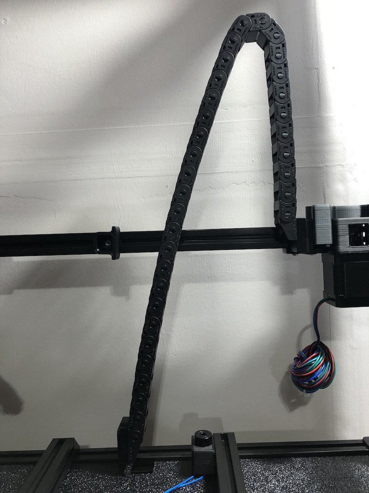
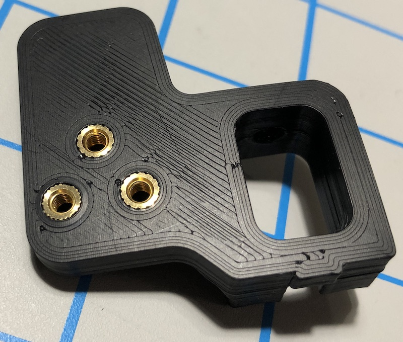
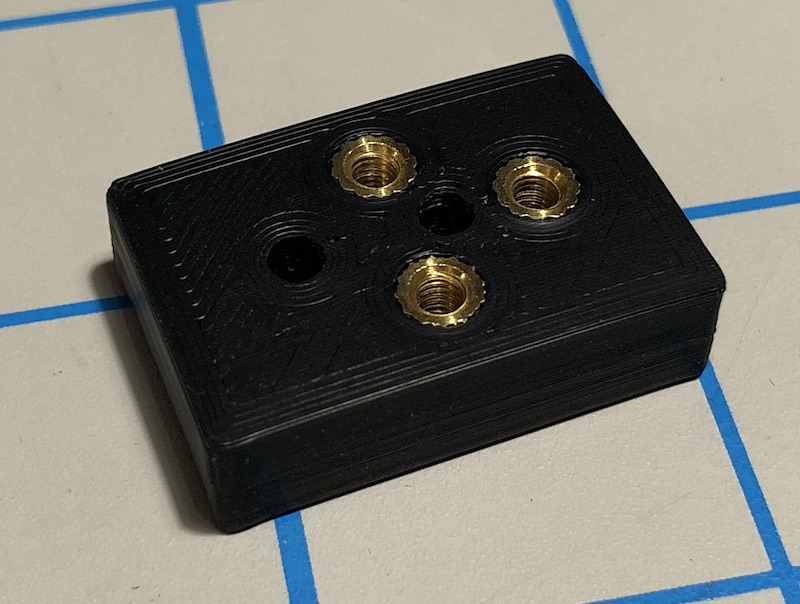
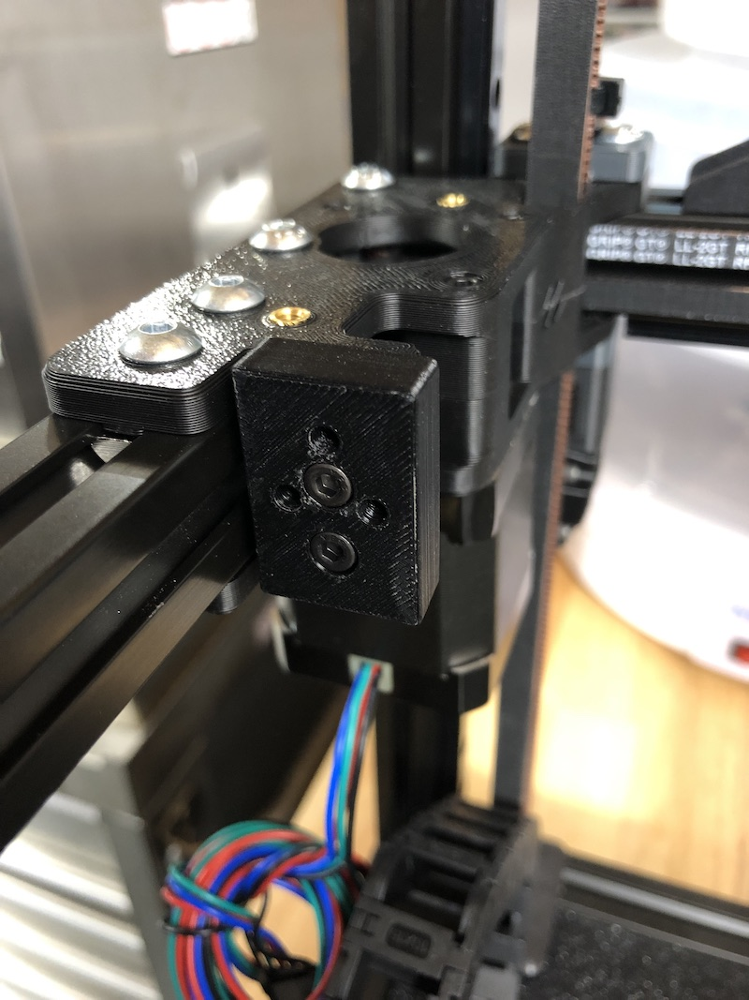
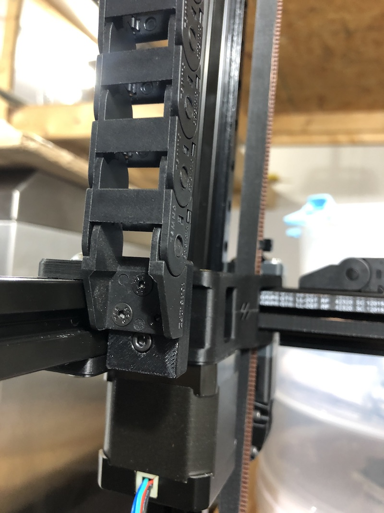

VORON 2.4 Z Chain 3 Hole Mounts
===============================

This mod is used to mount a generic 3-hole Z chain in a VORON 2.4.  The lower mount replaces the stock lower mount,
and the upper mount attaches to B drive in the stock location instead of the 2-hole chain, and then the 3-hole chain
mounts to the upper mount.

BOM
---

Lower mount:
- 1x M5x10 BHCS
- 1x M5 ball spring nut (or other extrusion nut)
- 3x M3x8 FHCS
- 3x M3 threaded insert

Upper mount:
- 2x M3x12 SHCS
- 2x M3 nut
- 3x M3x10 FHCS
- 3x M3 threaded insert
