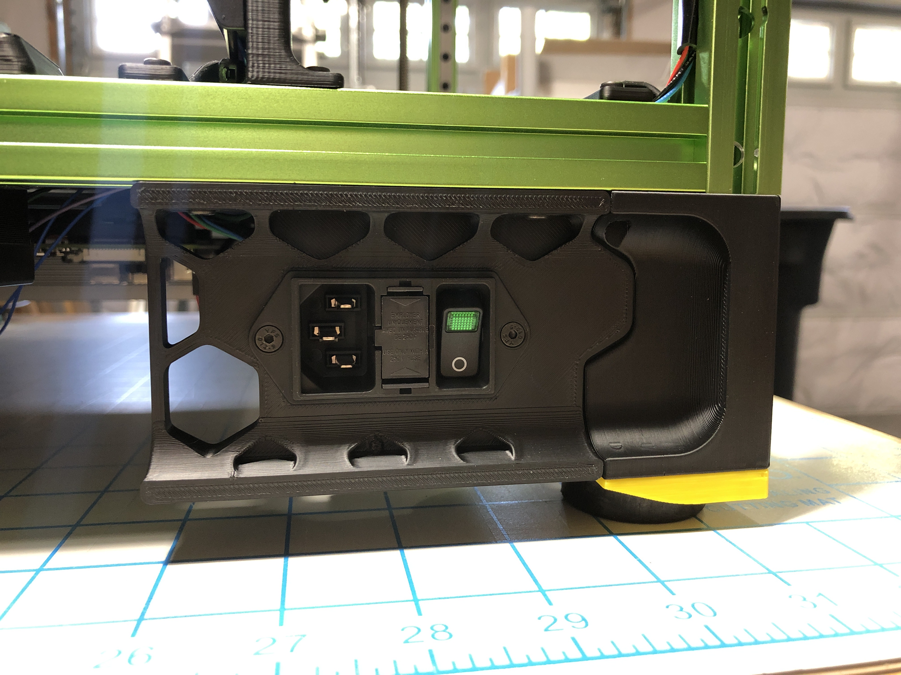
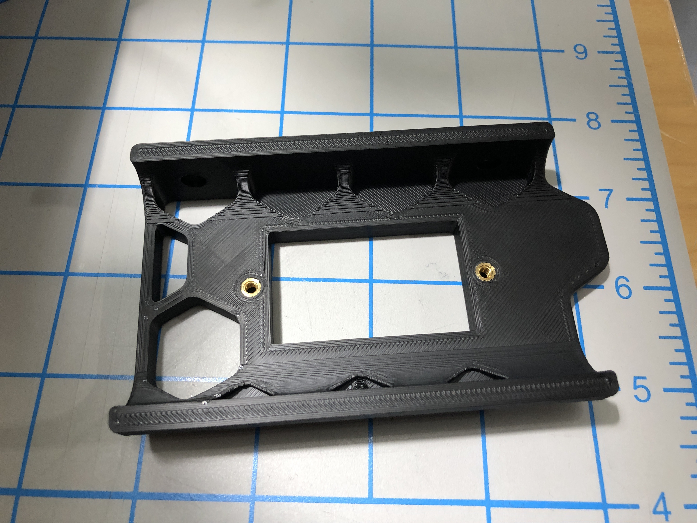
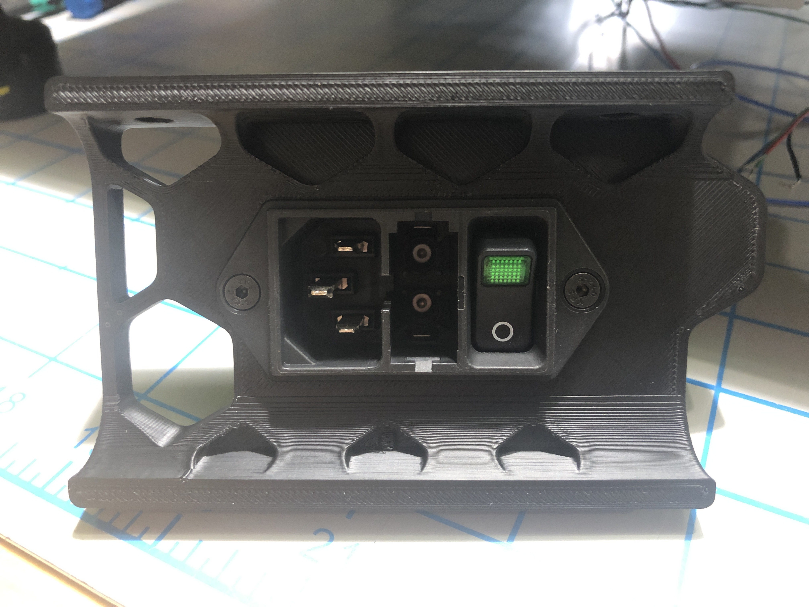
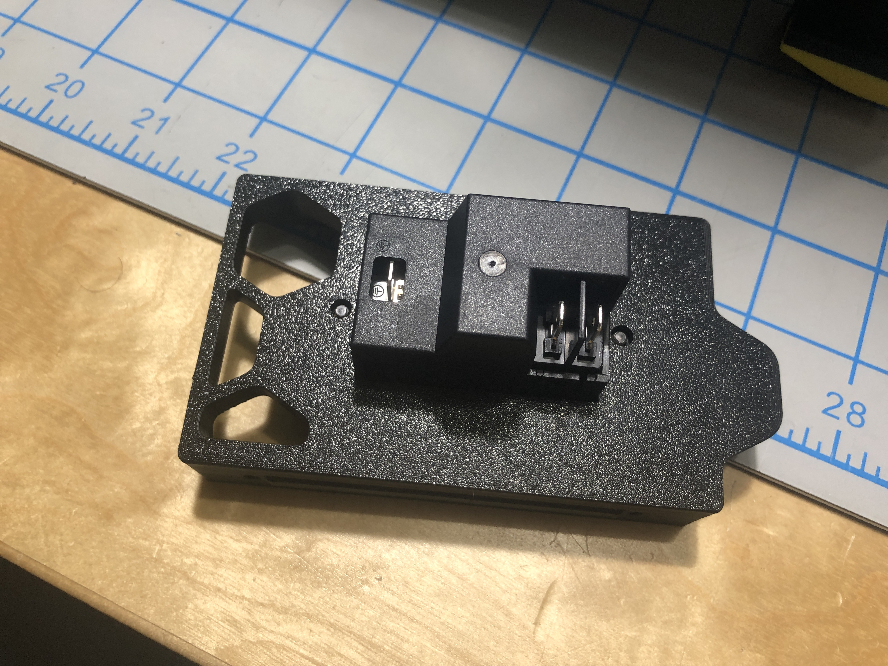

Trident Inlet Skirt For Schurter DD11.0124
==========================================

This is a modified inlet skirt for VORON Trident to install a [Schurter DD11.0124](https://www.digikey.com/en/products/detail/schurter-inc/DD11-0124-1111/1646872)  or similar power inlet.

Print using standard VORON print settings.  You'll need the same 2 heatset inserts and 2 FHCS screws as the stock filtered inlet to mount this.

