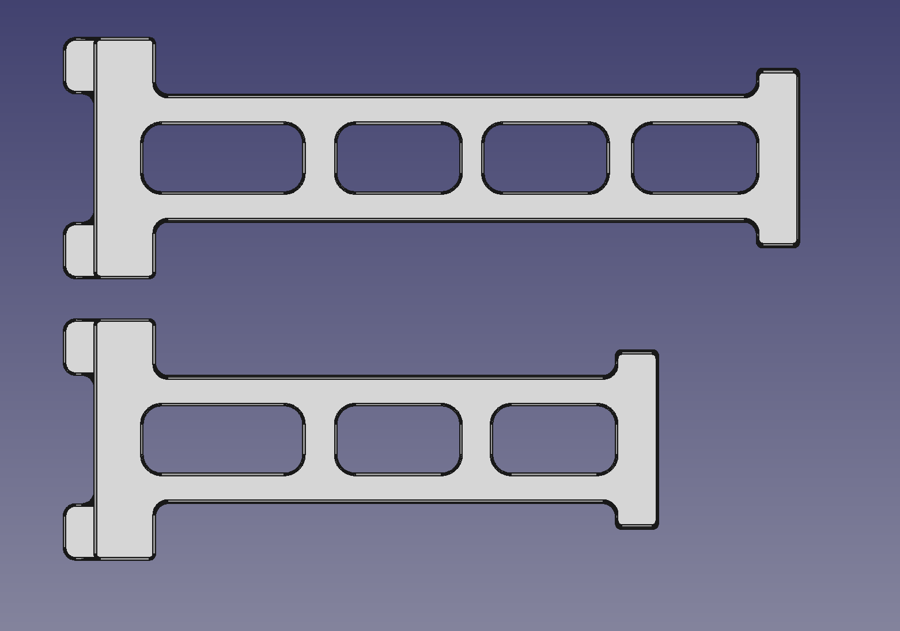

# Voron Zero - Large spool holder

### Overview

The original Voron Zero spool holder is nice, but not all people use the "regular" spools.
Most spools are bigger by a tiny bit.

Hence a tiny bit larger spool holder.

### Print instructions:

Let it rip with any type of filament.
Choose you infill to your liking.

### Customization:

Since we all ditched Fusion360 and use FreeCad. You will find an included STEP file and an STL.
