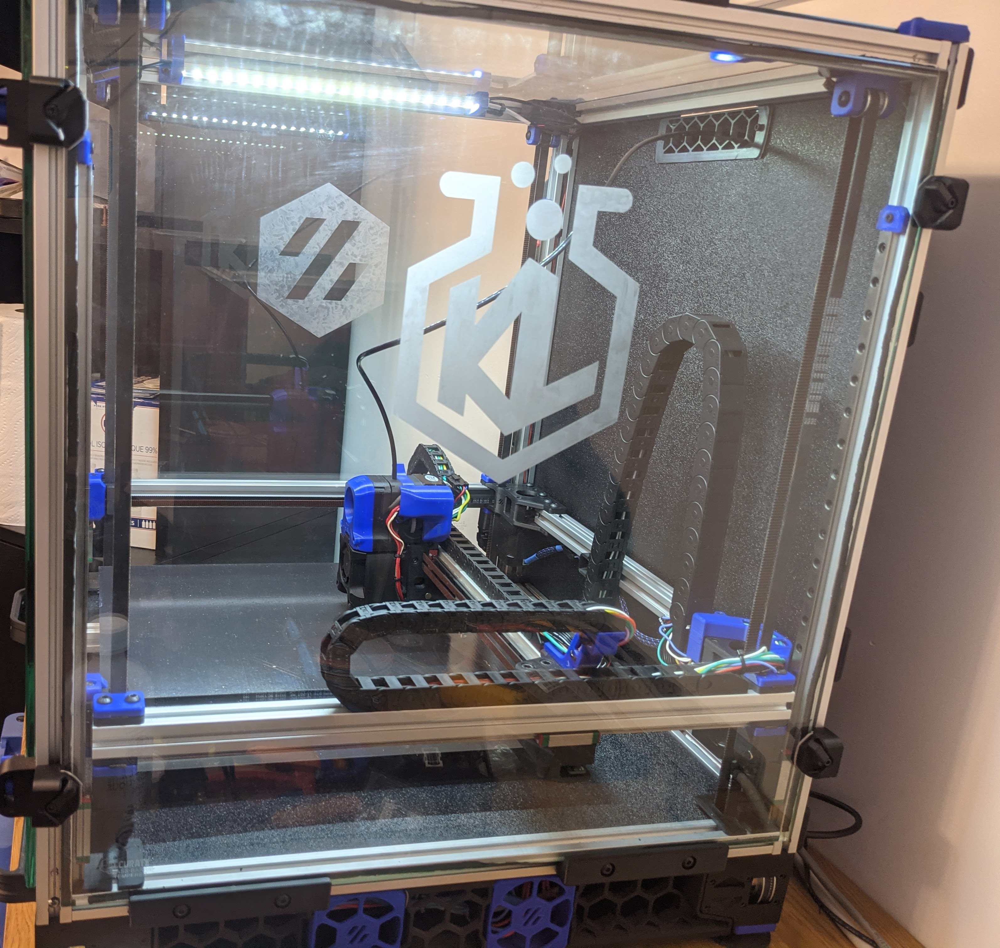

# Glass mount

This is a modification of the front panel locks from 2.1 to support holding 6mm tempered glass panels.  I used 3m VHB to adhere them to my glass panels so that thickness was considered as well.  The tab which supports the glass was thickened and has proven to be very robust on my printer. This can be run with 2.4 without issue, using panel sizes from the 2.1 bom.

I've also added 'Glass_Rest.stl' & the step file to secure the side panels with quick releases as well.  This is necessary as the glass is quite heavy and the lock levers wont hold it from sliding.

Print the stock lock 2.1 levers [here](https://github.com/VoronDesign/Voron-2/tree/Voron2.1/STLs/VORON2.1/panel_mounting/front_panel_locks) to go along with these parts.

Here is the finished assembly in production:
