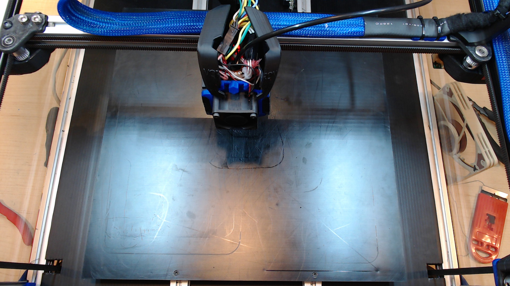
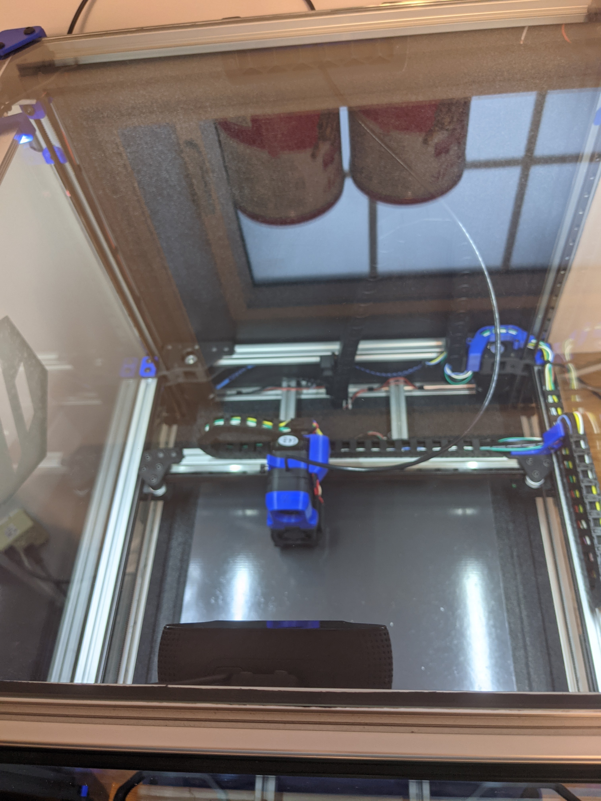

# C920 Mount

This is a mount for a Logitech C920 webcam for the front top extrusion on the Voron 2.  On my 350 the field of view looks like this: .  

This is how it looks mounted in the printer:

I used to M3x10 SHCS to attach to my extrusion with a couple t-nuts. 

This is a video of the [Disassembly](https://www.youtube.com/watch?v=94lDYZgihT4) which you will need to perform in order to use this bracket.  Disassemble until you can get the two metal swivel joints undone, slide into the two holes on the mount, then reassemble.