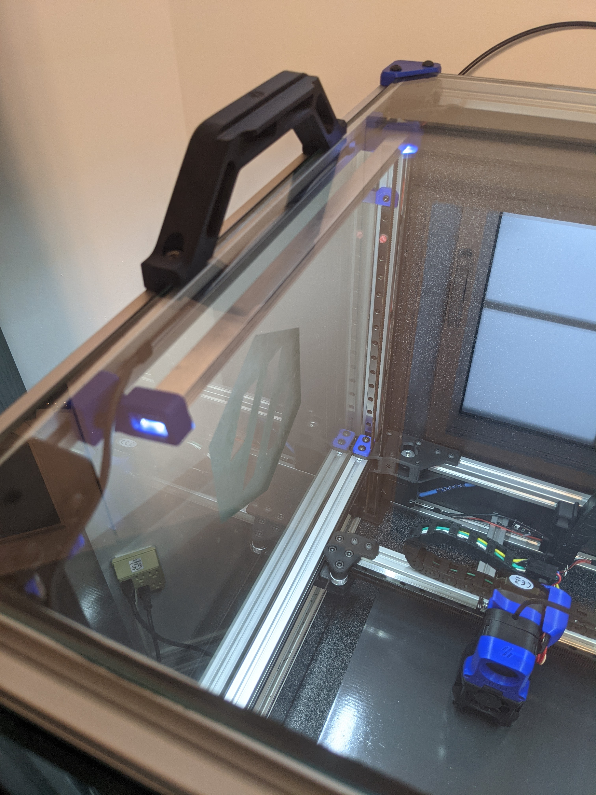

# LED Mounts

This is a simple LED light bar mount for this 12V LED Strip light: https://www.banggood.com/30CM-8W-SMD5630-Waterproof-U-Shape-Dual-Row-42LEDs-Rigid-Strip-Hard-Bar-Light-DC12V-p-1255036.html

I run this off a 12V power supply, and groundside switch it on an SKR: https://www.digikey.ca/en/products/detail/cui-inc/VGS-25-12/2045660

You will need 1 A & 1 B mount for each strip you intend to install, and I positioned them just under my top glass (or plexi).  Beware, running these at 100% duty cycle will get very hot (~80C), and if you have plastic panels it may warp, so you will want to run them with PWM, which is fine since they are very very bright.

I used m3x12 socket head screws to fasten them.

This is how the finished project looks:

