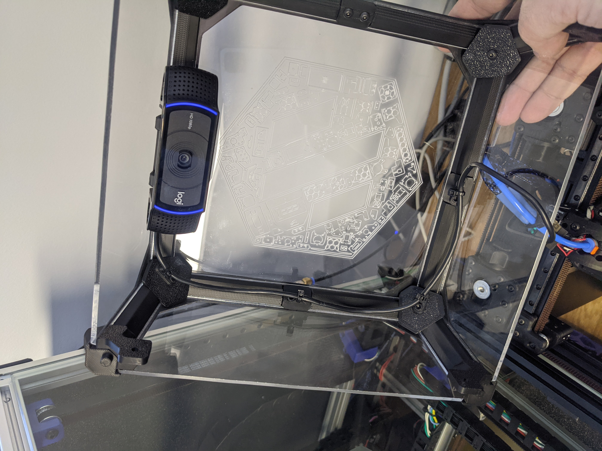

# V0 C920 Mount

This is a low profile mount to hold a Logitech C920 series camera at the top front of the tophat, sharing the existing screw mount for the panel clips.  I've also included some cable tie brackets to facilitate cable management for the usb cable. The mid-span clips are somewhat fragile, but if you use care they work well, as they aren't under any stress. 

You will need to disassemble the C920, you can follow this [video guide](https://www.youtube.com/watch?v=94lDYZgihT4).  Disassemble until you can get the two metal swivel joints undone, slide into the two holes on the mount, then reassemble.

This is how the finished project looks:

Note: this will not work with the sherpa & extended top hat per goopyplastic V0.263