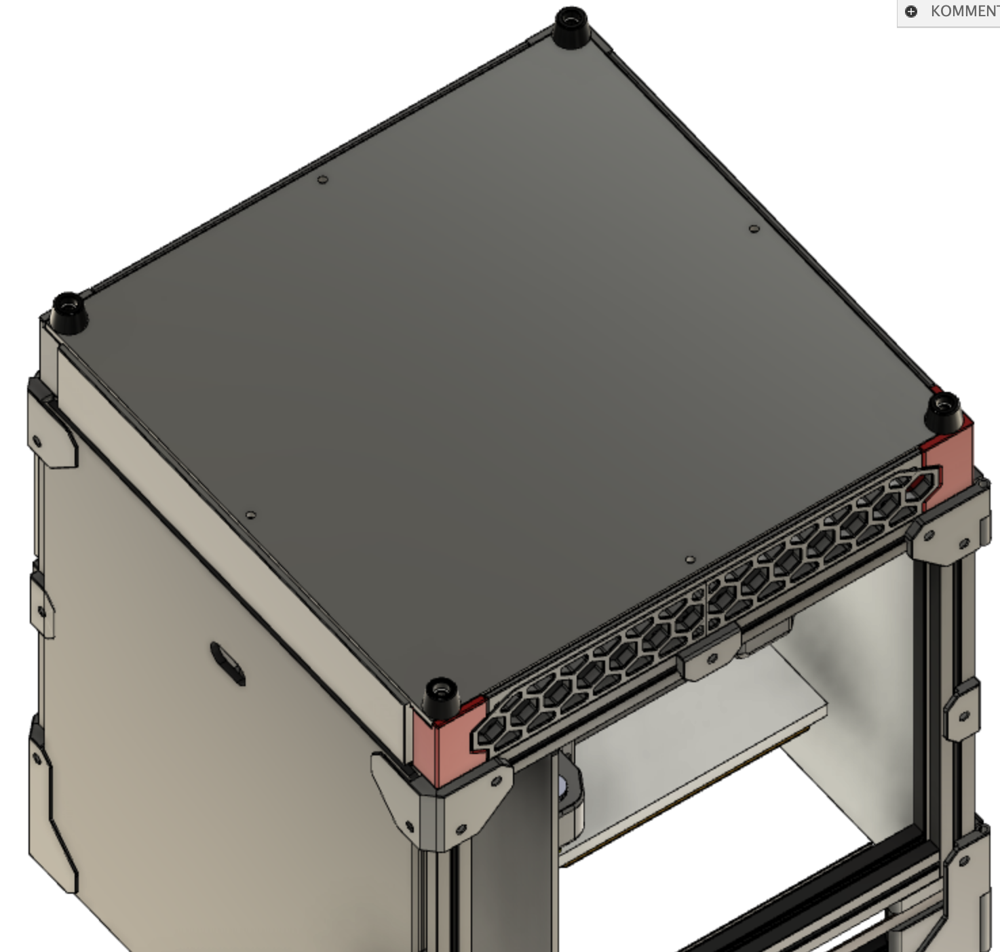
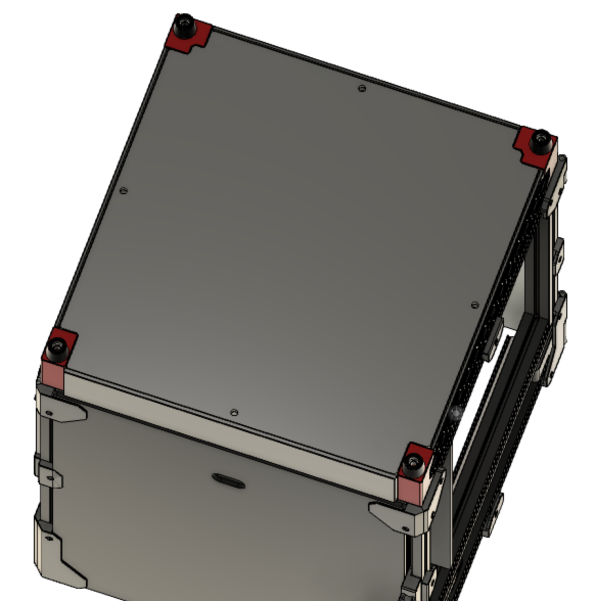
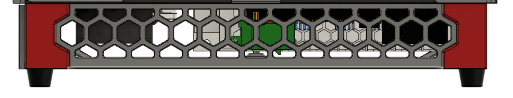
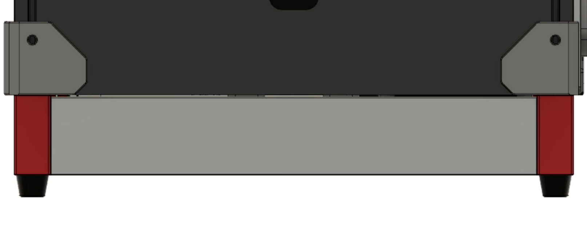
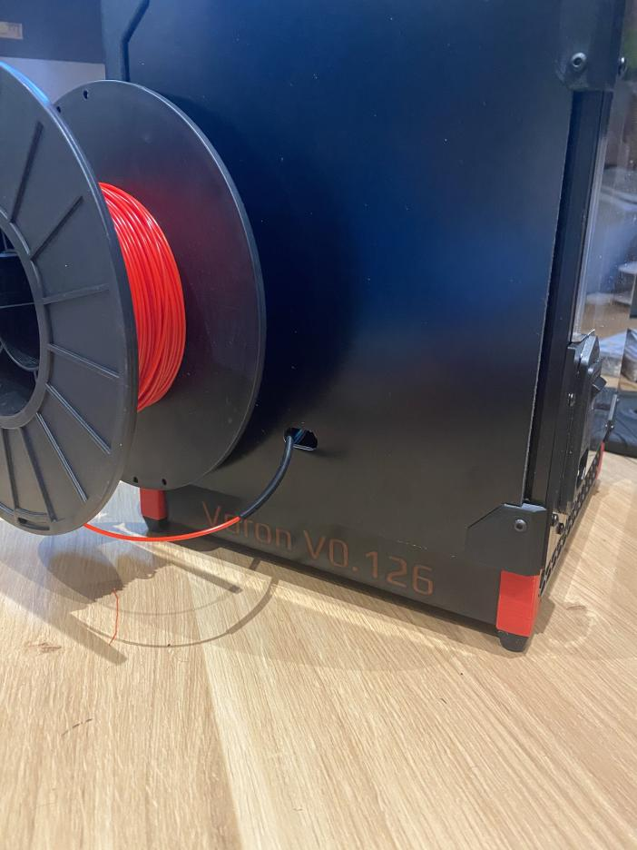
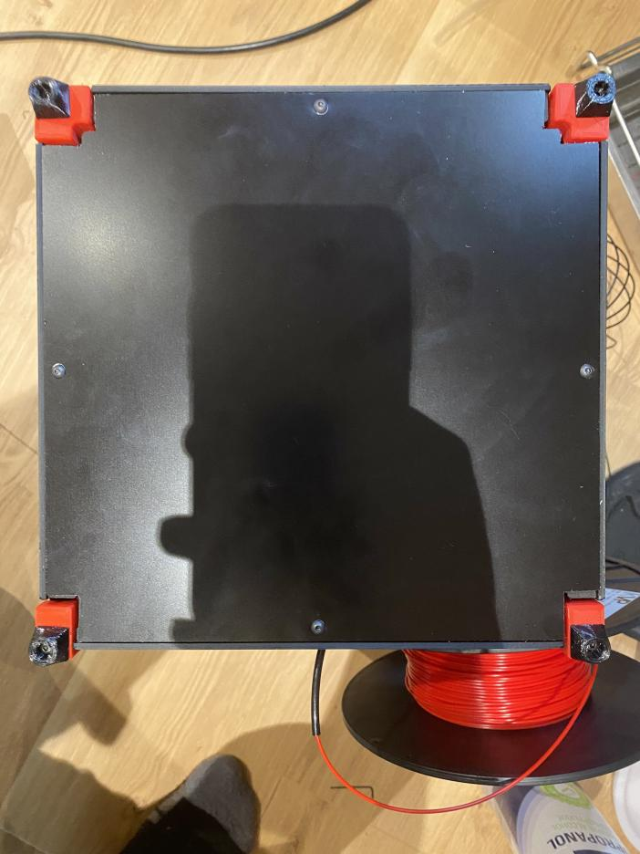

# README

### Overview

This is my take on fully enclosing the V0. This mod lifts the printer by 10 mm and requires new legs and skirts to be printed. Without further modification this mod can not be printed on a V0 since a bigger build volume is required.

### Variants:

I designed two variants of the bottom panel:
- **Simple:** This only requires a rectangular cut (223 mm x 226 mm x 3 mm) bottom panel (can also be printed). The drawback is that the feet have to be removed to access electronics and the feet can only be properly attached with the panel.

- **Fancy:** Requires to cut out to leave out the legs. More loose fit. Non supported corners require stiff panel. Panel can be attached or not independant on the feet.

### Requirements:

- Single part skirts (too big to print on V0).
- Legs matching the variant you chose.
- 3 mm stiff panel cut to shape. I used Dibond and cut it with a jigsaw.
- 4 x M3 x 40 mm screws for the longer legs.
- 4 x M3 x 6 mm screws to mount panel and lip.

### Lip:
The Lip to cover the portion below the spec "back panel" has to be printed and can be attacked with VHB and/or a single screw. Pictures show non uploaded variant with serial added by first layer color change (not uploaded)

### Assembly:

The skirts and the lip require a 5x4 m3 brass heat insert. The lip can optionally also be attached with VHB.

