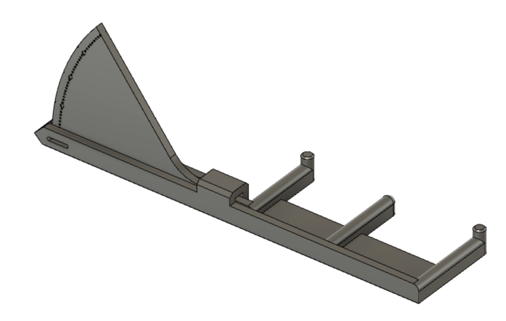

# README

### Overview

Inspired by the print in place tension meter Prusa released recently, I drew up this one from scratch.

It's not intended to give you an absolute result but I found it accurate enough to measure the same tension independent off the orientation you mount it with. Therefore it should be accurate enough to set multiple belts to the same tension (e.g. V2 z-belts).

### Print instructions:

Only tested with KVP ABS.

Always print it with 100% infill

### Application:

The meter has three "legs". The belt is supposed to go above the outer ones and below the inner one. The belt tension will then flex the dial indicator and show the tension.
I'd recommend printing it with a light filament color, then you can tighten one belt and use a sharpie to mark the dimple of the tension you aim for on both sides of the dial. Then tighten all your belts to see the marking through the hole in the pointer and you should be good.

### Customization:

I added the messy f3d source files with a parametric design. If you find it to flex too much or too little with your filament the easiest adjustment is to increase or lower the "springthickness".
