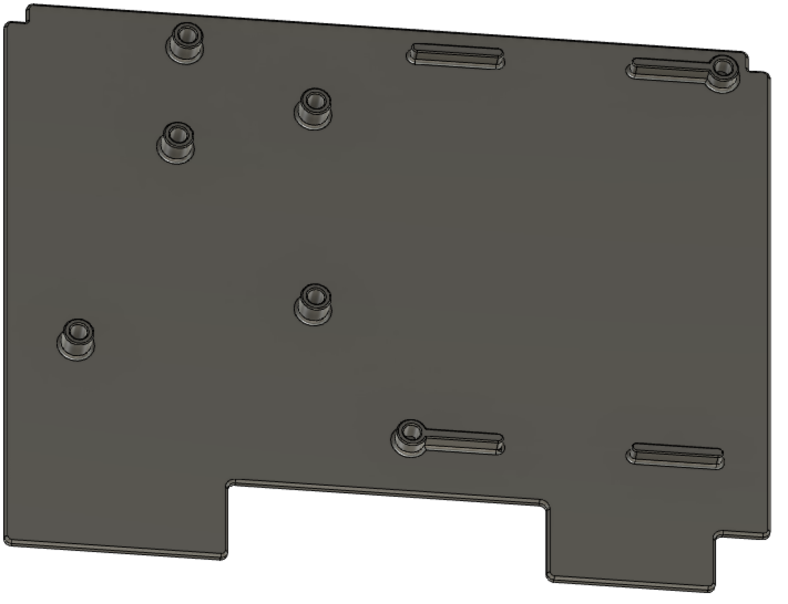
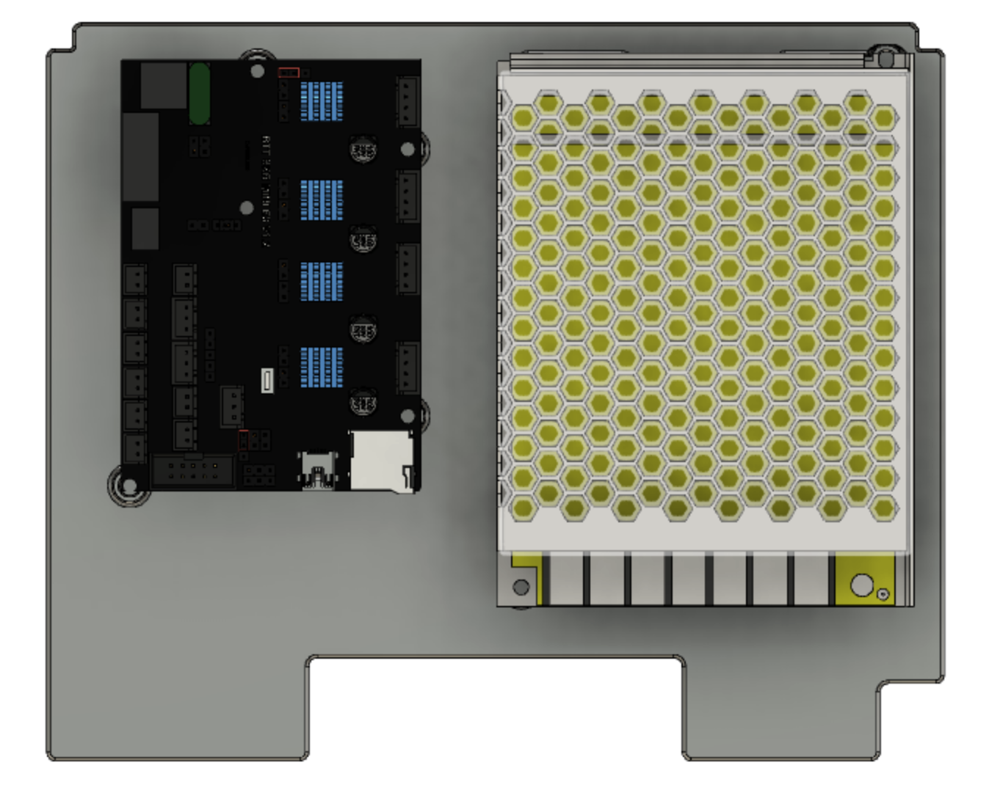
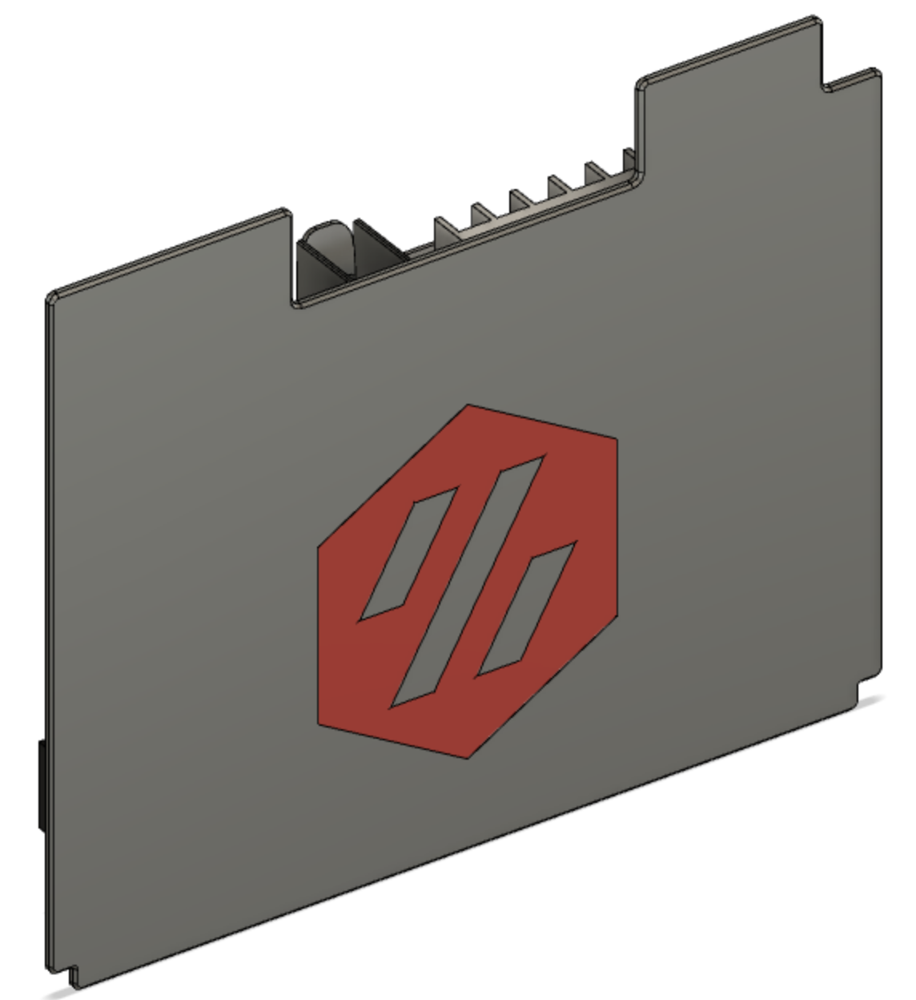

# README

### Overview

Remix of the crew mods deck panel that use heat inserts instead of stand-offs to not have screw heads showing when looking at the printer. Allows inserts 5 mm x 6 mm (shorter 4 mm ones recommended for PSU).

### Requirements:
Designed for spec hardware:
- PSU: Meanwell LRS-100-24
- MCU: BTT SKR Mini E3 1.2

### Print with accent colored logo
The "Deck_Panel_with_Logo.zip.amf" contains two STLs, one being the Voron logo cut out with 0.4 height at 60° (2 layers). You can print the logo first in your accent color, change filament and print the main color over it <b>without touching the bed</b> in between. Deactivate fans for overhands and put overhang flor to 100% to get a proper adhesion between the two prints. Also put z-Hop to 0.2 mm (perfect world) or 0.4 mm (safe side) for the main color print. no not crash the nozzle into the accent color.

