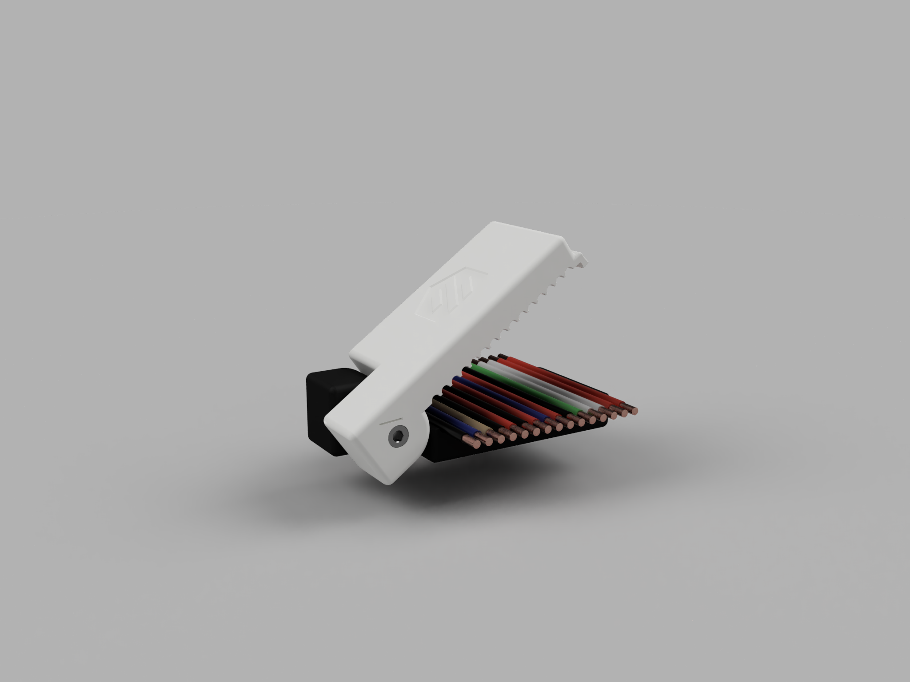
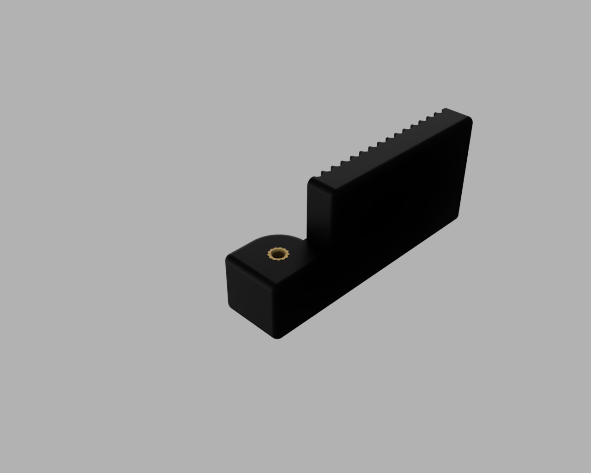
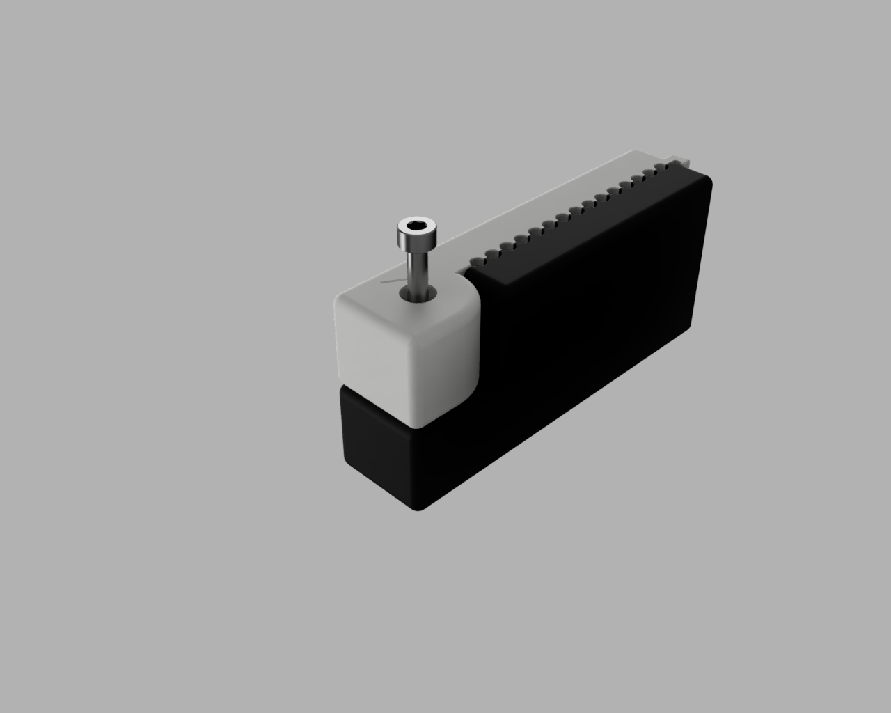
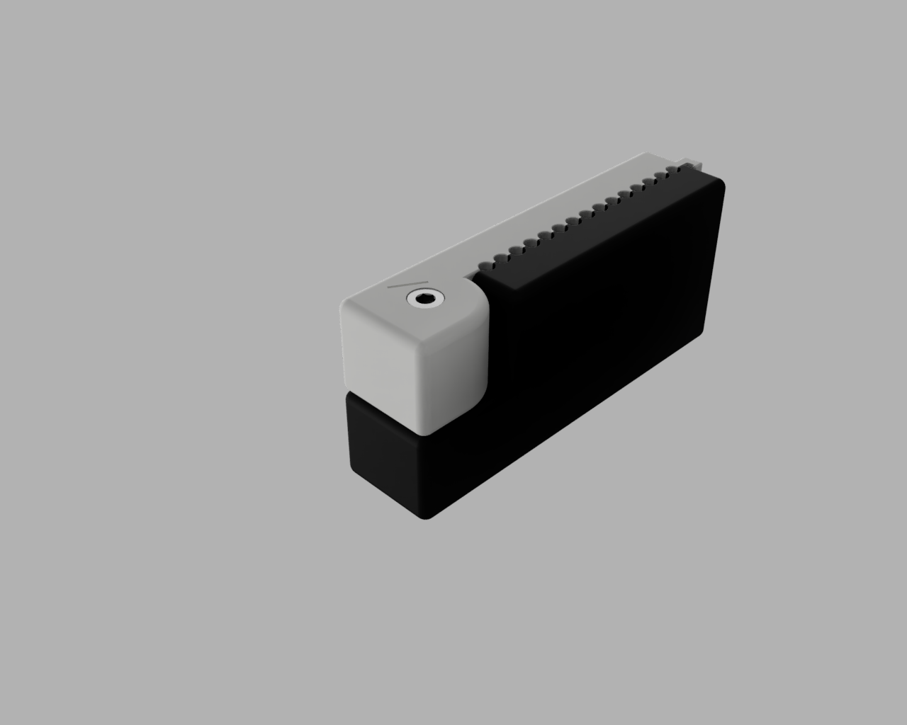
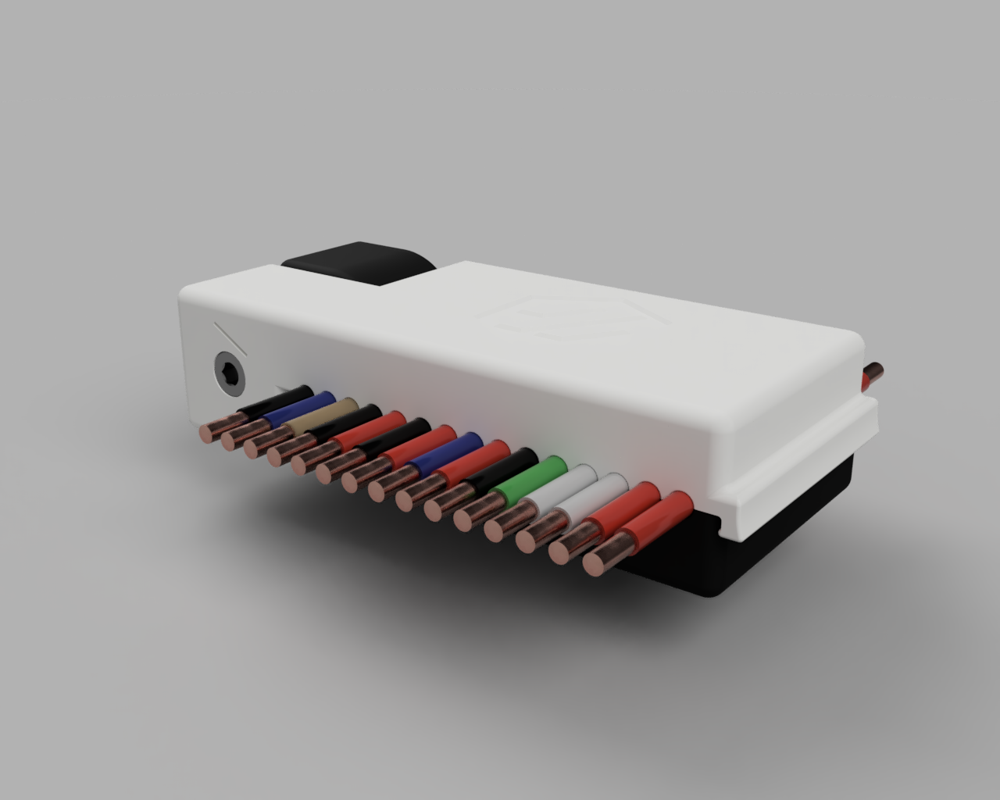

# The CableGator!
The cable comb that takes a BITE out of dragchain frustration!

## Why do I need this?
Keeping your wiring tidy as you're installing your dragchains can be a hassle, sometimes quite the croc!

Enter, CableGator!

The totally not reptilian overlord that gently combs your "I swear it was neat but now it's a rat's nest" wiring harness into a tame and beautiful bundle of joy, ready for electrocution.

## Aren't gators dangerous?
Yes!

## How do I make this?

CableGator was designed and prototyped by a stranger you've never met, on the internet. But that stranger also mentioned something about using the typical Voron Parts slicing configuration (forced .4 extrusion widths and .20mm layer height) to print this. It has been designed with 3D printing in mind! The CableGator can be made with all kinds of different 3D printing materials, but molten plastic is recommended.

## What all do I need?

#### Materials:
#### - (1) M3 Heat-Set insert
#### - (1) M3x16 SHCS
#### - (Both) CableGator [parts](./STLs), fresh off the print bed.

## Assembly Instructions:

Assembly is so easy, even delicious unsuspecting waterfowl could make it! Probably, right?

First, install an M3 heat-set insert into the Lower Jaw of the CableGator like so:

Then, you'll want to take the Upper Jaw and lay it on top of the Lower Jaw, taking care not to look CableGator directly in the eye hole. It doesn't like that.

Now take your M3x16 SHCS and feed it into the CableGator's eye hole:

Snug up the M3x16 SHCS to complete the assembly. It doesn't need to be hulked down, we want the jaws to move nicely. CableGator is now ready to use!

## Best Practices:

It's best to use cablegator before your terminations have been made (i.e. putting crimped wire-ends into their housings. However, if you're using a toolhead PCB that uses a 14-pin Molex connector, having one end of your harness terminated may be ideal.) Also, it's a great idea to label each wire at the crimped end before combing the harness out. (Small bits of color-coded heat-shrink tubing or actual printed labels work great.)

Lay out your harness on a flat surface, and try to make an area of your harness flattened out so you can load the gators teeth one wire per tooth. Once you are holding your mouth just right, and have all the wires laying in the CableGator, snap it's maw shut around the wires making sure to not pinch any wires or get multiple wires stuck in one tooth. This may require a bit of wiggling and rolling to get each wire to sit correctly, but you'll eventually get it. 

Multiple passes are encouraged, just like combing your own hair. It's prom night, and your harness has a hot date with your drag chains, so make sure your wires are looking their best! After one pass with the CableGator, lay the harness flat again, unclip the CableGator, and start at the top again. Lay everything nice and flat, clip on the CableGator, and comb the harness out once more. 

After coming the harness out a couple times, before removing the CableGator, it's a good idea to at least zip-tie each end of the harness. That way, the harness will stay nice and neat until you are able to start running it all.

## Drag chain tips:

#### Zip-ties are a harnesses best friend!

Do not go crazy though. Any drag chain should NOT have anything other than wire inside of them. This includes heat-shrink tubing, wire sleeving, zip ties, etc. As long as we are INSIDE of a drag chain, we are strictly going for function over form. Anything OUTSIDE of a drag chain is fair game, so long as it does not impede movement of your toolhead. At junctions between axes X, Y, and Z, be sure to keep the harness tidy by any reasonable means. Strain relief plays a big part in longevity of any wiring harness. 

#### Be sure to give your harness room to "breathe" inside of your drag chains.

Wiring should be laying nice and flat, side by side inside a chain. Run your toolhead around every now and again to make sure the harness isnt pushing or pulling on any walls of the chain. There's a sweet spot we're trying to achieve. A good method is after you have ran all your wiring inside of one chain, grab the whole harness around the exit point and push or pull the whole harness GENTLY while looking at the harness inside of the "bend" of the chain. You want it floating somewhere in the middle. Again, not pulling, or pushing on the chain at all. Once you've found that sweet spot, zip-tie the harness down to the chain's strain relief leg or some other means to keep the harness in that spot.

#### Perfection is something to strive for, but impossible to achieve. 

At the end of the day, we're all just doing our best. You may notice some wires slipping past one another inside of the drag chain. This is TYPICAL, and is why silicone/ptfe wire is spec'd in the BOM. Your wiring plays a very important role, and it's easy to understand why you want it to be perfect and not slip around inside of the chains, but we need to remember that this is a 3D printer that fits on a desktop and will typically not move as fast as an industrial machine running 24-7-365. Just do your best to keep the wiring neat, the wire will move where it needs to.

# CHOMP!

