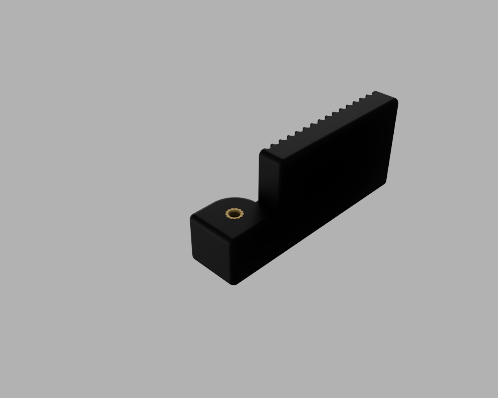
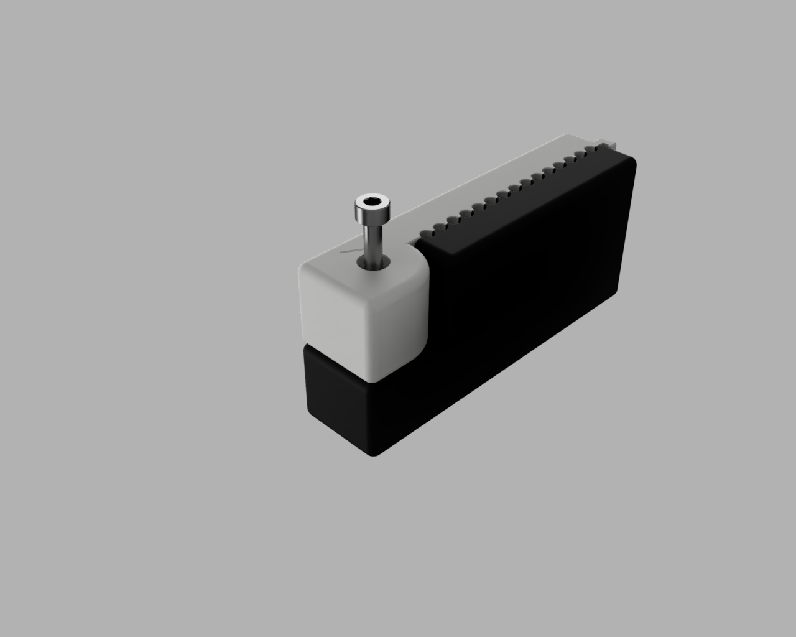
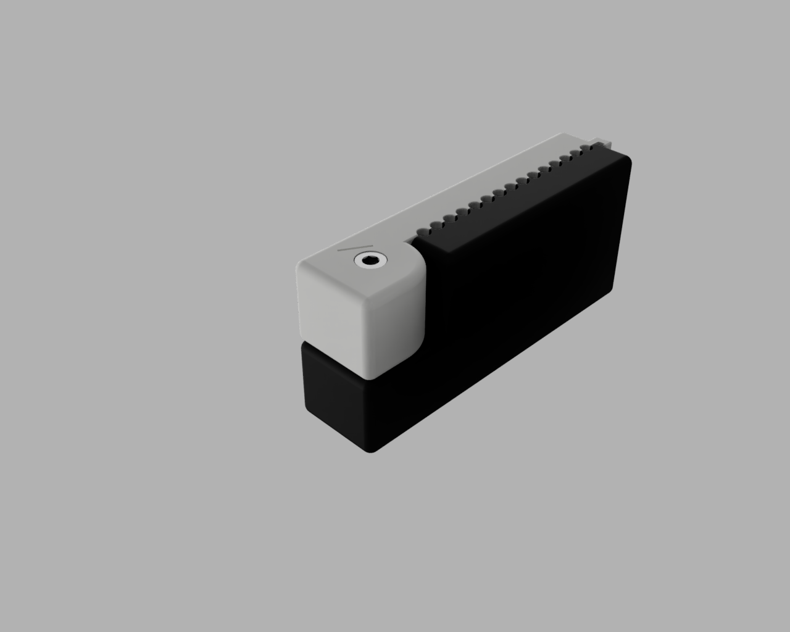
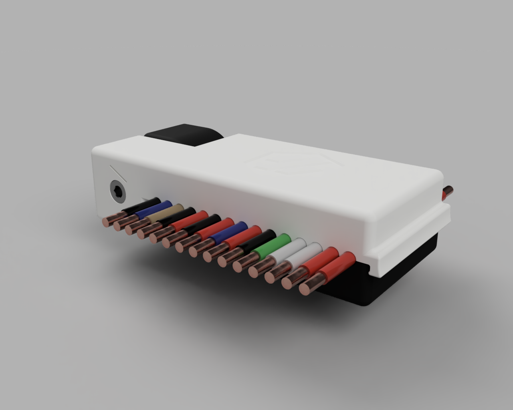

# The CableGator!
The cable comb that takes a BITE out of dragchain frustration!

## Why do I need this?
Keeping your wiring tidy as you're installing your dragchains can be a hassle, sometimes quite the croc!

Enter, CableGator!

The totally not reptilian overlord that gently combs your "I swear it was neat but now it's a rat's nest" wiring harness into a tame and beautiful bundle of joy, ready for electrocution.

## Aren't gators dangerous?
Yes!

## How do I make this?

CableGator was designed and prototyped by a stranger you've never met, on the internet. But that stranger also mentioned something about using the typical Voron Parts slicing configuration (forced .4 extrusion widths and .20mm layer height) to print this. It has been designed with 3D printing in mind! The CableGator can be made with all kinds of different 3D printing materials, but molten plastic is recommended.

## What all do I need?

#### Materials:
#### - (1) M3 Heat-Set insert
#### - (1) M3x16 SHCS
#### - (Both) CableGator [parts](https://github.com/kyleisah/VoronUsers/tree/master/printer_mods/Kyleisah/STLs), fresh off the print bed.

## Assembly Instructions:

Assembly is so easy, even delicious unsuspecting waterfowl could make it! Probably, right?

First, install an M3 heat-set insert into the Lower Jaw of the CableGator like so:

Then, you'll want to take the Upper Jaw and lay it on top of the Lower Jaw, taking care not to look CableGator directly in the eye hole. It doesn't like that.

Now take your M3x16 SHCS and feed it into the CableGator's eye hole:

Snug up the M3x16 SHCS to complete the assembly. It doesn't need to be hulked down, we want the jaws to move nicely. CableGator is now ready to use!

# CHOMP!

