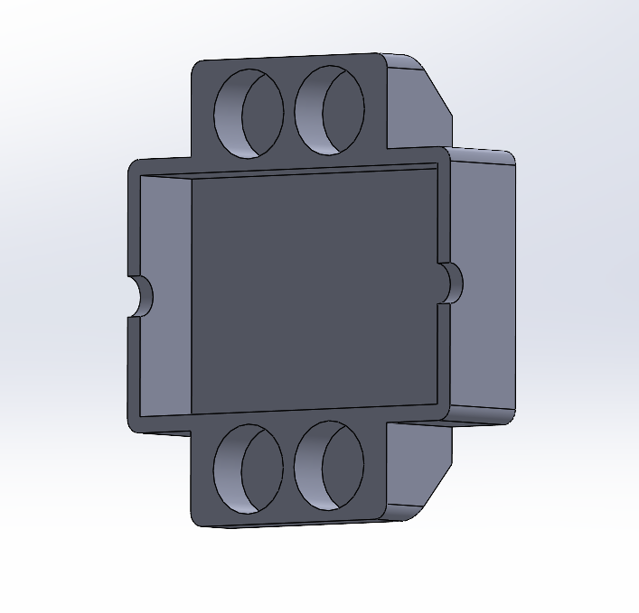
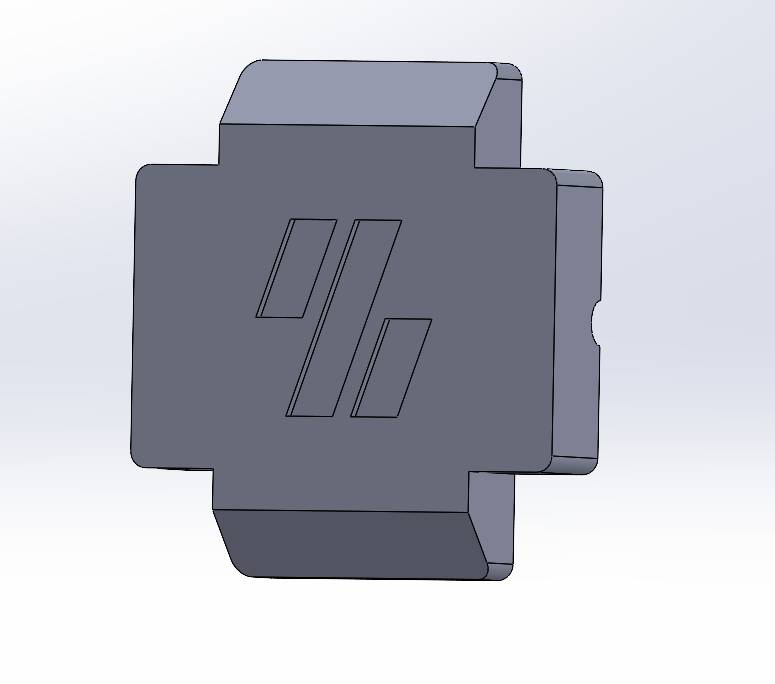
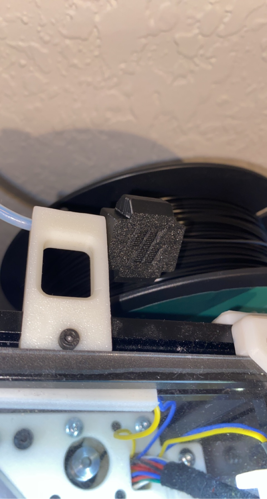
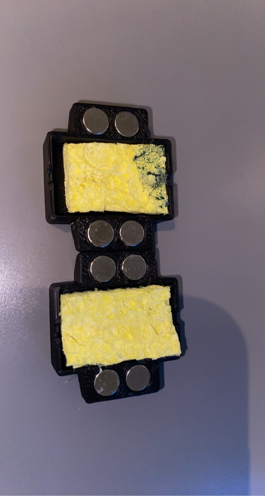

<h2>Overview</h2>
  
Scrubby is a filament dust scrubber that prevents any dust from reaching your nozzle and burning, causing partial clogs. My nozzle was clogging regularly and I 
decided to test a dust scrubber, and I have not had another clog for a very long time, so I thought I would make this design public in case someone else can benefit.

<h2>Materials needed</h2>
  
* 8x 6x3 Neodynium Magnets
* Any cheap, sponge-like material (I cut up part of a scotchbrite kitchen sponge)
* 2x Scrubby.stl
* Note: I tested the tolerances in ABS. Due to shrinkage, other filament may make a slightly larger hole.

<h2>Assembly</h2>

Assembly is quite simple; press fit or super glue the magnets into each hole, carefully paying attention to polarity. Cut up your chosen spongy material and fit
it into each scrubby half. Place your scrubby halves together, sandwiching the filament between the halves. You want enough sponge to get a nice drag on the filament
to make sure it cleans it as best as possible. I put mine right against the bowden retainer, shown in the picture above.

<h2>Notes</h2>

I included the solidworks part file and the step file in case anyone wants to modify. Make sure to clean the dust it filters off somewhat regularly. It pulls a suprising
amount off. Please message me on discord if you have any questions. Happy clog-free printing!
