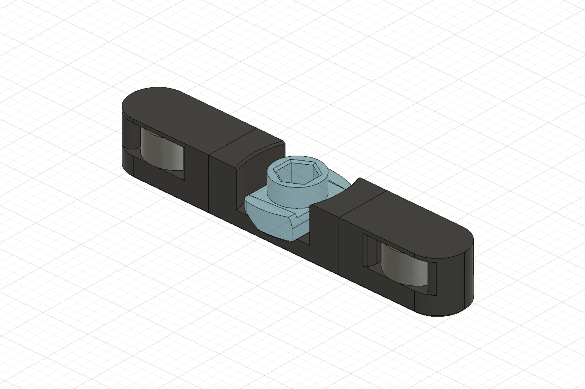
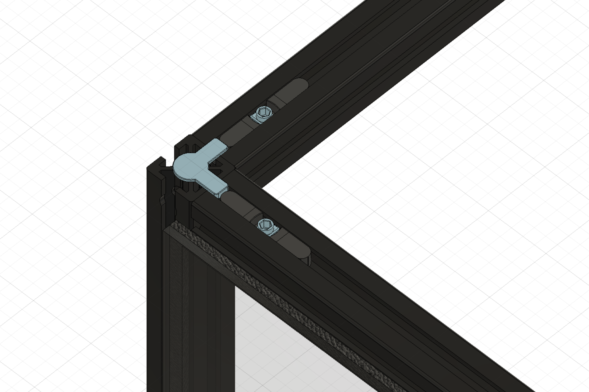

## Magnetic Panels with Magnet Inserts

Update 10/03/22: Adding a few alternative STLs.

* New V2 magnetic insert has been beefed up to resist cracking when used with stronger/N52 magnets. The retaining layer has been thickened slightly, though the extra plastic between magnets means a slight reduction in magnetic pull. These updated V2 magnetic inserts can be printed on their sides without bridging.
* New V2 unhmamer nut to go with the V2 magnetic inserts.
* Alternative V2 unhammer nut that uses a flat head screwdriver rather than a hex key. This will hopefully help with people who are experiencing rounding out with the hex version.
* If using V2 magnetic inserts, please use V2 unhammer nuts for proper fitment.

There are various panel latches and magnetic clips that offer quick panel removal for swapping between enclosed- and open-chamber printing, but I wanted to fix a few of the pain points that I ran into with some of the existing mods.

* Does not require a lot of filament. The corner and mid-panel clips were modeled after the stock Trident panel clips and are similarly hollowed, saving filament and print time.

* Uses a thin strip of VHB to adhere to the panels. This should provide (1) solid adhesion without the need for drilling or extra fasteners, (2) some amount of squish for the magnets to pull against, and (3) the ability to adjust or remove them in the future.

* The frame magnet inserts are designed to (1) require only printed parts and no additional fasteners aside from the 6x3 magnets, (2) sit inside the frame slot flush against the aluminum frame face, (3) be easily adjustable, and (4) retain the magnets without glue and allow removal for correcting polarity or salvaging. Discord@PF VT.520 came up with the idea of using a hammerhead-style rotating nut to tighten and press against the magnet insert, holding it in place. There are two included versions of the inserts. *Magnet-Insert.stl* is the original design but may be slightly more difficult to print due to the bridging involved. *Magnet-Insert-Side.stl* is redesigned for easier printing; namely, reoriented on its side, uses 45° chamfers rather than fillets, and does not require bridging.

* The panel's ability to sit right up to the face of the frame allows the panels to pop on and off without any interference.

* The only required parts are a small amount of VHB tape and a lot of magnets (48 6x3mm magnets for each panel).

*Magnet inserts hold two 6x3 magnets and is held in the aluminum extrusion with an unhammer*

*The corner and mid-panel clips hold matching 6x3 magnets*

*Installation jig makes it easy to set the proper spacing for corner inserts*

