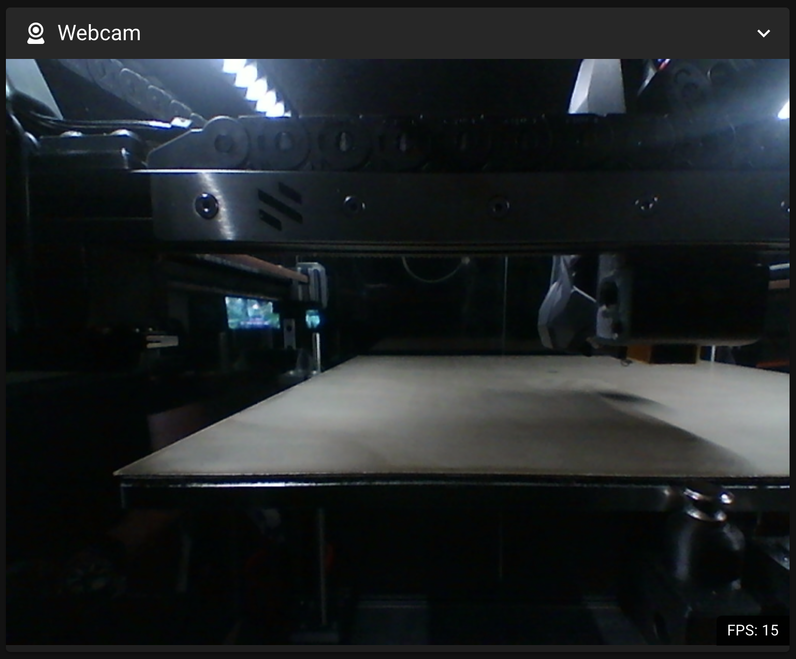

## OV5648 Camera Mount

For an in-chamber camera, I decided on trying a variant of the OV5648 camera ([Aliexpress](https://www.aliexpress.us/item/2251832770407060.html) with manual focus and a slightly wider camera angle and mounting it under the rear X extrusion on the opposite side from the Z cable chain. For the mount itself, I am basing it on the Panzer Observer for the slim profile, rotation, and minimal hardware.

### BOM

* OV5648 camera ([Aliexpress](https://www.aliexpress.us/item/2251832770407060.html)

* 2 heatset inserts

* 2 M3 T-nuts

*2 M3x10 or M3x12 screws

I’ve designed a new mount, body, and cover that will fit within the space, even on a 250mm build. The spacer will push the mount past the existing gantry printed parts. The mount has a center slot to accommodate one or two screws that will go through both the mount and spacer to drop-in M3 nuts inside the aluminum extrusion, and the mount has a recess to clear the M5 button heads on the A motor printed part. The overall length of the body and cover have been shortened as much as possible. This setup is flexible and can slide anywhere along that particular extrusion to fit any Trident build size. On any other extrusion, the mount can be used without the spacer. Cable relief has been removed from the original mount and added to the body of the camera housing to keep everything tidy.

*How it all comes together* - Here are how the different parts come together.

*This is where it goes* - The camera mounts in this little pocket between the rear vertical and the A motor. Unobtrusive with a low viewing angle. On my 300mm Trident, I can see the full Z-Tilt-Adjust.

*The spacer* - This spacer provides clearance to match the A motor's printed parts.

*The mount* - The mount has a scooped cutout to fit over the A motor's M5 BHCS. The slot is for the screws to secure through the spacer and into the two M3 nuts in the extrusion. The slot and scoop allows the camera to fit on any Trident bigger than 250mm.

*The camera* - Camera goes here.

*POV* - This is the camera's angle and point-of-view.
