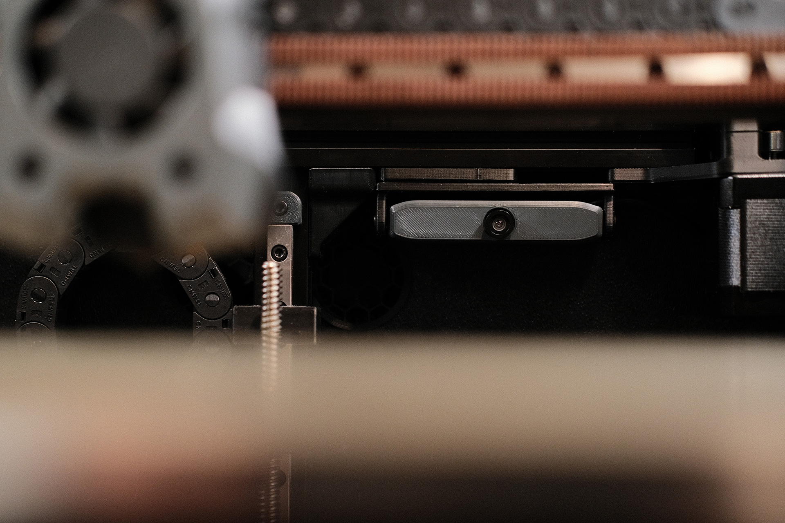
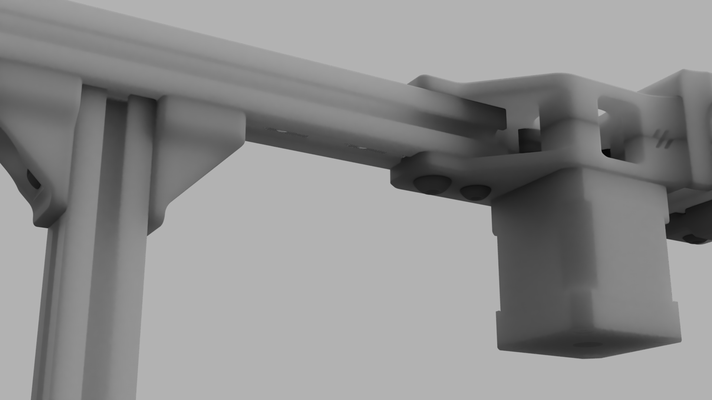
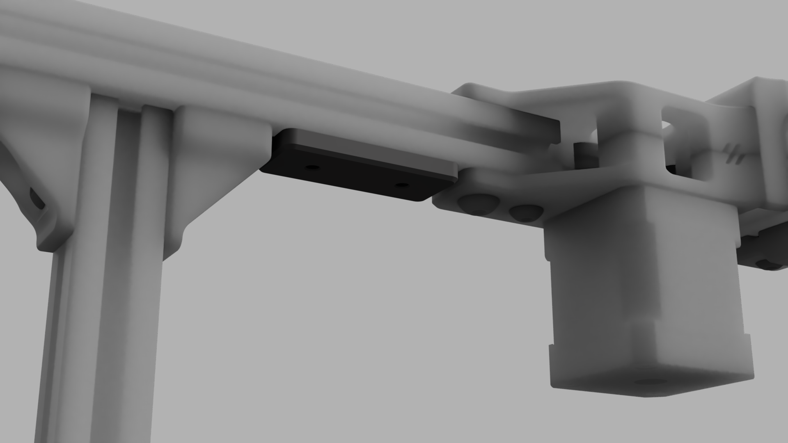
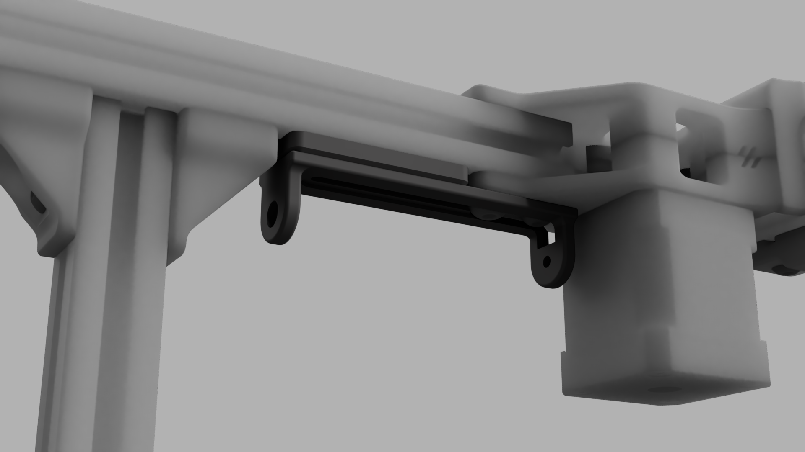
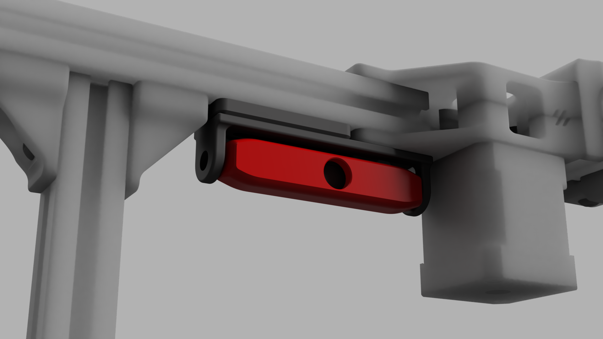

## OV5648 Camera Mount

For an in-chamber camera, I decided on trying a variant of the OV5648 camera with manual focus and a slightly wider camera angle and mounting it under the rear X extrusion on the opposite side from the Z cable chain. For the mount itself, I am basing it on the Panzer Observer for the slim profile, rotation, and minimal hardware.

I’ve designed a new mount, body, and cover that will fit within the space, even on a 250mm build. The spacer will push the mount past the existing gantry printed parts. The mount has a center slot to accommodate one or two screws that will go through both the mount and spacer to drop-in M3 nuts inside the aluminum extrusion, and the mount has a recess to clear the M5 button heads on the A motor printed part. The overall length of the body and cover have been shortened as much as possible. This setup is flexible and can slide anywhere along that particular extrusion to fit any Trident build size. On any other extrusion, the mount can be used without the spacer. Cable relief has been removed from the original mount and added to the body of the camera housing to keep everything tidy.

_How it all comes together_

_This is where it goes_

_The spacer_

_The mount_

_The camera_

