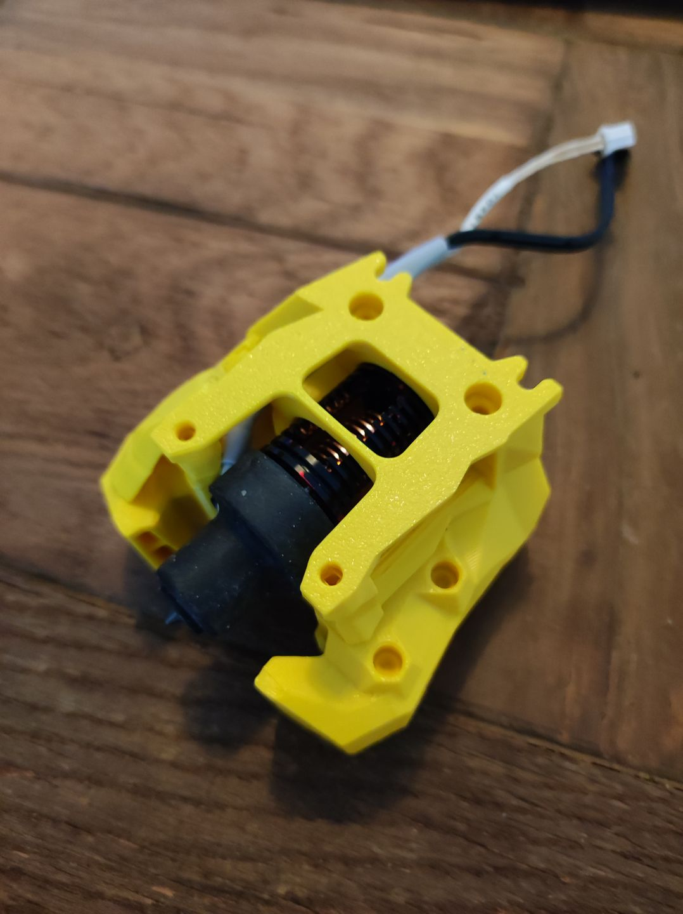
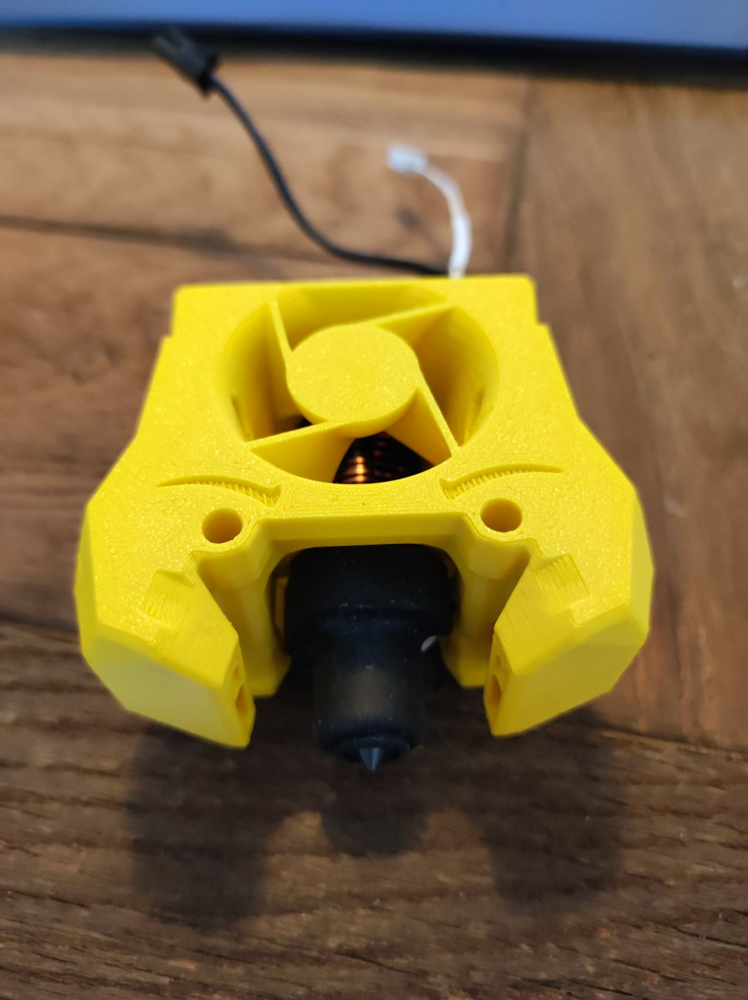

# Red Lizard K1 UHF toolhead 

Stealthburner toolhead for the Haldis Red Lizard K1-UHF. 

This is a Rapido style hotend which can be found at Aliexpress. It features a 115W heater while still fitting the regular Stealthburner front. 

For assembly you may have to remove the three screws to rotate the bottom part correctly. 
