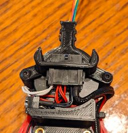
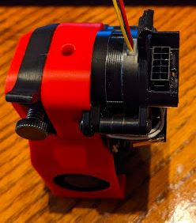
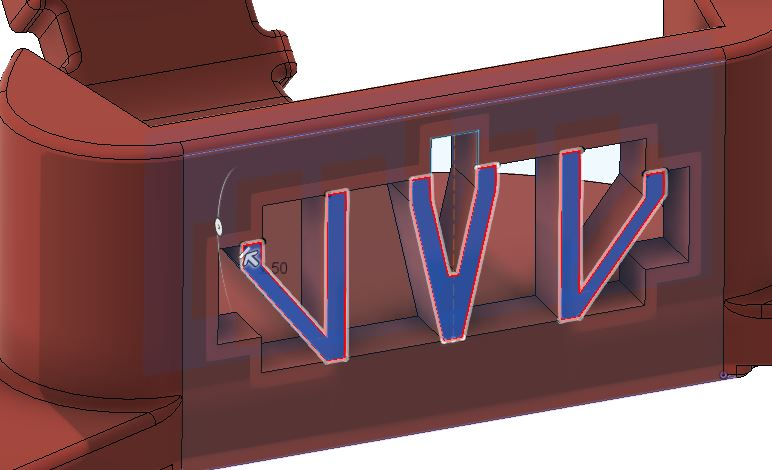

Strain Relief to Mount a Microfit 10 pin panel mount connector. Pics have bent cable tie from previous iteration, for printability without supports the STL included prints without support in your slicer. The hole for the connector has a V shaped built-in support that must be cut away to insert connector. Easily snips away with your flush cutters.

