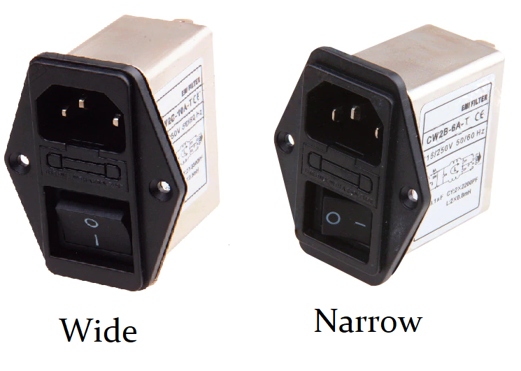
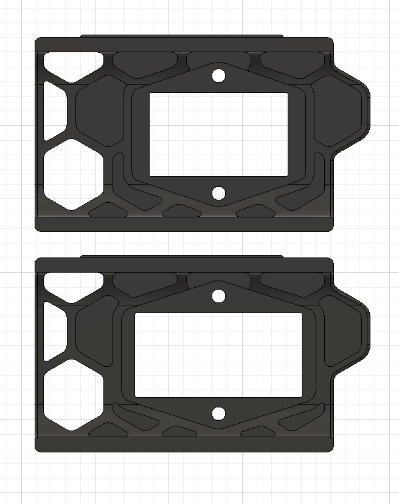

## Combo Inlet for Trident, 2.4 and 2.4r2

#### These skirt plates are for the fuse-filter-switch combo c14 inlets. 

Wide switch Shaffner FN283-10-06 inlets, metal case up to 57mm width.
- Or equivalent product from a reputable reseller. Amazon/Aliexpress not recommended.

Narrow switch in the style of adamstech inlets, metal case up to 48mm width.

BOM - Same as stock part, plus:
- 2 - M3 5x4mm heatsets (voron standard) 
- 2 - M3-8mm flat head screws (or longer)

