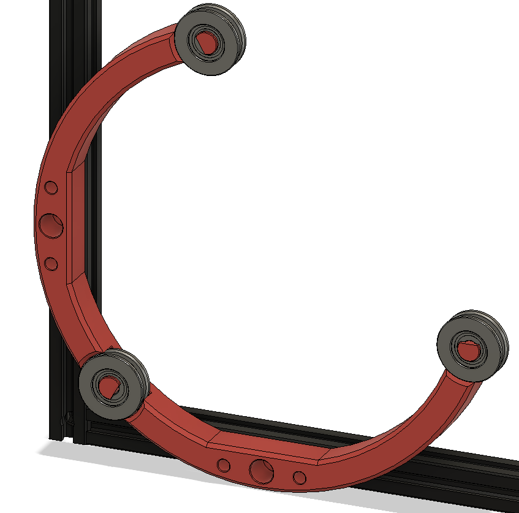

## Trident Internal Spool

### This is beta!  Has been tested on a few machines successfully. Please provide feedback for issues/suggestions to #Logan2225 on VoronDesign Discord.  Thanks! 

This is a method to mount the filament spool inside the enclosure of a Voron Trident 3d printer, or outside a V0, V1 or V2 printer. It works with 200mm, 1kg spools only. 

For mounting internally in the Trident, the ptfe tube is installed as shown: up through the gap in the side of the rear extrusion. Alternately you could drill a 4mm hole though the B stepper mount top and bottom parts. 

To install the spool: Feed the filament through the ptfe first, then align the spool into the front and top bearing rings, and pull forward to spring the frame and drop into the rear bearing ring. 

#### BOM:
- 3 608 bearings (any type)
- 2 M5-8mm pan head bolts
- 2 M5-Tnuts
- optional: 3 - M3-8mm bolts (any head type)

#### External version for V0, V1, V2
To mount the bearings securely, print the ShortPlasticBolt(3x) instead and use a m3-8mm PH or SH bolt to secure the pin in place. 

