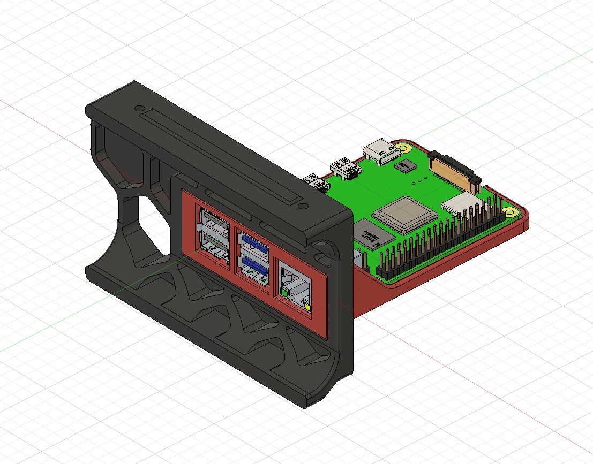
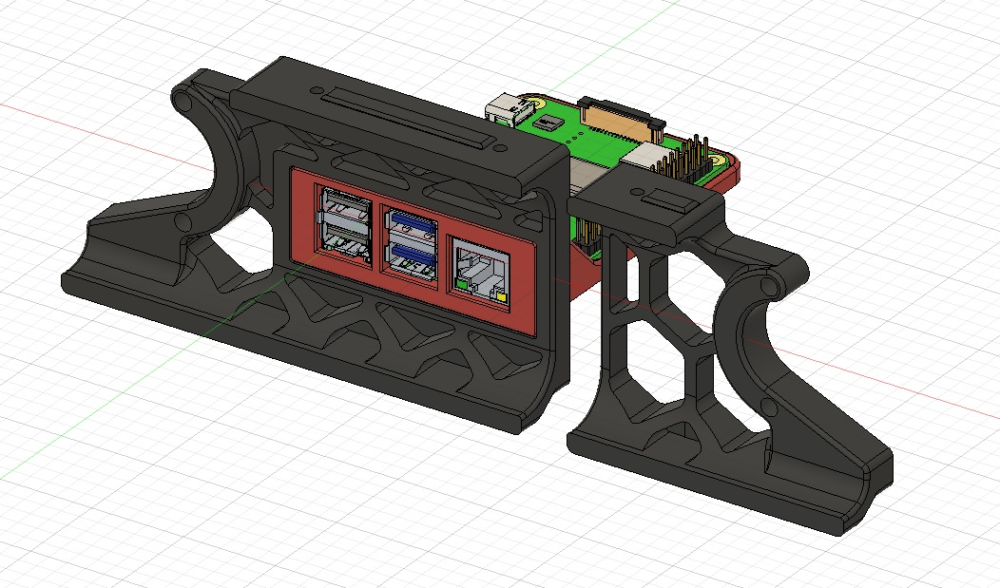

If you want to mount your Raspberry Pi so the usb and ethernet ports are externally accessable, look no further.  

Supported: Pi 3B/4B and Trident or Voron 2.4 machines.  
*New* Support added for Voron 2.4 250 size, and all 3 sizes of V2.4r2 

BOM: 
Uses stock hardware, no additional parts required. M2 screws for Pi to plate, other hardware is the same as stock skirt installation.

