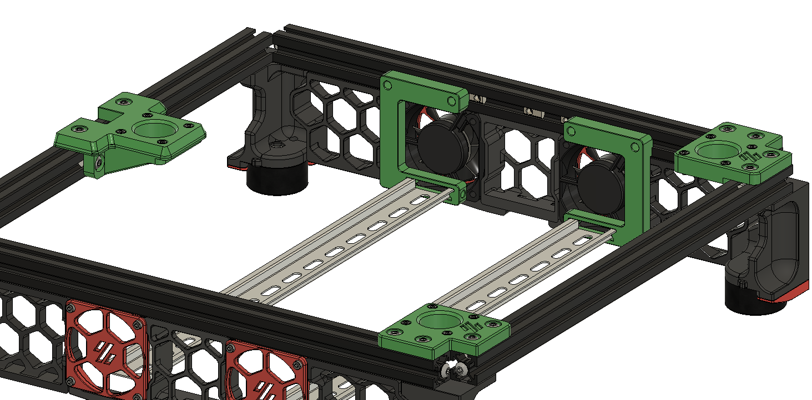

# Trident Inverted Electronics Bay Mod
(but can be used for the 2.4 as well with a hinged bed mod)

# Major update to align with 2.4r2 fan mounts!  
Included in the CAD (but not STLs) are the V2.4r2 skirt screw-on fan mounts. The STLs are available from the 2.4r2 STL repository. 

Newly added: C shaped din rail supports so no additional hardware is required. Also allows rails to be more easily installed front to back of printer if desired, as the C shape allows them to be installed around the power inlet and PiPlate.

You do not need custom panels!  The front Z stepper mounts have been modified to remove the captive part of the plate that locked the panel in place, so it can be just dropped in as shown in the animated gif below. 

No additional hardware required, BOM parts only. 

