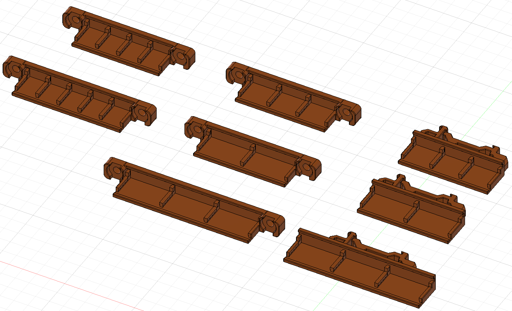

This is a simple mount for attaching wago 221-41x to extrusion: by power inlet and under bed, or to Din Rails, for smaller builds.

BOM - 2x M5-10mm bolts & 2x M5 T-nuts, Wago 221-41x

This is a simple angled mount for wago 221-41x blocks in sets of 3 that mount to a din rail using the Trident power supply din rail clip. Original design by Socal3D on voron discord, I just cleaned up the design and added the mount. 

BOM - 2x M3-8mm bolts, Wago 221-41x 

