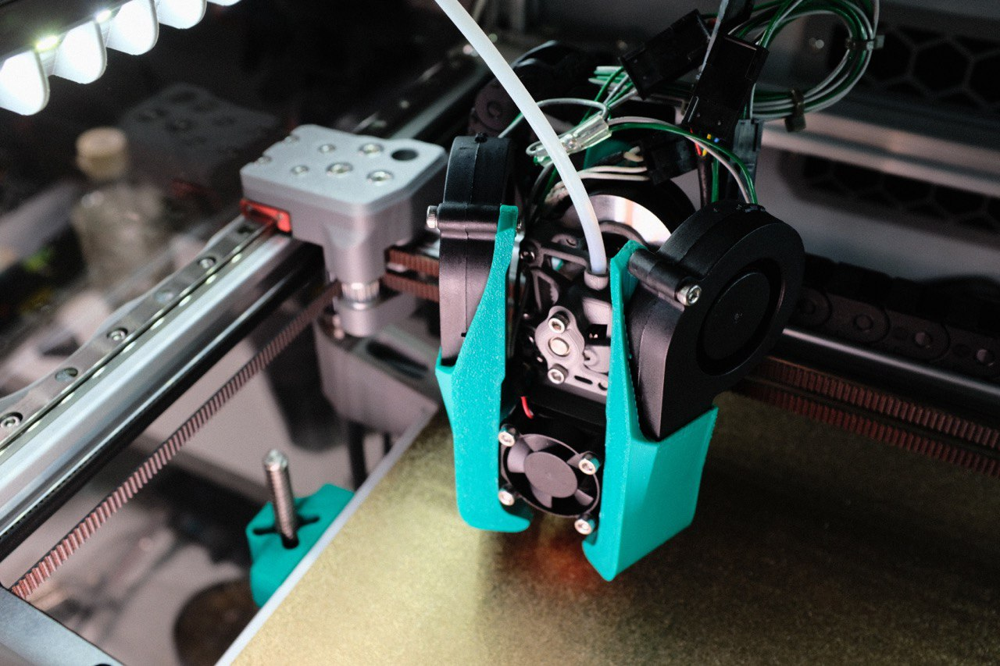
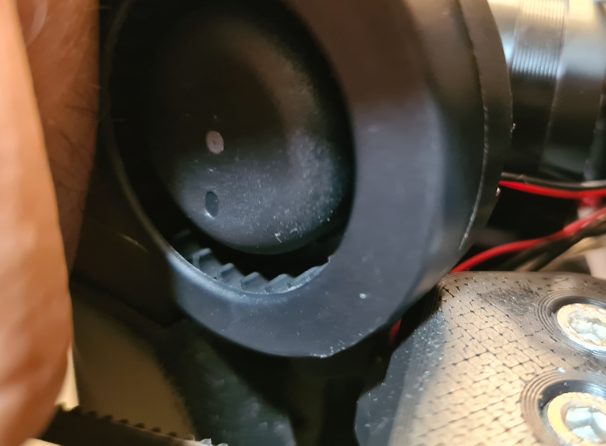

<table width=100%>
<TR>
<TD align="center"><B>Link</TD><TD align="center"><B>Description</TD></TR>
<TR><TD align="center"><a href="readme.md">Readme</A></TD><TD align="center">Mantis Description and Updates</TD></TR>
<TR><TD align="center"><a href="bom_acknowledgements.md">BOM and Acknowledgements</A></TD><TD align="center">BOM, links to other repositories, acknowledgements</TD></TR>
<TR><TD align="center"><a href="print_orientation.md">Print Orientation</A></TD><TD align="center">Printing the parts</TD></TR>
<TR><TD align="center"><a href="carriage_assembly.md">Carriage Assembly</A></TD><TD align="center">Building the MGN9, MGN12 Carriage, Hotend Mounts</TD></TR>
<TR><TD align="center"><a href="magprobe.md">Magprobe Assembly</A></TD><TD align="center">Assembly of Mag Probe</TD></TR>
<TR><TD align="center"><a href="firmware_slicer_settings.md">Firmware and Slicer Settings</A></TD><TD align="center">Firmware and Slicer Settings</TD></TR>
<TR><TD align="center"><a href="1.8_trident.md">Voron 1.8 and Trident</A></TD><TD align="center">Notes on Voron 1.8 and Trident</TD></TR>
<TR><TD align="center"><a href="final_assembly.md">Final Assembly</A></TD><TD align="center">Notes and Pictures of final assembly</TD></TR>
<TR><TD align="center"><a href="https://github.com/mandryd/MantisUsermods/tree/main/Usermods">Usermods</A></TD><TD align="center">Mods by Mantis Users (note: separate repository)</TD></TR>
<TR><TD align="center"><a href="https://github.com/mandryd/VoronUsers/tree/master/printer_mods/Long/Mantis_Dual_5015">Long's Mantis Repository</A></TD><TD align="center">Long's Repository for Mantis.  Updates and newest stuff will be found here</TD></TR>
</table>

  
Voron Trident
============
**Notes for building on a Voron Trident**
- Trident is compatible with Mantis using the files for 2.4.  
  - Thanks to WingZero for testing this.

Voron 1.8 
============
**Notes for building on a Voron 1.8 (NOT trident)**
- You will need to cut the rearward “ears” off the 5015 fans for clearance.
  - OscarGM was able to get the standard length ducts (found in the 2.4 folder) to clear. It looked tight, but it did clear.
  - The ducts in the 1.8 folder have 2mm extra clearance, and should clear with most fans.
  - The reason 1.8 needs the ears cut is because the duct start to look ridiculously long due to the inverted nature of the 1.8 gantry.
- Acknowledgements:
  - Just wanted to thank GarretWP, OscarGM, and Koonweee for being the brave souls to test and work with me to get it working with 1.8.
 <table width=100% border=0>
 <TR>
 <TD align="center" width=50%> </TD>
  <TD align="center" width=50%> </TD>
 </TR>
 <TR>
 <TD align="center" width=50%>Koonweee’s Voron 1.8 using 2mm extended ducts</TD>
 <TD align="center" width=50%>OscarGM’s Voron 1.8 with 2.4 ducts (clearance by cutting the 5015 ears)</TD>
 </TR>
 </table>
