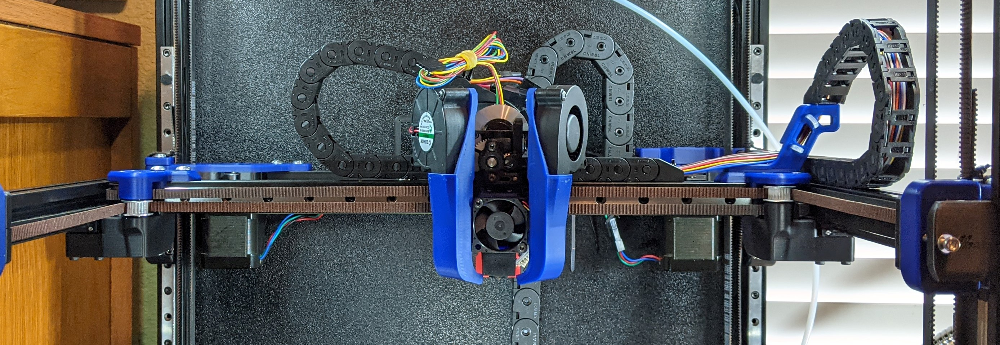
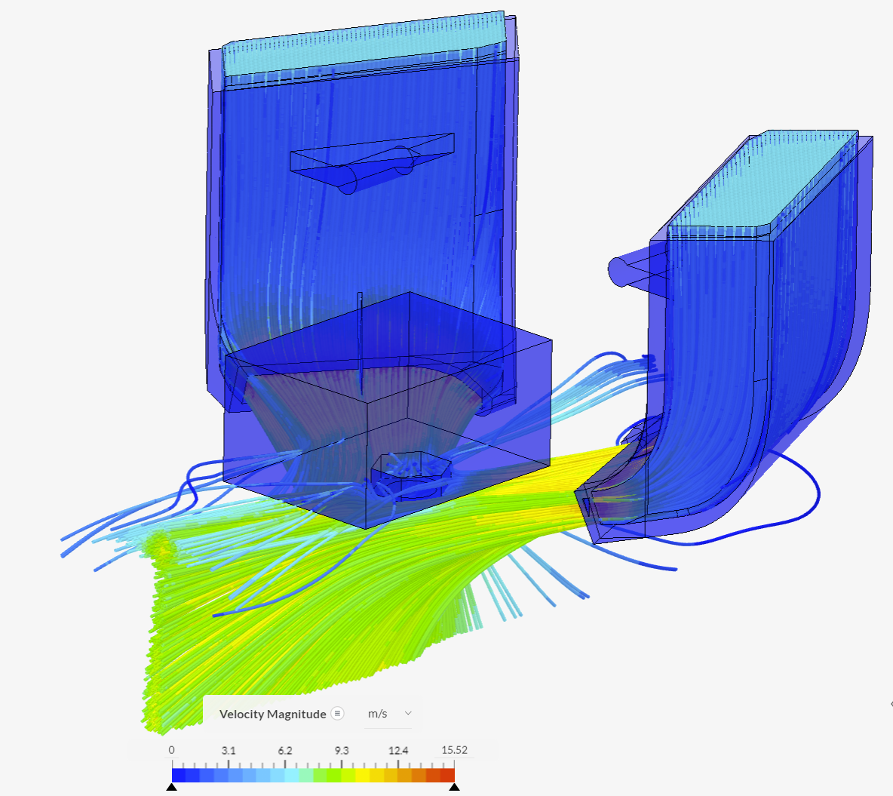

Mantis Dual 5015 Toolhead by Long
============
  
**Please see the ([Readme_v1.06.pdf](Readme_v1.06.pdf)) for full description, bom, etc**  
  
    
  
    

Changes
-----------------
7-18-2021
1.  Now compatible with Voron 1.8!
2.  updated readme
3.  changed directory structure for clarity
4.  magprobe dock arms v1.5 - new version of dock arms (for bed and gantry mount) which are tighter and longer (thanks to ShinyPants for lots of testing with these)
5.  carriage_v1.037 - minor revision adds a hole on the left side for ADXL mounting (thanks koonweee)
6.  chain_anchor_v3.2 - moved the front ziptie location higher.  added a rear ziptie location. (thanks koonweee)
7.  mantis_v1.037a.step updated - includes the above changes
