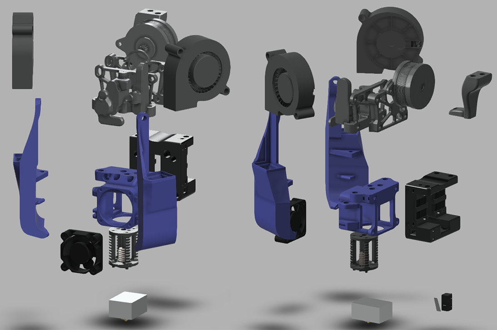

Mantis Dual 5015 Toolhead by Long
============
  
**Please see the ([Readme_v1.07.pdf](Readme_v1.07.pdf)) for full description, bom, etc**  
  
**Note that updates are staged at ([https://github.com/mandryd/VoronUsers/tree/master/printer_mods/Long/Mantis_Dual_5015](https://github.com/mandryd/VoronUsers/tree/master/printer_mods/Long/Mantis_Dual_5015)).  Go there for most recent stuff.**
  
    
  
    
  
   

**Features:**
* Now compatible with single MGN9 and MGN12 X-Rail.  
 * Dragon Hotend only right now although mods are floating around for others
 * Dual 5015
    - Left to Right airflow balance is no longer an issue
    - Single piece ducts without splitting and fewer bends = less duct losses
    - Total airflow is ~3x more than Longsfang using the same fans. 
* Lighter
    - This entire tool head weighs ~290g including the carriage
    - Spec AB is ~470g.  Spec AB with gailieo is ~375g.
    - Using single MGN9 removes an additional ~140g from the Y axis on a 300.  
 * Stiffer
    - Single piece carriage and hotend mounts are stiffer than spec.
 * Detachable Bed Probe (magprobe)
    - Decreases weight and allows shrinkage of the carriage.  
    - Direct probing of the bed surface.  Allows usage of any bed surface. 
 * More balanced weight
    - Hotend is moved closer the rail +y, and upwards +z
    - Gain in Y and Z travel (~5mm each)
 * Decreased length from extruder to hotend
    - Bowden from mini-sherpa to Dragon is only 19mm
 * X-endstop relocated to carriage.  Easy to transition to umbilical if desired.
    - Y-endstop can still be from the spec endstop pod on the right xy-joint.
 * Area around heat block is very open.  Ducts give wide berth to block.  Duct shouldn’t have any issues with melting.  
    - Josh Murrah has been printing ABS at 300c without duct melt.  
    
 **Cons:**
 * With spec front idlers, you will lose space at the front corners of the bed ~10mm in X at each idler.  
 * There are now alternative idlers that allow use of Mantis without any loss of build area
    - Rama - https://github.com/Ramalama2/Voron-2-Mods/tree/main/Front_Idlers 
    - Phalanx - https://github.com/selliott79/Other-V2-Idlers 
 * Some parts like the ducts and hotend mount are a bit tricky to print.
 * Thumb screw for the mini-sherpa will not fit.  Use a buttonhead to save space.
    - I bought 6mm diameter x 0.9mm coil diameter x 10mm length springs for extra clearance.
    - (Replaces stock 6mm x 1mm x 12mm spring) 
    - Depending on how much you tighten your screw, the standard 12mm one will work.

Readme and Link to Long's repository
-----------------
**Please see the ([Readme_v1.07.pdf](Readme_v1.07.pdf)) for full description, bom, build instructions, etc**  
  
**Note that updates are staged at ([https://github.com/mandryd/VoronUsers/tree/master/printer_mods/Long/Mantis_Dual_5015](https://github.com/mandryd/VoronUsers/tree/master/printer_mods/Long/Mantis_Dual_5015)).  Go there for most recent stuff.**

Changes
-----------------
11-3-2021
1.  Updated MGN12 carriage (Carriage_MGN12_v1.040.stl).  Updated the wire path from the magnets and x-endstop switch so they don't go through the hotend exhaust path.  Also improved the hotend exhaust path so it should flow a bit better.
2.  Added a usermods folder.  Adding the mods in and crediting the creator in the filename was getting unwieldy, so Mantis now has a usermods folder.
3.  Charles made a mount for a Hartk PCB Board.

10-11-2021
1.  Added Mantis Toolhead PCB by Henrikssn.  
2.  Added Mgn9 Klicky Carriage by Henrikssn.  This is a modded single mgn9 carriage that works with Josar's Klicky magprobe
3.  Added Flat Flexible Cable (FFC) mod by Be Water.  Allows use of the [FFC Kit by Schmidt Proto](https://www.schmidtproto.com/product-page/voron-2-4-ffc-mod-kit) with Mantis

9-23-2021
1.  Added carriage for Mantis that uses a single MGN9 linear rail.  I am currently using this with a RobotDigg 440 SUS rail and it's working well.  Thanks to Bob Arctor and Henrikssn for their bravery in testing the early versions of this.
2.  Updated ([Readme_v1.07.pdf](Readme_v1.07.pdf)).  Added info for the MGN9 Carriage, fixed some wording, added link to Rama's option for narrow front idlers.
3.  Added ducts for Voron 2.4 that are 1.5mm shorter.  Decreases the clearance from 3.5 to 2mm.  No real advantage except if you like the shorter duct arm appearance.
  
7-18-2021
1.  Now compatible with Voron 1.8!
2.  updated readme
3.  changed directory structure for clarity
4.  magprobe dock arms v1.5 - new version of dock arms (for bed and gantry mount) which are tighter and longer (thanks to ShinyPants for lots of testing with these)
5.  carriage_v1.037 - minor revision adds a hole on the left side for ADXL mounting (thanks koonweee)
6.  chain_anchor_v3.2 - moved the front ziptie location higher.  added a rear ziptie location. (thanks koonweee)
7.  mantis_v1.037a.step updated - includes the above changes
