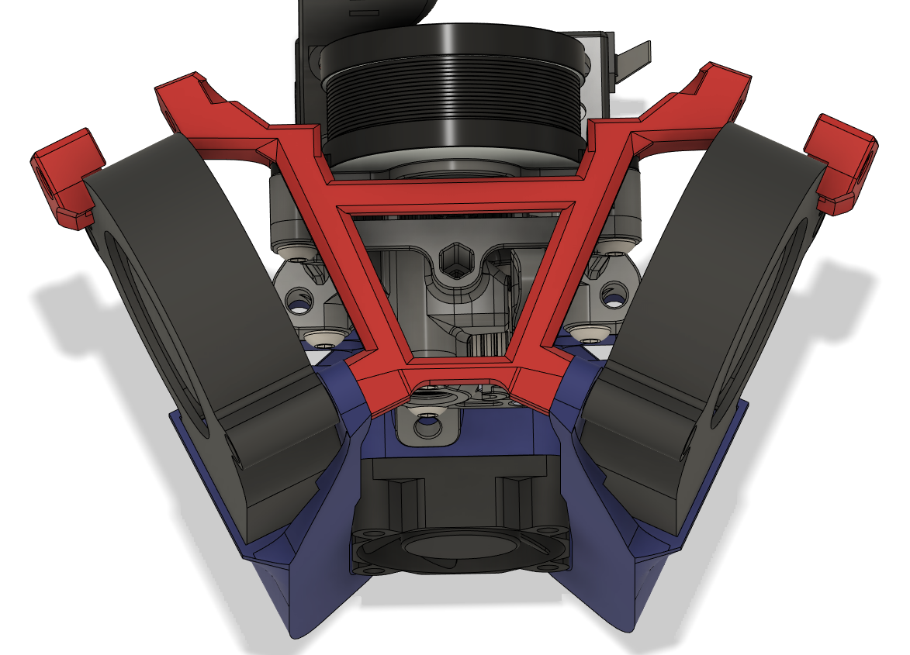
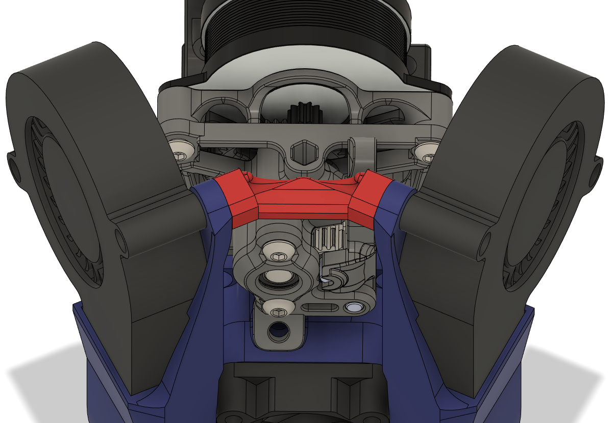
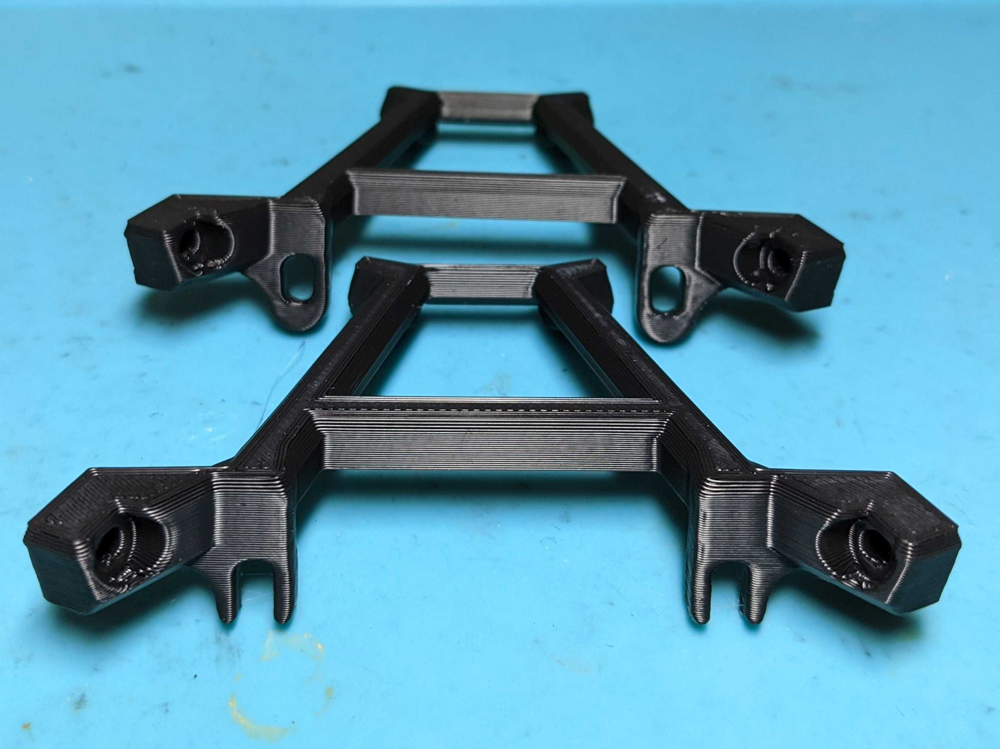
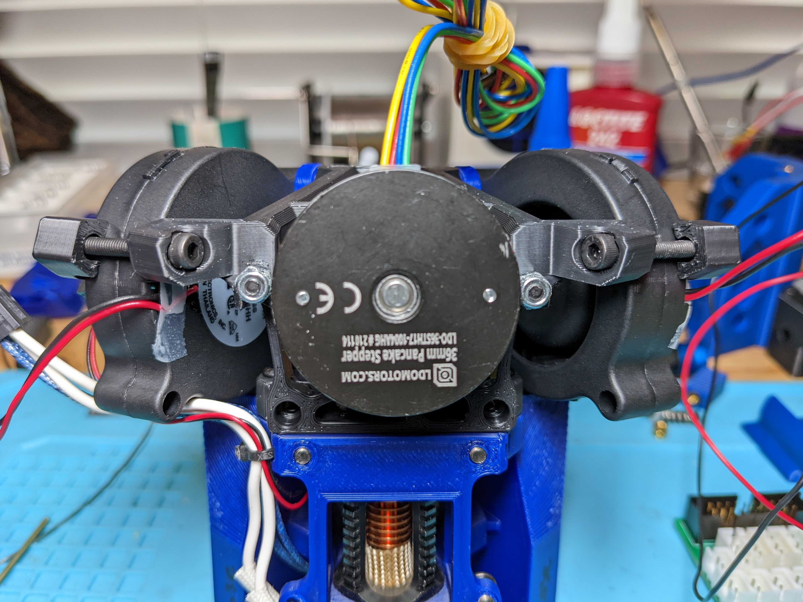

Duct Braces
============

<TABLE width=100%>
<TR>
<TD width=50% align="Center" valign="TOP"> Full Duct Brace</TD>
<TD width=50% align="Center" valign="TOP">Simple Duct Brace</TD>
</TR>
<TR>
<TD width=50% align="Center" valign="TOP"> Closed Mount (top) vs Open Mount (bottom) versions</TD>
<TD width=50% align="Center" valign="TOP"> Locknut to secure brace to motor.   Replace Sherpa mini to motor mount bolts with m3x20mm</TD>
</TR>
<TR><TD width=100% colspan=2 align="CENTER"></TD></TR>
</TABLE>

- **Purpose**
  - The Mantis 5015 mount is unstable due it being a single mounting point.  The rear and top part of the 5015s are susceptible to vibration on the x-axis resonance tests.  This results in a second 125hz peak on the X axis resonance graphs.
  - This is a rigid solution that makes the fan mounting much more stable and greatly decreases the 125hz peak.
- **Simple Brace Notes**
  - This is a quick and easy brace.  It decreases the x-axis resonance slightly and is very simple to install.  I highly recommend the full brace over the simple brace.
  - m3x25mm bolts through the upper duct arm mount and straight into the plastic of the duct brace.
- **Full Brace Notes**
  - *Just FYI, these are new parts, so I'm still polishing/adjusting things.*
  - There are two versions of the full brace parts.  
    - The open motor mount version is easier to mount but may be a weaker mounting surface, time will tell.  I bet it'll be ok.
    - The closed motor mount version is stronger, but requires you to unscrew the m3x20s during mounting of the duct.  It's not a big deal, but the option is there.  
  - I used a lock nut to clamp the duct brace to the sherpa mini motor.  This is annoying because there isn't enough space to fit a hex socket on the nut.  I'm looking into alternative ways to clamp the brace to the sherpa.
  - Yes, the rear 5015 clamp currently bolts from inside out.  The 4.5mm thick plastic + heatset clamps well and doesn't lean too much.  I'm looking into ways to have this clamp with the bolt head to the outside, but it works ok for now.  
    - The fans actually feel pretty rigid even without the clamps.  With more testing, the rear clamps may not be needed.  
  - Note: The clamps for **dragon** have slots to allow for the fan wires to pass though and thus need to be on the correct side.  
    - The clamps for rapido/crazy volcano do not require these slots, so left/right on the clamps shouldn't matter.    
- **Acknowledgements**
  - Thanks to Woenn for the idea for the simple duct brace.  He's the one that got me started on the bracing.
  - Thanks to Netweaver for the idea for the A-Frame connecting the sherpa mini motor to the front duct arms.  I took his idea and added the rear 5015 support/clamps.  He was relentless in testing and helping figure out where the extra vibration was coming from.

Changelog
============
- 05-02-2022
  - v1.2 full braces.  Added Slots to the rear fan clamping (where the bolthead goes at the rear of the horizontal brace).  Some 5015s are larger than others, so this will allow for some size differences.  
