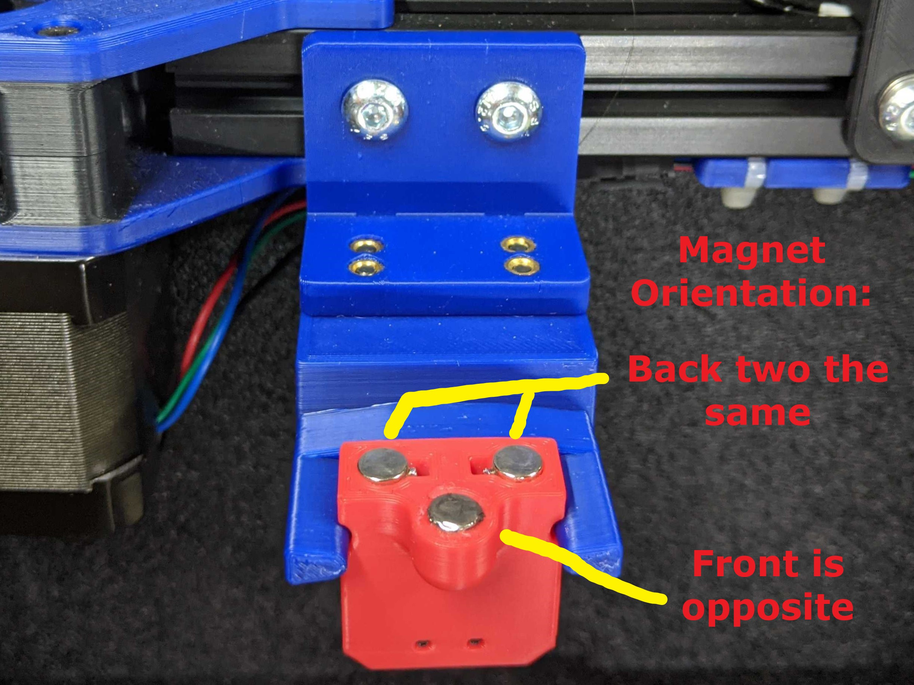

Gantry Mounted Mag Probe
============

- Print the dock mount, extrusion mount, and either of the dock arms.
  - Depending on your machine and the m2 screws you used on your mag probe, you may need the double magnet version of the dock arms.  I am using the single magnet version and I havent had the magprobe fall out during printing yet.  However some poeple have needed the double version.  I would say start with the single magnet version then swap to the double if necessary.
- Adjusting your dock mount
  - Height
    - This is straightforward. Adjust the height so the probe lines up with the arms.
  - Forward Reach 
    - I have my dock adjusted so that the magprobe, when docked, is actually a few mm further back (+y) than where the magnets of the carriage can reach.  
      - For example.  If the carriage magnets are at y305.  Then the mag probe magnets, when in the dock, can be at around y308 (out of the actual moveable range of the printer)
    - When picking up the probe, the mag probe will snap forward to the carriage magnets.  
    - When dropping off the probe, as the toolhead moves to the side, the mag probe will snap back to the dock.  
    - This allows you to have the magprobe just a few more mm out of your printing area.  

