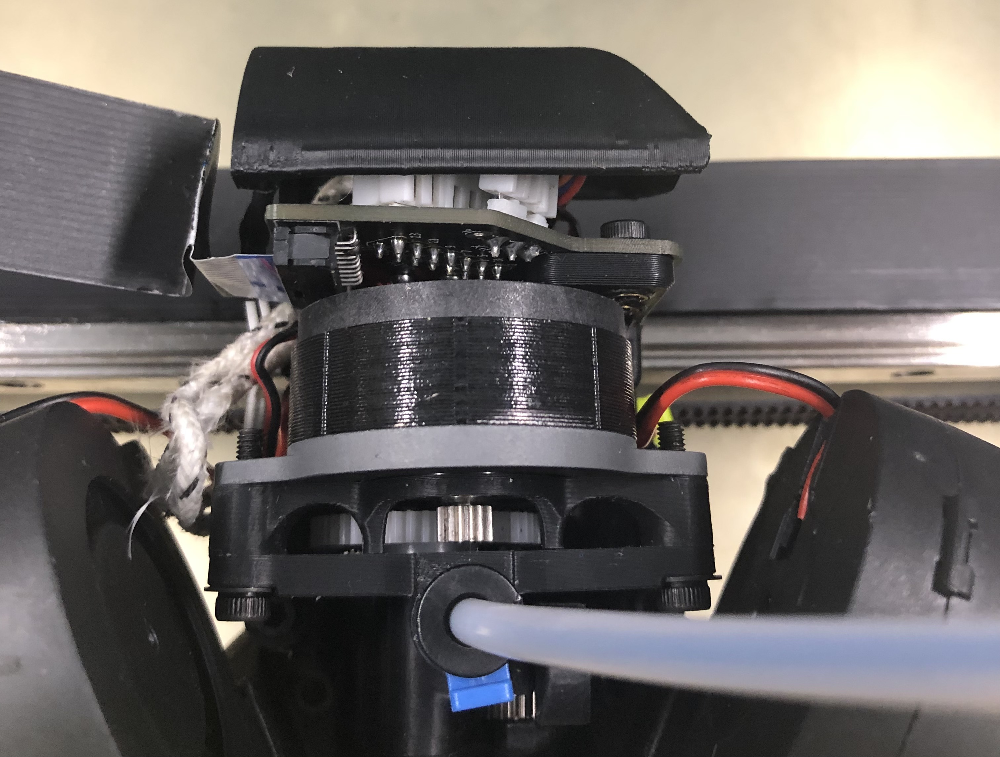
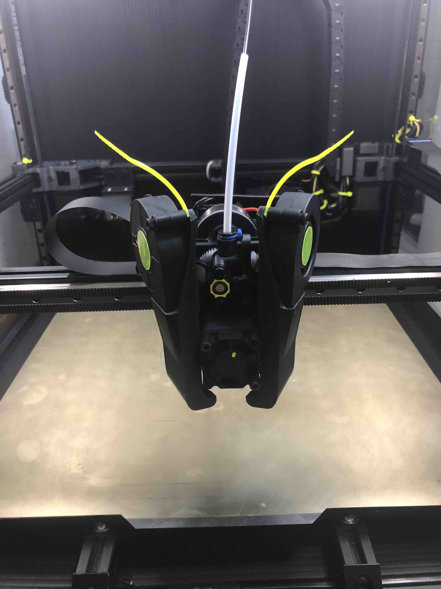
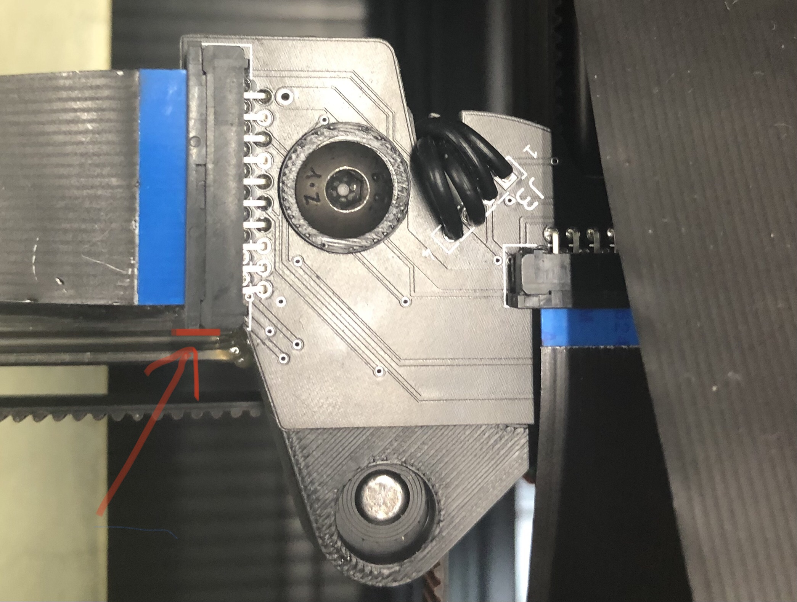
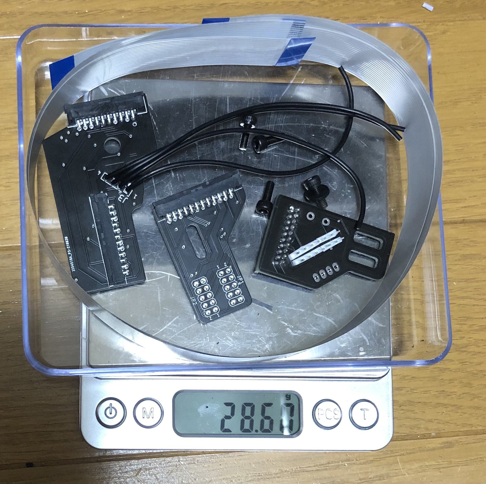
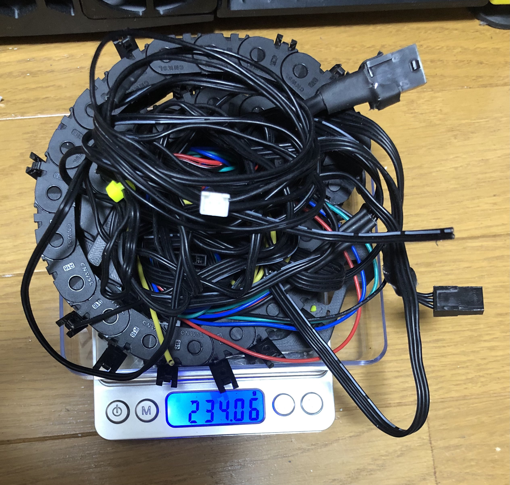

Flat Flexible Cable mod by Be Water
============
  
    
  

  

  

  
Info
-----------------
This mod by Be Water allows usage of the [FFC Kit by Schmidt Proto](https://www.schmidtproto.com/product-page/voron-2-4-ffc-mod-kit) with Mantis.

BOM:
- 2x standard heatset inserts
- 2x m3 x 8mm screws 
- 2x m3 x 6mm screws (8mm can work but may need to be filed down a little)

Build tips:
- Use the plastic M5 and M3 spacers on the X-Y pcb and the Y-Z pcb to prevent shorts. The toolhead pcb has adequate spacing.
- Press the two heatsets into the anchor so they are slightly recessed, creating a little gap to the PCB.
- Use the M3 x 6mm screws to attach the PCB to the anchor. Confirm they don't touch the back of your stepper.
- Tuck and manage cables to your liking, then attach the anchor, then the FFC cable, and then the cover.
- Fold the FFC cable 90°, 45°, then 90° as shown in the first picture. Add double-sided tape inside the resulting triangle portion.

CAUTION:
- Before homing X for the first time, loosen the XY PCB and slowly move the toolhead until you can make sure the endstop triggers consistently. 
- To help it clear the anchor when homing, on the X-axis FFC connector, on the right side of its locking tab, you may need to nip off the protruding part (~1mm) as shown with the red line in the corresponding picture.
- Then check that the Y ribbon doesn't hook on the right side fan when homing Y.
- Manage your wires carefully around where the ribbon attaches to the PCB so they don't touch the ribbon.
  
- Refer to the product page on schmidtproto.com for more.   

My wires got a bit frayed and messy from adjusting it a bunch but i've printed on this for about 20 hours now with no problems
