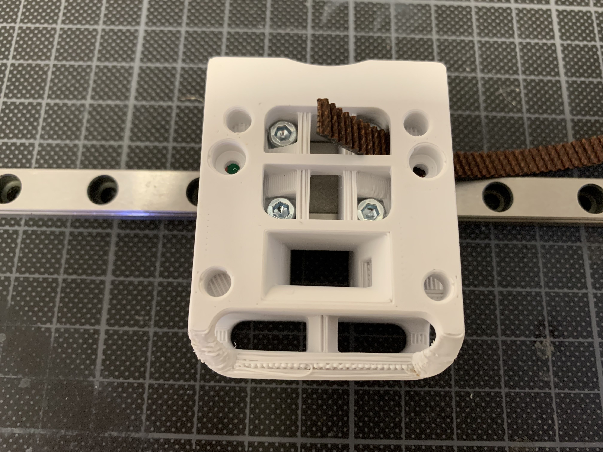
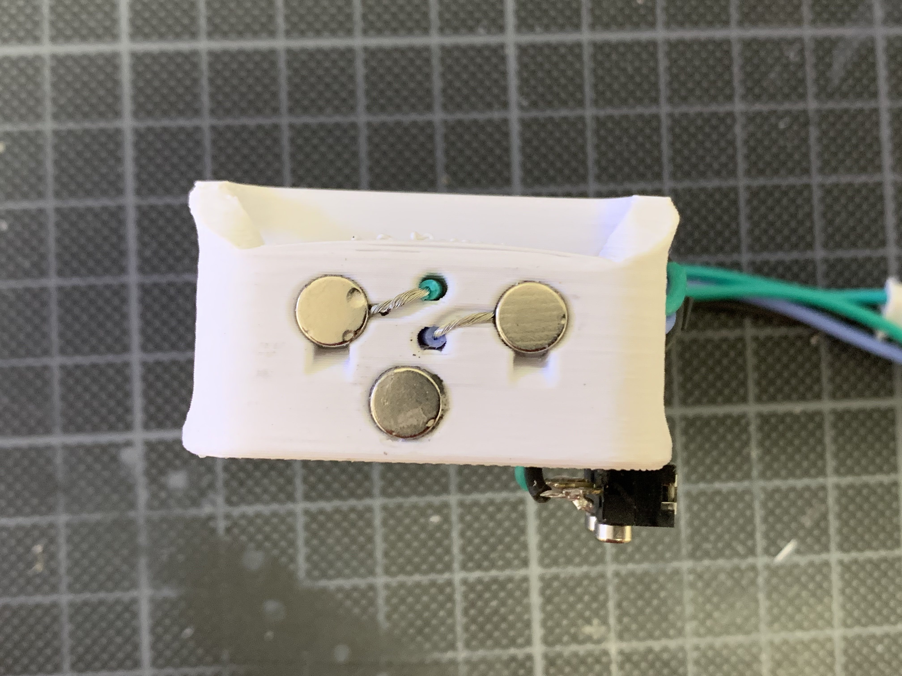
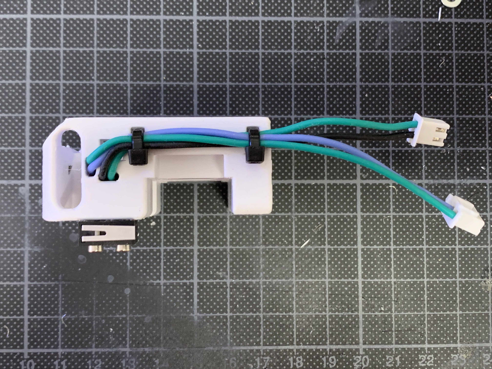
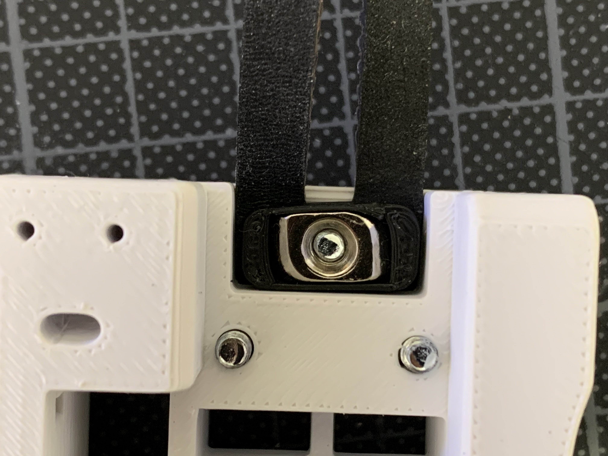

Klicky mod for single MGN9 Mantis by Henrikssn
============
  
    
  

  

  

Info
-----------------
This is a mod of the single MGN9 carriage which allows usage of ([Josar's Klicky Probe](https://github.com/jlas1/Klicky-Probe)) instead of the Mantis magprobe.  

The Klicky version and Mantis version of the magprobe function similarly.  If you prefer the Klicky magprobe, then this will work for you :).

The t-nut_adapter allows you to use a tnut and a printed part (if you don't have any makerbeam t-nuts or openbuild t-nuts).
