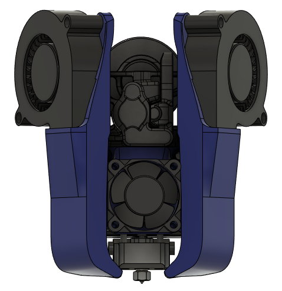

Slice Mosquito Mount for Mantis by Wingzero
============
  
      
  
Info
-----------------

 -  25mm Fan Version
    - I used one of the winsinn "high speed" fans on amazon with no problem
     - m2.5 hardware
       - m2.5x8 (x2) should be enough for mounting the mosquito at the top (im not sure on the lengths exactly)
       - m2.5x8 (x2) should be enough for attaching the mosquito on the back. 
       - m2.5x12 or m2.5x14 (x2) for attaching the fan to the mosquito heatsink
  - 30mm Fan Version (modification of Wingzeros Mount to use a 30mm Fan by Long)
    - Note:  This still needs more testing for confirmation that it works well.
    - Two versions in the folder.  One has support inbuilt.  Other if you want to generate your own supports.  This will actually print OK without supports also depending on your bridging abilities.  

Changelog
-----------------
- hotend_mount_mosquito_30mm_fan_v0.42
  - tightened tolerance between mosquito heatsink and the mount.
  - split the supports into four pieces for easier removal.
