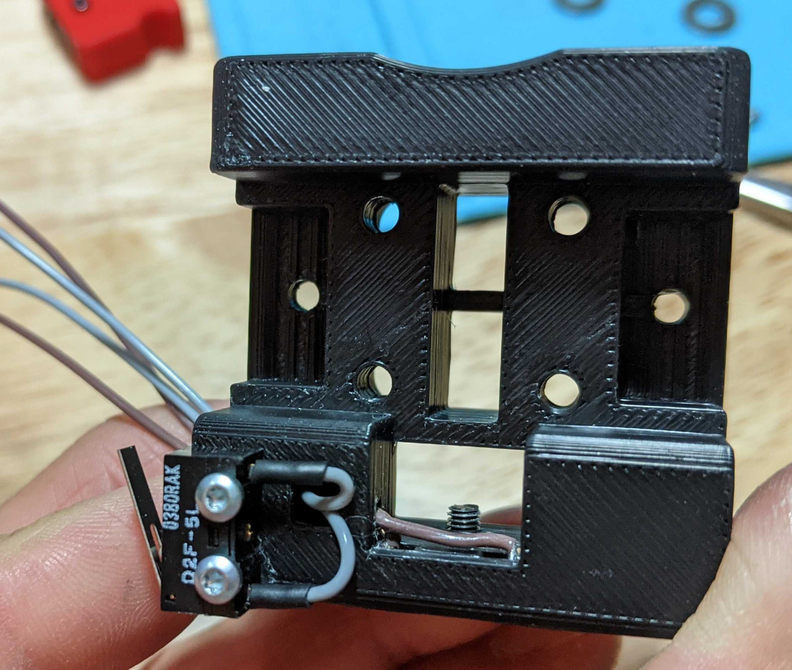
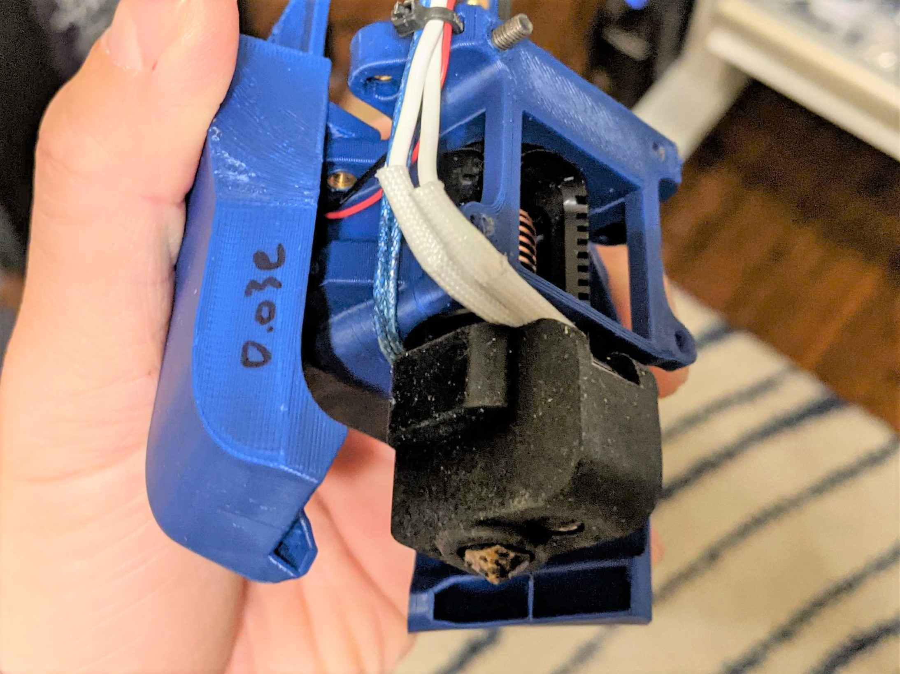

<table width=100%>
<TR>
<TD align="center"><B>Link</TD><TD align="center"><B>Description</TD></TR>
<TR><TD align="center"><a href="readme.md">Readme</A></TD><TD align="center">Mantis Description and Updates</TD></TR>
<TR><TD align="center"><a href="bom_acknowledgements.md">BOM and Acknowledgements</A></TD><TD align="center">BOM, links to other repositories, acknowledgements</TD></TR>
<TR><TD align="center"><a href="print_orientation.md">Print Orientation</A></TD><TD align="center">Printing the parts</TD></TR>
<TR><TD align="center"><a href="carriage_assembly.md">Carriage Assembly</A></TD><TD align="center">Building the MGN9, MGN12 Carriage, Hotend Mounts</TD></TR>
<TR><TD align="center"><a href="magprobe.md">Magprobe Assembly</A></TD><TD align="center">Assembly of Mag Probe</TD></TR>
<TR><TD align="center"><a href="firmware_slicer_settings.md">Firmware and Slicer Settings</A></TD><TD align="center">Firmware and Slicer Settings</TD></TR>
<TR><TD align="center"><a href="1.8_trident.md">Voron 1.8 and Trident</A></TD><TD align="center">Notes on Voron 1.8 and Trident</TD></TR>
<TR><TD align="center"><a href="final_assembly.md">Final Assembly</A></TD><TD align="center">Notes and Pictures of final assembly</TD></TR>
<TR><TD align="center"><a href="https://github.com/mandryd/MantisUsermods/tree/main/Usermods">Usermods</A></TD><TD align="center">Mods by Mantis Users (note: separate repository)</TD></TR>
<TR><TD align="center"><a href="https://github.com/mandryd/VoronUsers/tree/master/printer_mods/Long/Mantis_Dual_5015">Long's Mantis Repository</A></TD><TD align="center">Long's Repository for Mantis.  Updates and newest stuff will be found here</TD></TR>
</table>

Carriage and Hotend Mount Assembly
============
**Carriage Assembly:**
- Magnets:
  - <a href="https://youtu.be/G4MdrRXfb1M">Quick video on soldering magnets</A>
  - Sand the side of 2 m6x3 magnets. Place a magnet on a bigger stack of magnets then solder a piece of wire to the side as shown.
  - If you don’t have the magnet on the bigger stack, your magnet will lose some of its magnetic strength. I haven’t tested, but I think it’s probably ok because of the double stack with an unsoldered magnet (and the magnet being soldering is the magnet on the inside).
  - Put superglue into the magnet holes.
  - Place the second magnet on the soldered magnet, and then press the two magnets into the hole so the unsoldered magnet is out. The magnets should sit “proud” of the carriage.  
  - I use a flat surface to press the magnets in and then lap them so they mate well with the mag probe.
  - Note, previously, attaching the magnets by pinching the wires was thought to be ok.  After further testing, the "wire pinch" method of attaching the wires to the magnets is no longer recommended due to failures of the connection over time.
  - 
- Misc Notes
  - Adjust the tilt of your magprobe by screwing in and out the m3x6 button head screw on the bottom of the carriage.
  - Do not forget to put superglue into the holes in the carriage prior to putting in the magnets.
  - Hole on left side of carriage is for ADXL mounting. (Thanks @Koonweee)
- Heatsets
  - As shown on front and top. There will be an extra hole on top/right. This extra hole is currently unused and is present to allow for mods.  

**MGN9 Carriage Notes:**
- Notes
  - Mounting Mantis with a single MGN9 carriage is possible. I am currently testing this with a Robotdigg 440 SUS MGN9 rail. So far, I am not noticing any loss in quality after switching from MGN12 using the same slicer profile. However, your results may vary depending on the quality of your linear rail.
  - For a Voron 300, MGN12 is 278g. MGN9 is 157g, which will help during Y-axis moves. 
  - Is it better than mgn12? I haven’t tested long enough to know. I will eventually ramp speeds and see.
- Printing and Assembly
  - The MGN9 carriage is tricky to get to print perfectly due to some steep overhangs. However, if these overhangs do not come out well, it should not affect the functionality of the part. The overhangs are part of the belt path, so as long as the belt goes through from the back to the front, you’ll be ok.
  - The belts are clamped using makerbeam T-nuts (see the V0.1 BOM for these)
  - You can use up to m3x8mm or m3x10mm SHCS or BHCS with the T-nuts.
  - m3x10mm nuts will make threading the belts easier.
  - I used openbuild T-nuts (because I had them around) and dremeled them narrower
  - m3x8mm bolts to attach carriage to MGN9.
  - Make sure the carriage is straight while tightening. If your carriage is tilted, using Auto-Z calibration will give inconsistent results. If you need to adjust the tile, note that you can loosen the carriage bolts without loosening the belts
<table>
  <TR>
    <TD align="CENTER" width=50%></TD>
    <TD align="CENTER" width=50%></TD>
  </TR>
<TR>
    <TD align="CENTER" width=50%> I'm using a filed down openbuild T-Nut here.  There are other mods to use t-nuts and hex nuts in <a href="https://github.com/mandryd/MantisUsermods/tree/main/Usermods">usermods.</a></TD>
    <TD align="CENTER" width=50%></TD>
</TR>
</table>
  

**Hotend Mount Assembly:**
- Heatsets and screws
  - Install heat sets into the obvious places.  
  - 3010 fan uses screws directly into plastic.

<table>
  <TR>
    <TD align="CENTER" width=50%> <B>Dragon</B> Heater cartridge is pointed to the back (opposite of afterburner/stealthburner)</TD>
    <TD align="CENTER" width=50%></TD>
  </TR>
<TR>
  <TD align="CENTER" width=50%> <B>Crazy Volcano</B> Note Heater block orientation and wire pathing.</TD>
  <TD align="CENTER" width=50%> <B>Rapido</B> Print the hotend mount (Hotend_Mount_Rapido_v.03 or Hotend_Mount_Rapido_v.03_Rotated120Degrees) that has the Phaetus logo on the sock facing directly forward.   Wires should come out right/forward</TD>
</TR>
</TABLE>
<Table>
<TR>
  <TD colspan=3 width=100%>Hotend mount (Hotend_Mount_Dragon_v1.040_sherpa_brace.stl) for dragon/dragon with crazy volcano that accepts <a href="https://github.com/Annex-Engineering/Annex-Engineering_User_Mods/tree/main/Extruders/Sherpa_Mini/Extruder_Mods/Long-housing_front_angled_front_brace">modified Sherpa mini housing_front</a>, which triangulates the extruder mounting and adds some stability.</TD>
</TR>  
<TR>
  <TD align="CENTER" width=33%></TD>
  <TD align="CENTER" width=33%></TD>
    <TD align="CENTER" width=33%> </TD>
</table>

- Hotends
  - Dragon and Dragon/Crazy Volcano
    - Both use the same Dragon Hotend Mount
  - Rapido
    - Uses a slightly modified hotend mount that rotates the heatsink slightly.  This is to allow the Rapido sock to be mounted symmetrically at the bottom with the logo forward.  
    - The Rapido sock isn't a symmetrical hexagon.  It is important for the Phaetus logo to be facing forward.  The part cooling ducts for Rapido have been designed to blow air under the sock in this orientation.  
