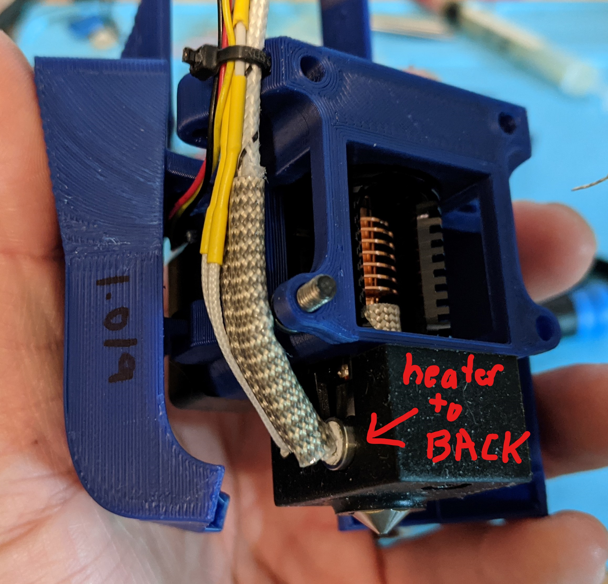
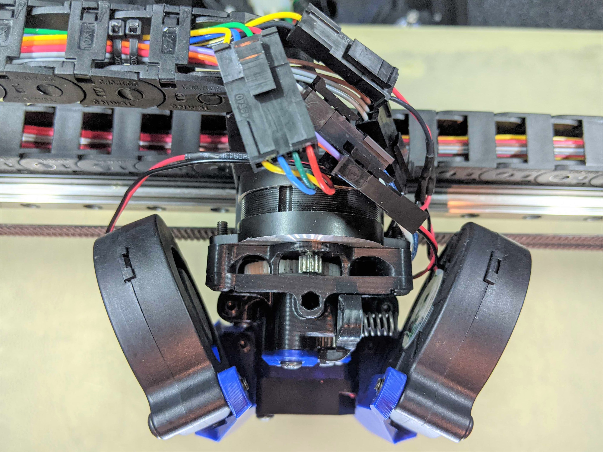
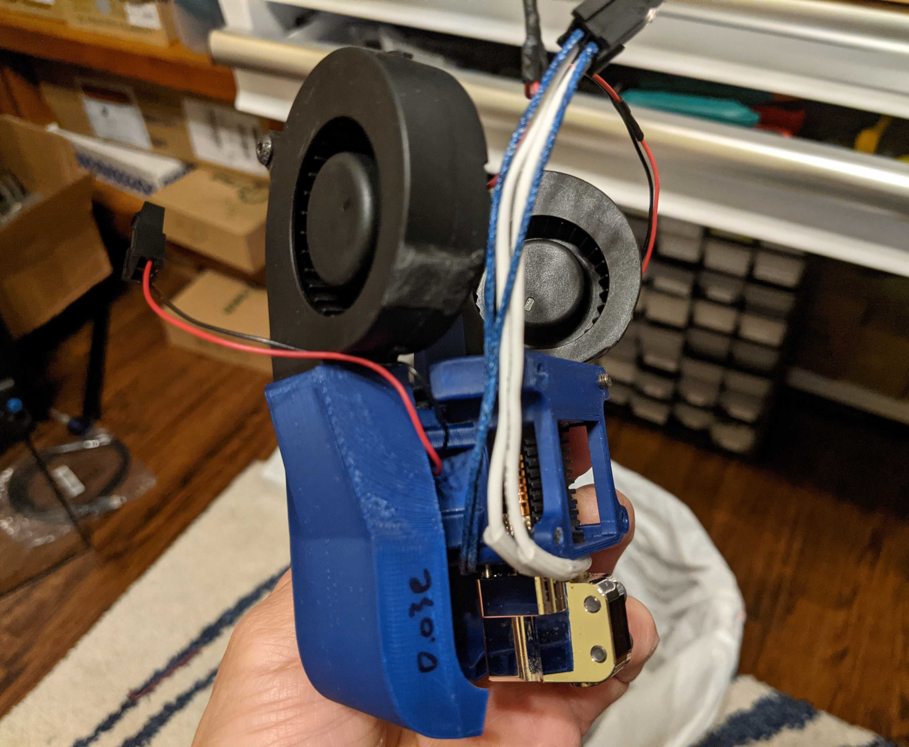
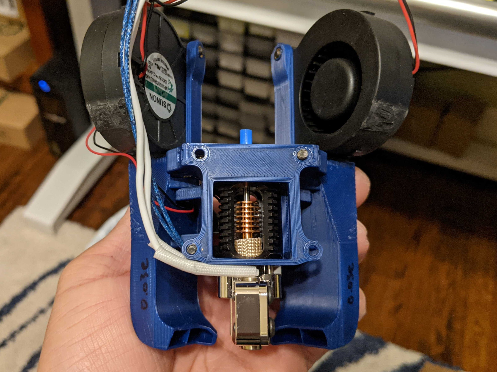
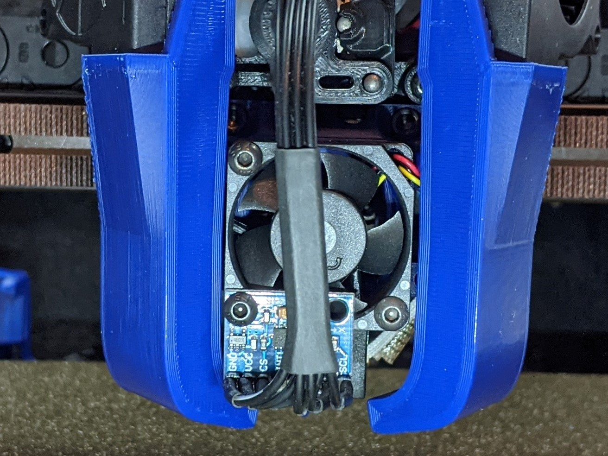
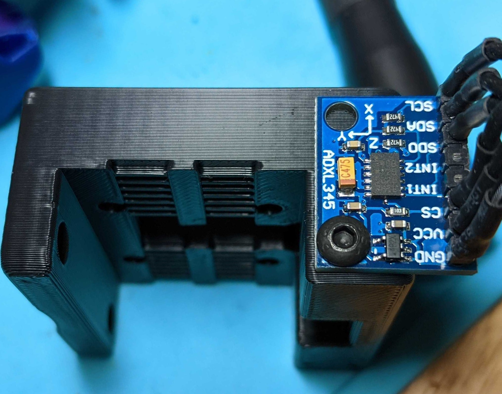
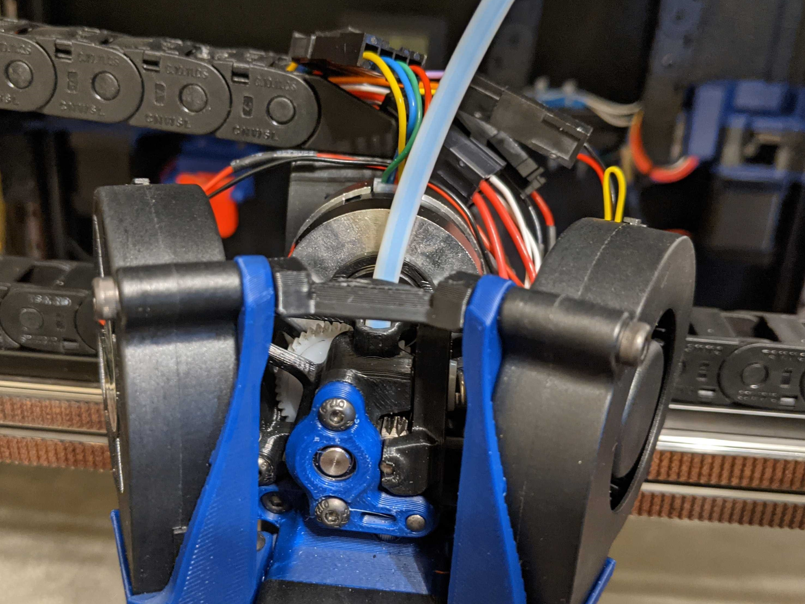
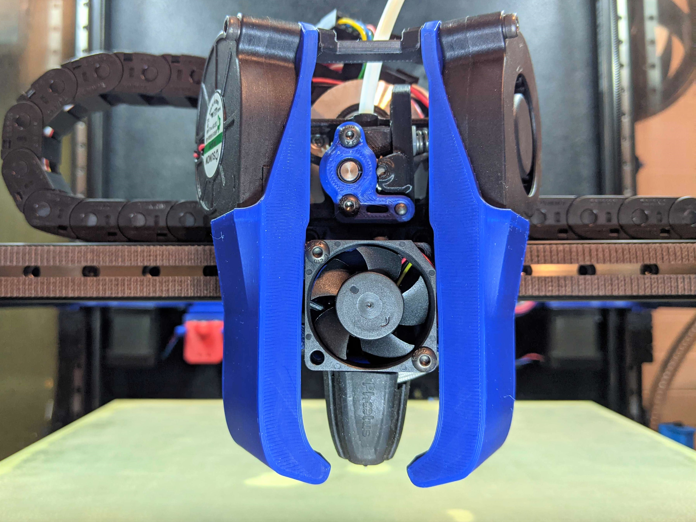

<table width=100%>
<TR>
<TD align="center"><B>Link</TD><TD align="center"><B>Description</TD></TR>
<TR><TD align="center"><a href="readme.md">Readme</A></TD><TD align="center">Mantis Description and Updates</TD></TR>
<TR><TD align="center"><a href="bom_acknowledgements.md">BOM and Acknowledgements</A></TD><TD align="center">BOM, links to other repositories, acknowledgements</TD></TR>
<TR><TD align="center"><a href="print_orientation.md">Print Orientation</A></TD><TD align="center">Printing the parts</TD></TR>
<TR><TD align="center"><a href="carriage_assembly.md">Carriage Assembly</A></TD><TD align="center">Building the MGN9, MGN12 Carriage, Hotend Mounts</TD></TR>
<TR><TD align="center"><a href="magprobe.md">Magprobe Assembly</A></TD><TD align="center">Assembly of Mag Probe</TD></TR>
<TR><TD align="center"><a href="firmware_slicer_settings.md">Firmware and Slicer Settings</A></TD><TD align="center">Firmware and Slicer Settings</TD></TR>
<TR><TD align="center"><a href="1.8_trident.md">Voron 1.8 and Trident</A></TD><TD align="center">Notes on Voron 1.8 and Trident</TD></TR>
<TR><TD align="center"><a href="final_assembly.md">Final Assembly</A></TD><TD align="center">Notes and Pictures of final assembly</TD></TR>
<TR><TD align="center"><a href="https://github.com/mandryd/MantisUsermods/tree/main/Usermods">Usermods</A></TD><TD align="center">Mods by Mantis Users (note: separate repository)</TD></TR>
<TR><TD align="center"><a href="https://github.com/mandryd/VoronUsers/tree/master/printer_mods/Long/Mantis_Dual_5015">Long's Mantis Repository</A></TD><TD align="center">Long's Repository for Mantis.  Updates and newest stuff will be found here</TD></TR>
</table>

Final Assembly
============
**Final Assembly:**
- Use button heads for everything if possible to save weight
-  ****note the heater cartridge location**
   - heater cartridge should be towards the back
- ADXL can be mounted on the left side of the carriage or using one of the 3010 mount holes.
- Duct_Brace_v1.0.stl can be used to brace the upper duct arms.  
  - The x-axis Resonance grace sometimes has a second resonance at ~110hz.  This brace can help mitigate that.  Prior to the duct brace, I used the MZV recommendation and didn't really have issues with ringing.  The duct brace improves the resonance graph, but I'm not sure if it makes a real world difference in print quality.  
  - Put the duct brace between the two upper duct arm/5015 mount holes and mount the fan to the duct arm and the duct brace with a m3x25.  
<table width=100%>
<TR>
<TD width=50% align="center"> The heater is always oriented towards the back with Mantis</TD>
<TD width=50% align="center"> Note you can also use heatsets in the 5015 mount arms</TD>
<TR>
<TD width=50% align="center"> Crazy Volcano.  Heater also goes towards back.</TD>
<TD width=50% align="center"> Crazy Volcano's narrow heat block allows nice angles of attack for part cooling to the nozzle and better part cooling airflow than with dragon, mosquito, or rapido.</TD>
</TR>
<TR>
<TD width=50% align="center"></TD>
<TD width=50% align="center"></TD>
</TR>
<TR>
<TD width=50% align="center"> Duct brace can help with the duct arm stability.</TD>
<TD width=50% align="center"> Rapido with duct brace.</TD>
</TR>
   
</TABLE>
