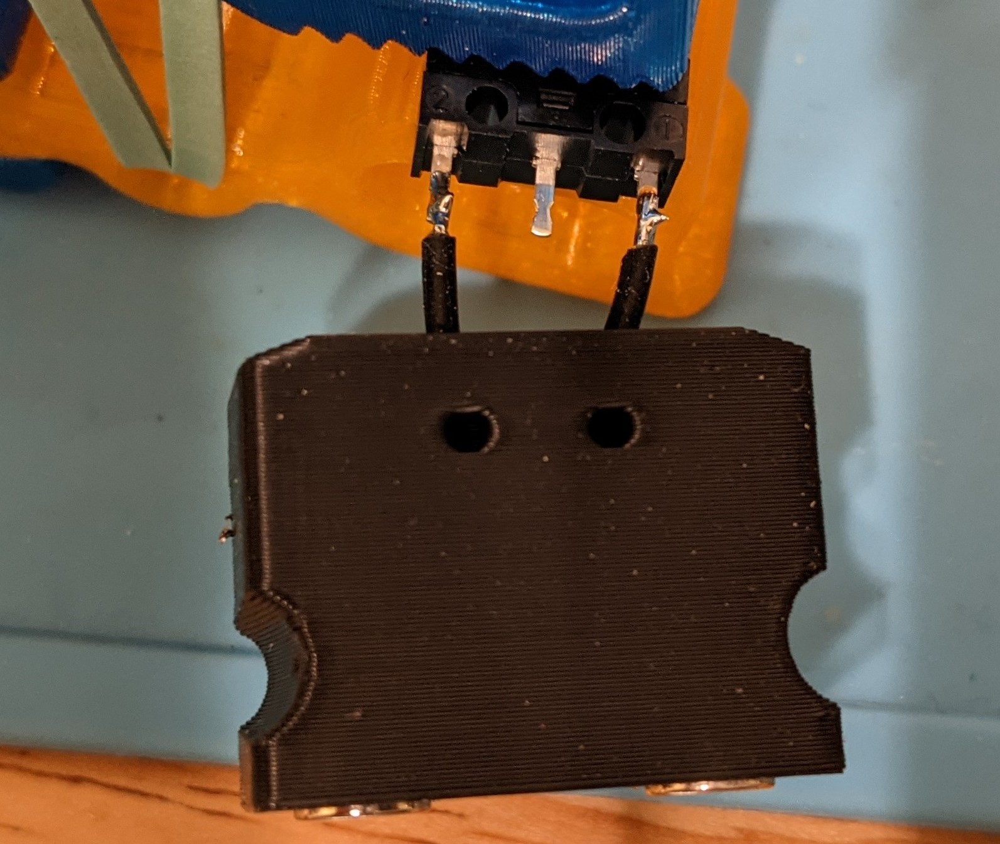
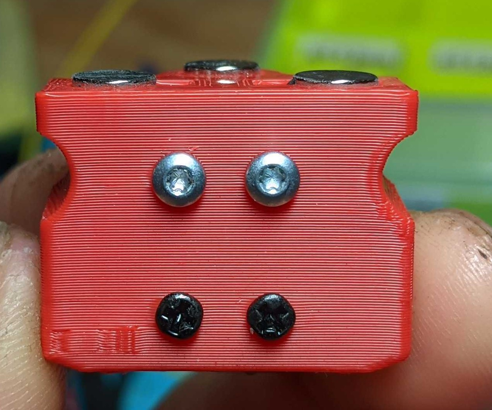
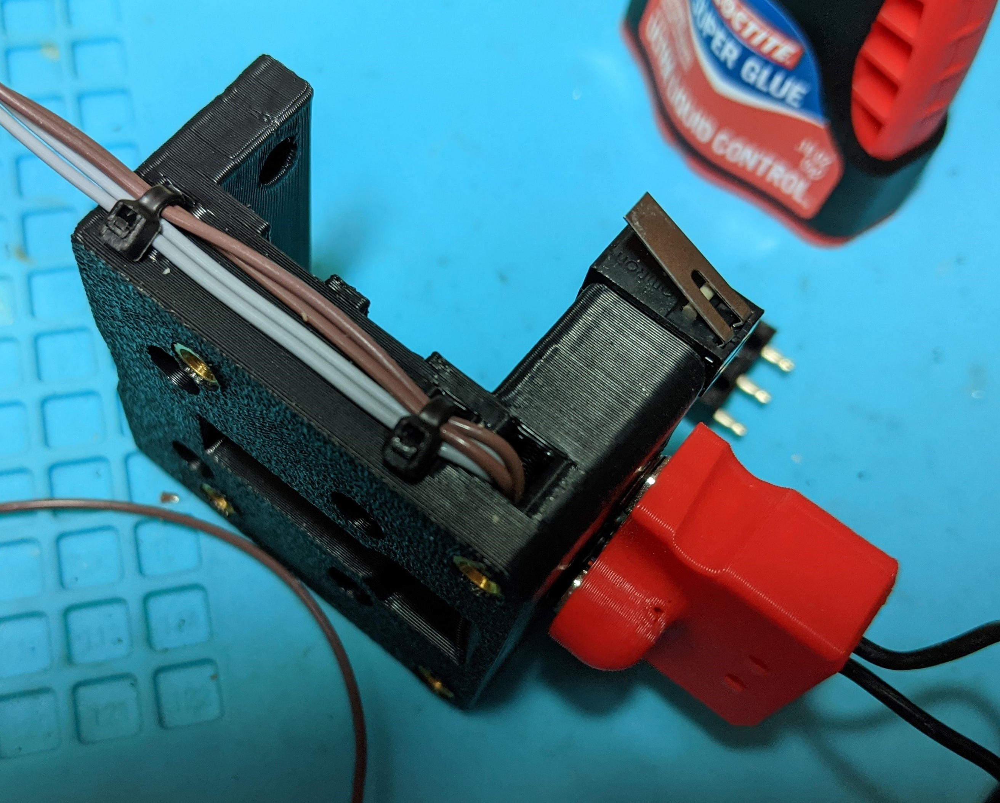
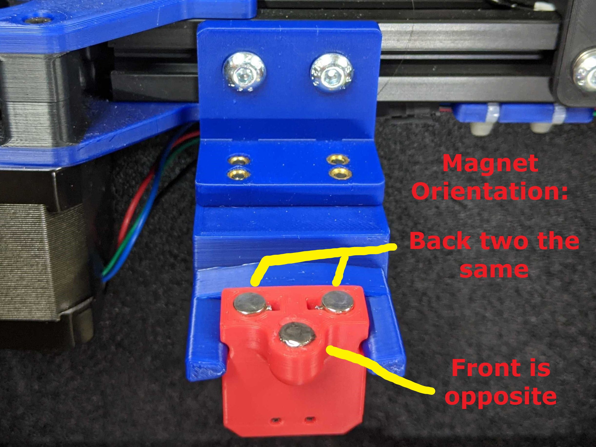
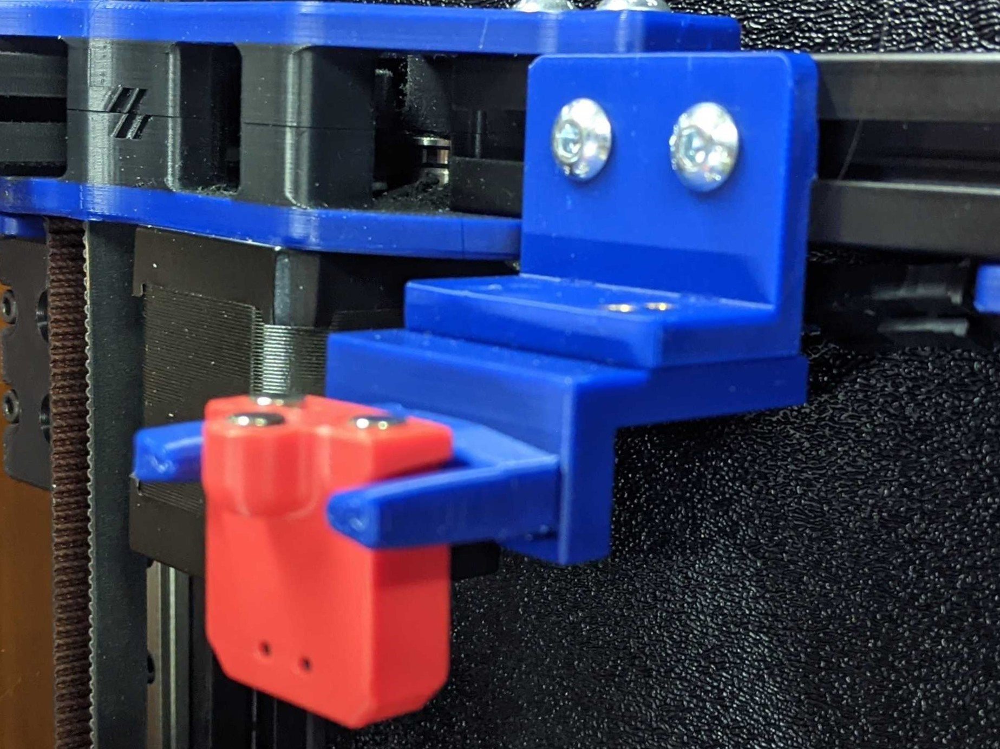
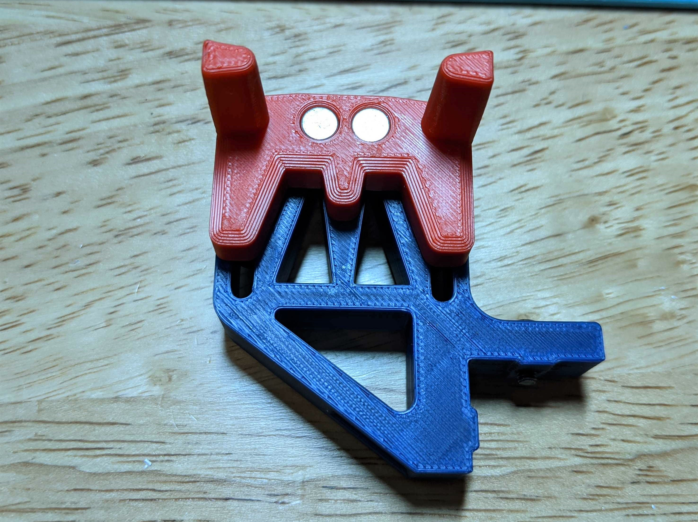
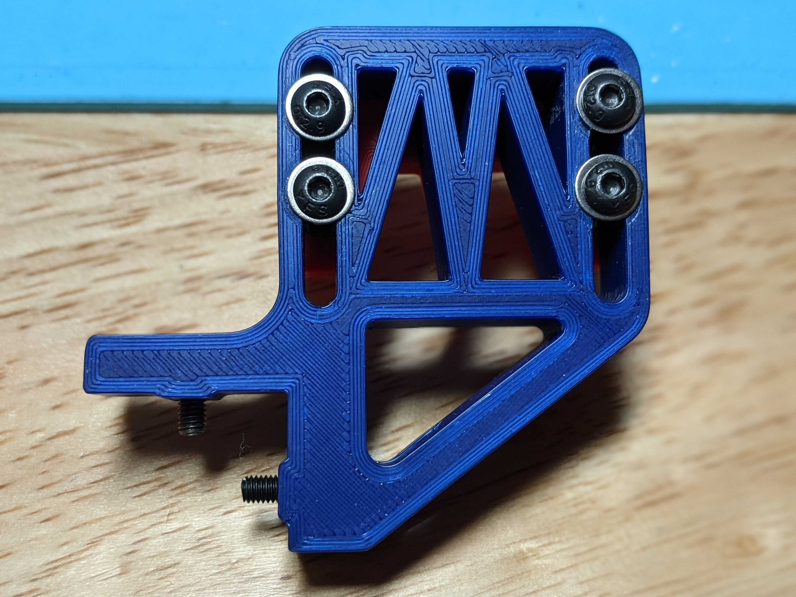
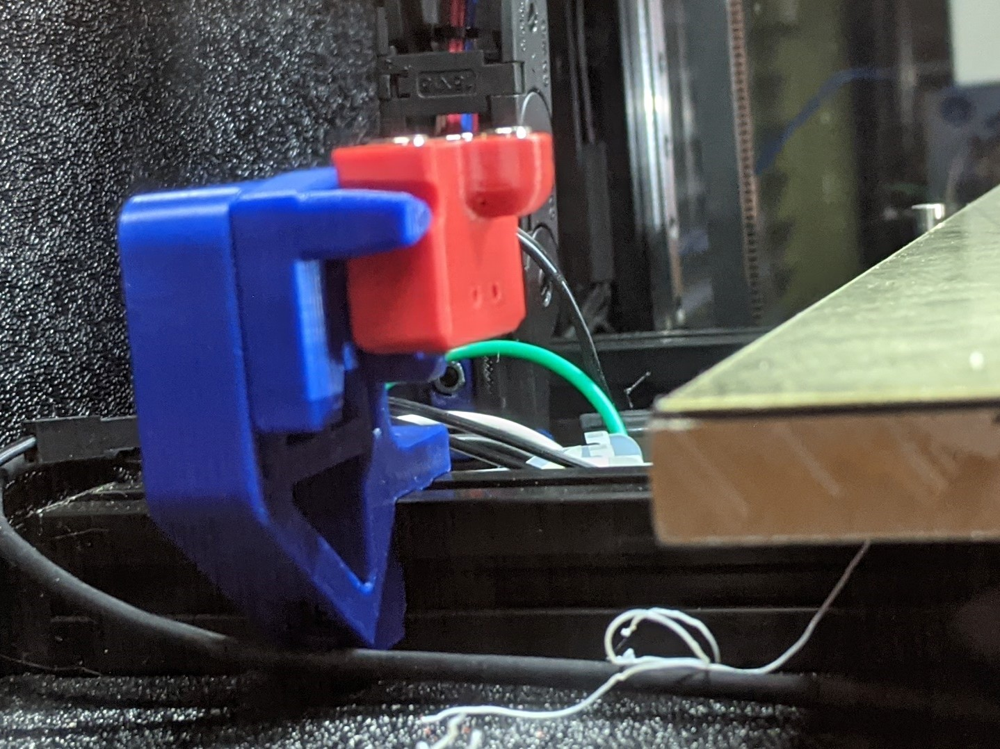

<table width=100%>
<TR>
<TD align="center"><B>Link</TD><TD align="center"><B>Description</TD></TR>
<TR><TD align="center"><a href="readme.md">Readme</A></TD><TD align="center">Mantis Description and Updates</TD></TR>
<TR><TD align="center"><a href="bom_acknowledgements.md">BOM and Acknowledgements</A></TD><TD align="center">BOM, links to other repositories, acknowledgements</TD></TR>
<TR><TD align="center"><a href="print_orientation.md">Print Orientation</A></TD><TD align="center">Printing the parts</TD></TR>
<TR><TD align="center"><a href="carriage_assembly.md">Carriage Assembly</A></TD><TD align="center">Building the MGN9, MGN12 Carriage, Hotend Mounts</TD></TR>
<TR><TD align="center"><a href="magprobe.md">Magprobe Assembly</A></TD><TD align="center">Assembly of Mag Probe</TD></TR>
<TR><TD align="center"><a href="firmware_slicer_settings.md">Firmware and Slicer Settings</A></TD><TD align="center">Firmware and Slicer Settings</TD></TR>
<TR><TD align="center"><a href="1.8_trident.md">Voron 1.8 and Trident</A></TD><TD align="center">Notes on Voron 1.8 and Trident</TD></TR>
<TR><TD align="center"><a href="final_assembly.md">Final Assembly</A></TD><TD align="center">Notes and Pictures of final assembly</TD></TR>
<TR><TD align="center"><a href="https://github.com/mandryd/MantisUsermods/tree/main/Usermods">Usermods</A></TD><TD align="center">Mods by Mantis Users (note: separate repository)</TD></TR>
<TR><TD align="center"><a href="https://github.com/mandryd/VoronUsers/tree/master/printer_mods/Long/Mantis_Dual_5015">Long's Mantis Repository</A></TD><TD align="center">Long's Repository for Mantis.  Updates and newest stuff will be found here</TD></TR>
</table>

Mag Probe 
============
- Magprobe Assembly
  - Solder a short length of flexible wire to two m6x3 magnets then press the magnets into the holes.
  - When pressing in the magnets, I used a clamp and a flat surface to try to get the magnets flat.
  - Screw in two of the m2x10 or m2x12 self-tapping screws (silver ones on the red pictured magprobe below) prior to soldering the microswitch in. Take care not to damage the wires.
  - Solder the other ends of the wires to the outer prongs (NC) of the microswitch. Note the image with the black magprobe is an older version.
  - 
  - Press in the microswitch now and screw in two more m2x10 or m2x12 to secure the microswitch. If there is any play in the microswitch, use some superglue to remove the play.
  - Test fit the magprobe to the carriage and adjust the level of the probe using the m3x6 button head on the bottom of the carriage.
  - Insert magnets into dock arms and secure to bed extrusion or gantry extrusion.
  - You don’t have to remove your bat85 diode when wiring in the wires to the magnets on the carriage, just omit the 24v.
- Dock Assembly
  - Gantry Mounted
    - This is generally the most popular version of the mount.  It is easy to set up and you don't have to worry about your z-offset when attaching and docking the probe.  
    - Note that the red magprobe in the gantry dock photos is the longer variant for rapido and crazy volcano.

    - 

    - Print the dock mount, extrusion mount, and either of the dock arms. 
      - Depending on your machine and the m2 screws you used on your mag probe, you may need the double magnet version of the dock arms.  I am using the single magnet version and I havent had the magprobe fall out during printing yet.  However some poeple have needed the double version.  I would say start with the single magnet version then swap to the double if necessary.
    - Height
      - This is straightforward. Adjust the height so the probe lines up with the arms.
    - Forward Reach 
      - I have my dock adjusted so that the magprobe, when docked, is actually a few mm further back (+y) than where the magnets of the carriage can reach.  
        - For example.  If the carriage magnets are at y305.  Then the mag probe magnets, when in the dock, can be at around y308 (out of the actual moveable range of the printer)
      - When picking up the probe, the mag probe will snap forward to the carriage magnets.  
      - When dropping off the probe, as the toolhead moves to the side, the mag probe will snap back to the dock.  
      - This allows you to have the magprobe just a few more mm out of your printing area.  

  - Bed Mounted
    - Bed mounted dock also works well.  Just a matter of personal preference.

- Magprobe Config
  - This seems pretty daunting to do…but it's not as bad as you think.  Check out the klicky or annex macros linked below.  
  - I highly recommend you print extra dock arms while you are figuring this out—especially if you are doing bed extrusion mounted.
  - Don’t forget to home y before x in homing_override.
  - For smart macros
    - Annex repo for their magprobe at  https://github.com/Annex-Engineering/Annex-Engineering_Other_Printer_Mods/tree/master/All_Printers/Microswitch_Probe
    - Klicky probe repo at https://github.com/jlas1/Klicky-Probe

