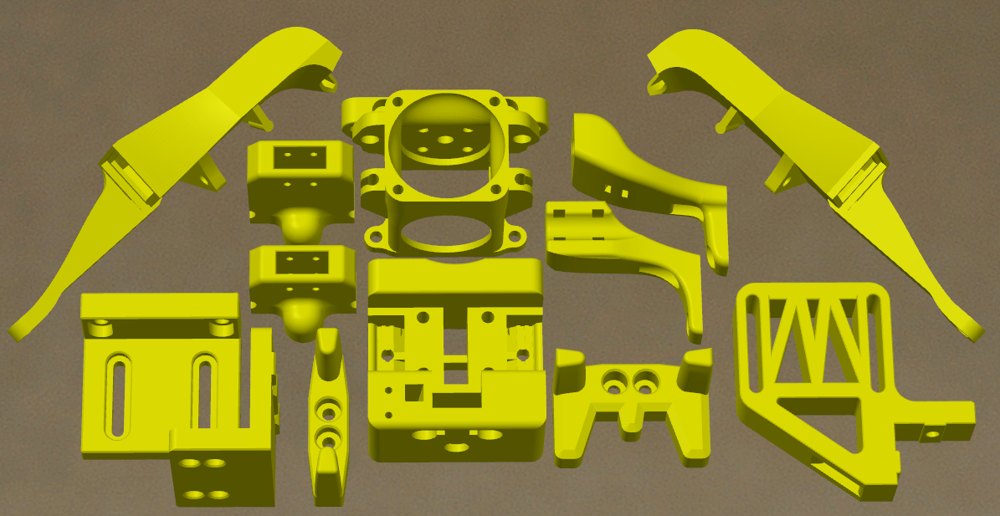
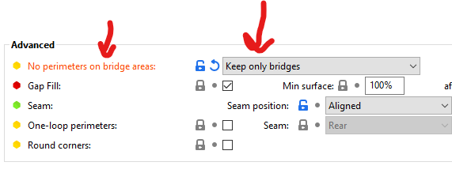
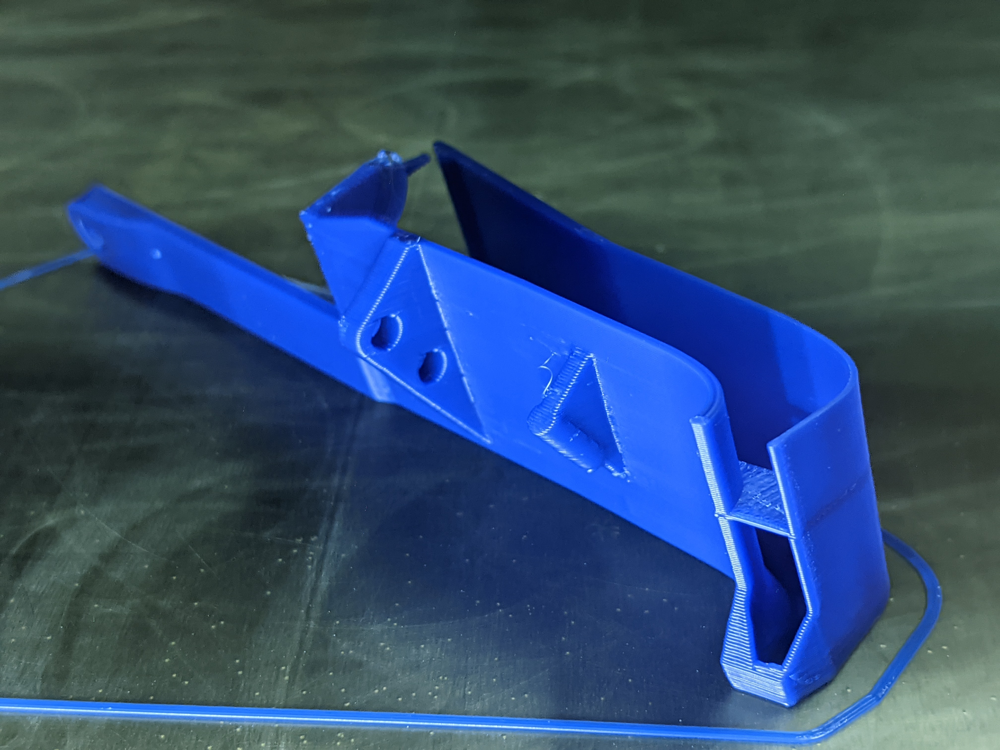
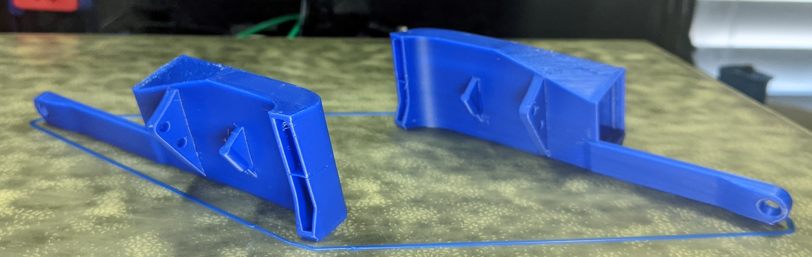

<table width=100%>
<TR>
<TD align="center"><B>Link</TD><TD align="center"><B>Description</TD></TR>
<TR><TD align="center"><a href="readme.md">Readme</A></TD><TD align="center">Mantis Description and Updates</TD></TR>
<TR><TD align="center"><a href="bom_acknowledgements.md">BOM and Acknowledgements</A></TD><TD align="center">BOM, links to other repositories, acknowledgements</TD></TR>
<TR><TD align="center"><a href="print_orientation.md">Print Orientation</A></TD><TD align="center">Printing the parts</TD></TR>
<TR><TD align="center"><a href="carriage_assembly.md">Carriage Assembly</A></TD><TD align="center">Building the MGN9, MGN12 Carriage, Hotend Mounts</TD></TR>
<TR><TD align="center"><a href="magprobe.md">Magprobe Assembly</A></TD><TD align="center">Assembly of Mag Probe</TD></TR>
<TR><TD align="center"><a href="firmware_slicer_settings.md">Firmware and Slicer Settings</A></TD><TD align="center">Firmware and Slicer Settings</TD></TR>
<TR><TD align="center"><a href="1.8_trident.md">Voron 1.8 and Trident</A></TD><TD align="center">Notes on Voron 1.8 and Trident</TD></TR>
<TR><TD align="center"><a href="final_assembly.md">Final Assembly</A></TD><TD align="center">Notes and Pictures of final assembly</TD></TR>
<TR><TD align="center"><a href="https://github.com/mandryd/MantisUsermods/tree/main/Usermods">Usermods</A></TD><TD align="center">Mods by Mantis Users (note: separate repository)</TD></TR>
<TR><TD align="center"><a href="https://github.com/mandryd/VoronUsers/tree/master/printer_mods/Long/Mantis_Dual_5015">Long's Mantis Repository</A></TD><TD align="center">Long's Repository for Mantis.  Updates and newest stuff will be found here</TD></TR>
</table>

Print Orientation
============

Slicer Tips:
- Perimeters/Shells
  - 3-4 Perimeters and low infill is adequate.
  - Josh Murrah is using 3perim/40% on his toolhead used in speedruns.
  - I’ve been using 4 perimeters/15%
- Ducts
  - Check that this outlet divider is sliced in a sane way.
  - In superslicer, I find the “keep only bridges” option under "Perimeters & Shell” works well for the ducts
  - 
  - The ducts have some tough overhangs, so orient the part so the over hangs print the best for you. Prioritize good quality for the outlet. The 5015 mount surface will generally be rough, but that’s ok.

