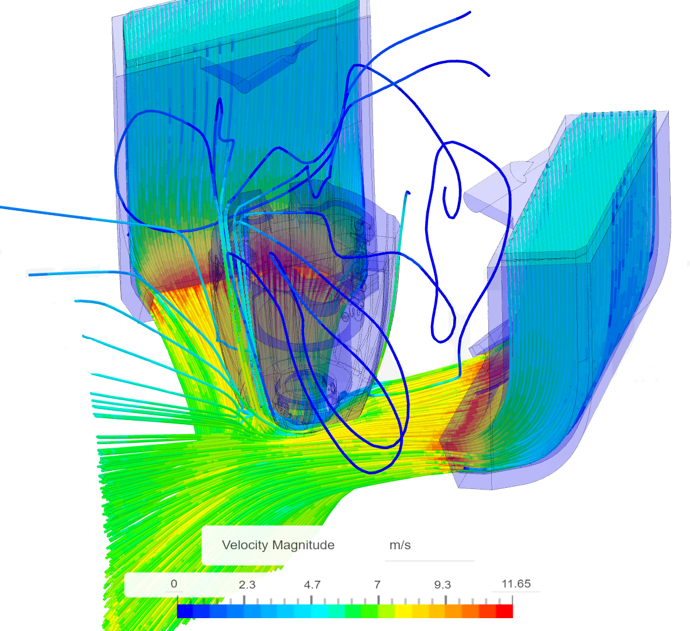

Mantis Dual 5015 Toolhead by Long
============
    
**Note: updates are staged at [https://github.com/mandryd/VoronUsers/tree/master/printer_mods/Long/Mantis_Dual_5015](https://github.com/mandryd/VoronUsers/tree/master/printer_mods/Long/Mantis_Dual_5015).  Go there for most recent stuff.**

|  Link  | Description |
|--|--|
| [Readme](readme.md)  |  Mantis Description and Updates |
|  [Print Orientation](print_orientation.md)  |  Printing the parts  |
|  [BOM and Acknowledgements](bom_acknowledgements.md)  |  BOM, links to other repositories, acknowledgements  |
| [Carriage Assembly](carriage_assembly.md) | Building the MGN9, MGN12 Carriage, Hotend Mounts |
|  [Magprobe Assembly](magprobe.md)  |  Assembly of Mag Probe  |
|  [Firmware and Slicer Settings](firmware_slicer_settings.md)  |  Firmware and Slicer Settings |
| [Voron 1.8 and Trident](1.8_trident.md)| Notes on Voron 1.8 and Trident|
|  [Final Assembly](final_assembly.md)| Notes and Pictures of final assembly
|  [Long's Mantis Repository](https://github.com/mandryd/VoronUsers/tree/master/printer_mods/Long/Mantis_Dual_5015) | Long's Repository for Mantis.  Updates and newest stuff will be found here  |
  
    
  
<TABLE>
<TR><TD Colspan=3 align="Center"><B>CFDs</B></TD></TR>
<TR><TD colspan=3 align="center" width=100%>Mantis ducts are optimized for the hotend they are paired with.   Depending on the geometry of the heatblock/sock around the nozzle, it is easier or harder to cool the nozzle.  If the width of the hotend around the nozzle is narrow, the ducts can be opened up and a higher max part cooling flow can be achieved.  </TD></TR>
<TR>
    <TD width=33% align="center" valign="top"></TD>
    <TD width=33% align="center" valign="top"> </TD>
    <TD width=33% align="center" valign="top"></TD>
</TR>
<TR>
    <TD width=33% align="center" valign="top"><B>Dragon</B> Lower part cooling than rapido/crazy volcano ducts due to the wide nature of the v6 block.  Still way more than a single 5015 duct that has been split, and more cooling than most people will ever need.</TD>
    <TD width=33% align="center" valign="top"><B>Crazy Volcano Block/Dragon Heatsink</B> This duct has highest amount of airflow due to the narrow shape of the heatblock.  This pairs well with the high flow (~45-50 mm^3/s plastic) nature of this setup. </TD>
    <TD width=33% align="center" valign="top"><B>Rapido HF</B> This duct has slightly less flow than the Crazy Volcano version, but more than dragon block.</TD>
</TR>
</TABLE>
  
   

**Features:**
* Now compatible with single MGN9 and MGN12 X-Rail.  
 * Hotends
   * Dragon
   * Mosquito (from usermod by WingZero)
   * Crazy Volcano block with Dragon heatsink
   * Rapido HF/UHF compatibility soon.
 * Dual 5015
    - Left to Right airflow balance is no longer an issue
    - Single piece ducts without splitting and fewer bends = less duct losses
    - Way more airflow than a single 5015.  
    - Minimum layer time can be much lower.  I'm using 5 seconds conservatively on 0.2 layer height.
* Lighter
    - Mantis tool head weighs ~290g including the carriage
    - Spec AB is ~470g.  Spec AB with gailieo is ~375g.  Stealthburner beta is ~410g.
    - Using single MGN9 removes an additional ~140g from the Y axis on a 300.  
 * Stiffer
    - Single piece carriage and hotend mounts stiff and light.
 * Detachable Bed Probe (magprobe)
    - Decreases weight, allows shrinkage of the carriage, and movement of weight closer to the extrusion.
    - Direct probing of the bed surface.  Allows usage of any bed surface. 
 * Weight moved closer to the rail for less lever.
    - Hotend is moved closer the rail +y, and upwards +z
    - Fans are rotated so the mass is further back.  
 * Decreased length from extruder to hotend
    - Bowden from mini-sherpa to Dragon is only 19mm
 * X-endstop relocated to carriage.  Easy to transition to umbilical if desired.
    - X-endstop must be relocated because the Mantis carriage is smaller and does not hang down far enough to trigger the endstop pod.
    - Y-endstop can still be from the spec endstop pod on the right xy-joint, however **I highly recommend relocating the y-endstop to the right a/b drive.**  
      - Normal 2.4 version - [https://github.com/hartk1213/MISC/tree/main/Voron%20Mods/Voron%202/2.4/Voron2.4_Y_Endstop_Relocation](https://github.com/hartk1213/MISC/tree/main/Voron%20Mods/Voron%202/2.4/Voron2.4_Y_Endstop_Relocation)
      - [Pin mod](https://github.com/hartk1213/MISC/tree/main/Voron%20Mods/Voron%202/2.4/Voron2.4_Pins_Mod) 2.4 version - [https://github.com/hartk1213/MISC/tree/main/Voron%20Mods/Voron%202/2.4/Voron2.4_Pins_Mod/STLs/Gantry/AB_Drive_Units](https://github.com/hartk1213/MISC/tree/main/Voron%20Mods/Voron%202/2.4/Voron2.4_Pins_Mod/STLs/Gantry/AB_Drive_Units)
    - Ditching the cable chain would save around 150g on the x-axis for a Voron 300.  
 * Area around heat block is very open.  Ducts give wide berth to block to decrease melting issues.
    
 **Cons:**
 * With spec front idlers, you will lose space at the front corners of the bed ~10mm in X at each idler.  
 * There are now alternative idlers that allow use of Mantis with minimal to no loss of build area
    - Rama - https://github.com/Ramalama2/Voron-2-Mods/tree/main/Front_Idlers 
    - Phalanx - https://github.com/selliott79/Other-V2-Idlers 
 * Some parts like the ducts and hotend mount are a bit tricky to print.
 * Thumb screw for the mini-sherpa will not fit.  Use a buttonhead to save space.
    - Standard 12mm spring should work with the button head.  
    - I used 6mm diameter x 0.9mm coil diameter x 10mm length springs for extra clearance, but this is unnecessary.
    - (Replaces stock 6mm x 1mm x 12mm spring) 

Changes
-----------------
1/10/2022
- Added Mods by [Usermods by TheWarolf](usermods/TheWarolf/)
  - ERCF Hotend mount which incorporates a filament sensor
  - Modified MGN12 carriage which fits the sailfin extruder
  - Umbilical mount which mates with the popular cable gland people have been using for umbilicals.
        
12-20-2021
- Added CAD files for Mantis with Crazy Volcano and Rapido (note that rapido is still in development)
    
12-19-2021
- Hotend_Mount_Dragon_v1.040
  - noticed a slight interference between the hotend mount and the ducts.  Adjusted so no more interference.  This should only affect you if you're using crazy volcano.
- Rapdio UHF ducts
  - Added ducts that are 8.5mm longer than the Rapido HF ducts to support the UHF.
  - **Don't forget to also make the longer Rapido UHF magprobe**
    
12-18-2021
- Updated readme so it is now in markdown.  No more readme.pdf!
- Added ducts for Rapido HF v0.02 under 2.4.  
  - You will also need to the rapido hotend mount.  **When installing the sock, the Phaetus logo should face directly forward.** The wires for the hotend should come out the right.
  - As with all my ducts, these have been optimized for the particular hotend that is being used.  As I have not yet received my Rapido, I can't confirm that these ducts/hotend mount works correctly yet.
- Rearranged files somewhat to accomodate a growing number of ducts

12-07-2021
- Rapido Hotend Compatibility
    -  The Rapido hotend is the same length as the Crazy Volcano/Dragon and should work using the Crazy Volcano ducts and magprobe.  I will be confirming part cooling CFDs and will make adjustments to make it fully compatible soon.  I have a Rapido on order so will be able to personally test this as well.  
    - The Rapido sock is very chonky.  For optimum part cooling, I will probably need to rotate the hotend slightly (slightly modified hotend mount part).  When mounted into the existing dragon heatsink holes, the triangular sock of the Rapido isn't square to the front of the carriage at the bottom (will need to confirm this when I receive mine).  
    - I'm considering making two sets of ducts for Rapido
      - One where the airflow clears the Rapido Sock
      - Second set of ducts where the sock is trimmed slightly at the bottom to allow for slightly bigger duct outlets and slightly better part cooling.  Trimming the sock will allow a better angle of attack for part cooling to the nozzle.
      - Note that both of these part cooling ducts will outperform the standard Mantis ducts because the Rapido is narrower at the bottom than the Dragon.  

11-29-2021
- Added WingZero's [Mosquito Hotend Mount](Usermods/Wingzero) for Mantis using 2510 hotend fan.  Thanks for a lot of work and testing for this mod!
- Added my mod of WingZero's mosquito mount which uses a 3010 fan instead of the 2510.  This mount is still alpha and needs more testing for confirmation.
- Crazy Volcano is now compatible
  - Added beta part cooling ducts and mag probe that should work with dragon/[crazy volcano block](https://www.aliexpress.com/item/1005003506351141.html).  
  - Note, to use the crazy volcano with dragon heatsink, the only different files you will need are the crazy volcano ducts (located in the 2.4 folder), and the longer magprobe (in the magprobe directory).
  - The part cooling ducts require cutting the rear fan ears off of your 5015s.  If you dont want to cut the ears off your ducts, I will post higher mounting 5015 ducts soon, or message me directly.  

11-3-2021
- Updated MGN12 carriage (Carriage_MGN12_v1.040.stl).  Updated the wire path from the magnets and x-endstop switch so they don't go through the hotend exhaust path.  Also improved the hotend exhaust path so it should flow a bit better.
- Added a usermods folder.  Adding the mods in and crediting the creator in the filename was getting unwieldy, so Mantis now has a usermods folder.
- Added a mount for Hartk PCB Board by Charles

10-11-2021
- Added Mantis Toolhead PCB by Henrikssn.  
- Added Mgn9 Klicky Carriage by Henrikssn.  This is a modded single mgn9 carriage that works with Josar's Klicky magprobe
- Added Flat Flexible Cable (FFC) mod by Be Water.  Allows use of the [FFC Kit by Schmidt Proto](https://www.schmidtproto.com/product-page/voron-2-4-ffc-mod-kit) with Mantis

9-23-2021
- Added carriage for Mantis that uses a single MGN9 linear rail.  I am currently using this with a RobotDigg 440 SUS rail and it's working well.  Thanks to Bob Arctor and Henrikssn for their bravery in testing the early versions of this.
- Updated ([Readme_v1.07.pdf](Readme_v1.07.pdf)).  Added info for the MGN9 Carriage, fixed some wording, added link to Rama's option for narrow front idlers.
- Added ducts for Voron 2.4 that are 1.5mm shorter.  Decreases the clearance from 3.5 to 2mm.  No real advantage except if you like the shorter duct arm appearance.
  
7-18-2021
- Now compatible with Voron 1.8!
- updated readme
- changed directory structure for clarity
- magprobe dock arms v1.5 - new version of dock arms (for bed and gantry mount) which are tighter and longer (thanks to ShinyPants for lots of testing with these)
- carriage_v1.037 - minor revision adds a hole on the left side for ADXL mounting (thanks koonweee)
- chain_anchor_v3.2 - moved the front ziptie location higher.  added a rear ziptie location. (thanks koonweee)
- mantis_v1.037a.step updated - includes the above changes
