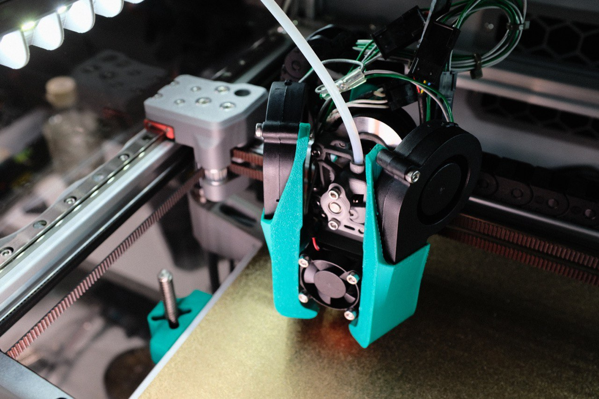

|  Link  | Description |
|--|--|
| [Readme](readme.md)  |  Mantis Description and Updates |
|  [Print Orientation](print_orientation.md)  |  Printing the parts  |
|  [BOM and Acknowledgements](bom_acknowledgements.md)  |  BOM, links to other repositories, acknowledgements  |
| [Carriage Assembly](carriage_assembly.md) | Building the MGN9, MGN12 Carriage, Hotend Mounts |
|  [Magprobe Assembly](magprobe.md)  |  Assembly of Mag Probe  |
|  [Firmware and Slicer Settings](firmware_slicer_settings.md)  |  Firmware and Slicer Settings |
| [Voron 1.8 and Trident](1.8_trident.md)| Notes on Voron 1.8 and Trident|
|  [Final Assembly](final_assembly.md)| Notes and Pictures of final assembly
|  [Long's Mantis Repository](https://github.com/mandryd/VoronUsers/tree/master/printer_mods/Long/Mantis_Dual_5015) | Long's Repository for Mantis.  Updates and newest stuff will be found here  |

1.8 and Trident
============
**Notes for building on a Voron 1.8**
- You will need to cut the rearward “ears” off the 5015 fans for clearance.
  - OscarGM was able to get the standard length ducts (found in the 2.4 folder) to clear. It looked tight, but it did clear.
  - The ducts in the 1.8 folder have 2mm extra clearance, and should clear with most fans.
  - The reason 1.8 needs the ears cut is because the duct start to look ridiculously long due to the inverted nature of the 1.8 gantry.
- Acknowledgements:
  - Just wanted to thank GarretWP, OscarGM, and Koonweee for being the brave souls
 
|    |    |
| :--: | :--: |
|Koonweee’s Voron 1.8 using 2mm extended ducts| OscarGM’s Voron 1.8 with 2.4 ducts| 
  
**Notes for building on a Voron Trident**
- Theoretically, the Mantis using 2.4 ducts should be compatible with Trident.  However, I'm not sure if it's been tested yet.  
