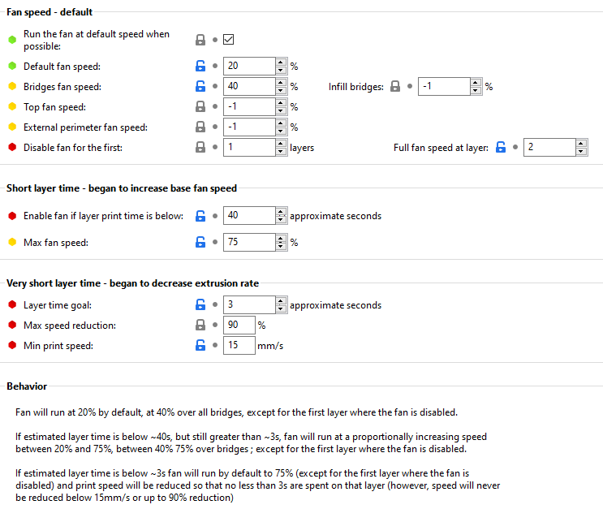

|  Link  | Description |
|--|--|
| [Readme](readme.md)  |  Mantis Description and Updates |
|  [Print Orientation](print_orientation.md)  |  Printing the parts  |
|  [BOM and Acknowledgements](bom_acknowledgements.md)  |  BOM, links to other repositories, acknowledgements  |
| [Carriage Assembly](carriage_assembly.md) | Building the MGN9, MGN12 Carriage, Hotend Mounts |
|  [Magprobe Assembly](magprobe.md)  |  Assembly of Mag Probe  |
|  [Firmware and Slicer Settings](firmware_slicer_settings.md)  |  Firmware and Slicer Settings |
| [Voron 1.8 and Trident](1.8_trident.md)| Notes on Voron 1.8 and Trident|
|  [Final Assembly](final_assembly.md)| Notes and Pictures of final assembly
|  [Long's Mantis Repository](https://github.com/mandryd/VoronUsers/tree/master/printer_mods/Long/Mantis_Dual_5015) | Long's Repository for Mantis.  Updates and newest stuff will be found here  |

Firmware Settings
============
- PWM
  - With my Sunon 5015s I have been able to pwm down to 7% using these settings

       ```
       kick_start_time: 0.5
       off_below: 0.05
       cycle_time: 0.008
       ```
       
- Skip First Probe
  - The first probing during QGL/Bed Mesh at each position is generally off and then settles for the following probes.  Many people do multiple probes then take the median value.  Another option is to use "ignore first probe" by CTSO.  
  - https://github.com/ctso/klipper/commit/75beccd22a70b49b50ae20391b5c0054113eb7b7 
 
 - [probe] settings

       [probe]
       # Mag Probe
       x_offset: -1.95 #This will be +1 or -1 depending on which way the nub on your  magprobe microswitch is oriented.
       y_offset: 32.95
       z_offset: 2.4
       speed: 5
       samples: 3
       sample_retract_dist: 1.5
       samples_tolerance: 0.006
       samples_tolerance_retries: 5
       drop_first_result: true #only used if you’re using the ignore first probe.
       
- Homing override to home y before x.
  - To avoid collision with the ducts with the front idlers.  This is less of an issue these days with narrow idlers released.
       
       [homing_override]
       axes: z
       set_position_z: 0
       gcode:
       G90
       G0 Z5 F600 # move up a little for clearance
       G28 Y
       G28 X
       G0 X200 Y305 F3600 # home on z pin at this location (update your own)
       G28 Z
       G0 Z10 F1800 # move up a little for clearance
       G0 X150 Y150 Z30 F3600 # Go to middle of bed

Slicer settings
============
- This is currently what I’ve been using for ABS as far as cooling with my Sunon 5015s. Not sure where I’ll end up here, but it’s a starting point.
- I increase default fan speed to 20% if the part has a lot of overhangs
- Don’t be afraid to pump the fan up with ABS, especially for overhangs and short layer times. 
  - The higher fan percent will increase your chamber temps and offset the higher fan usage. 
  - I often see 55c+ chamber temps in my uninsulated Voron 300. 
  - If I’m printing a single ABS part with short layer times I’ll often use 50%+ fan for the whole part. I haven’t had issues with layer splitting when I do this.  


