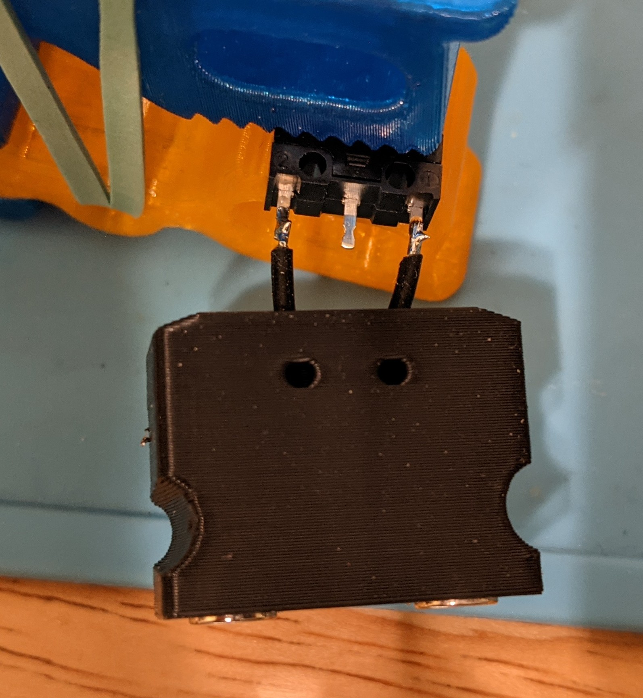
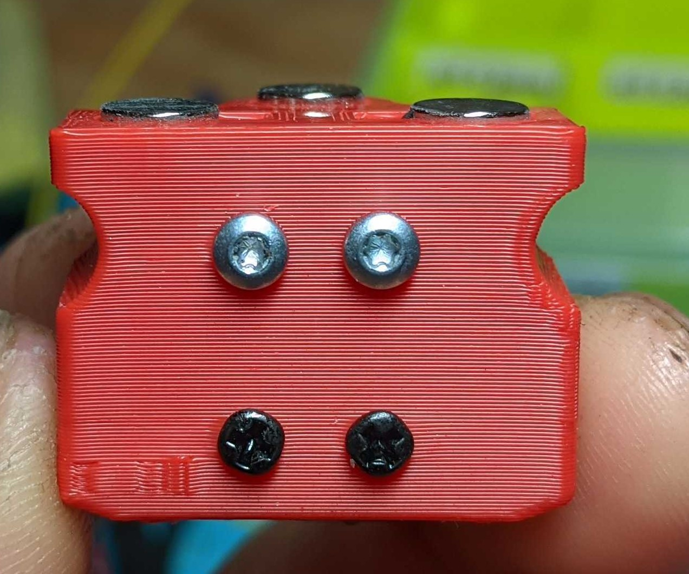
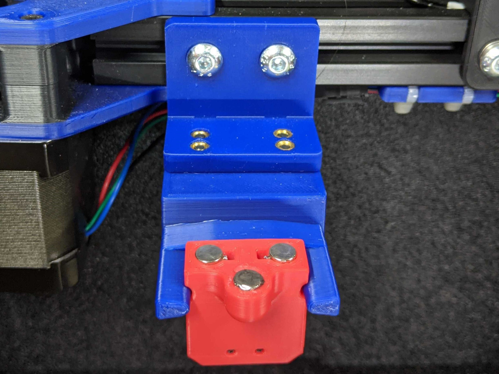
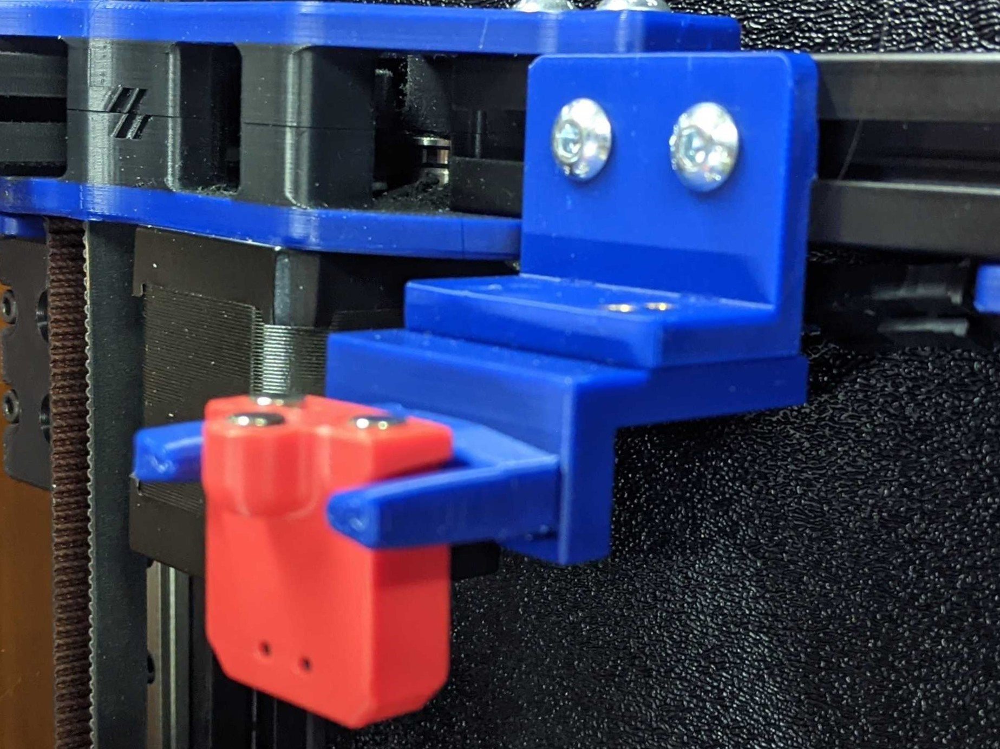
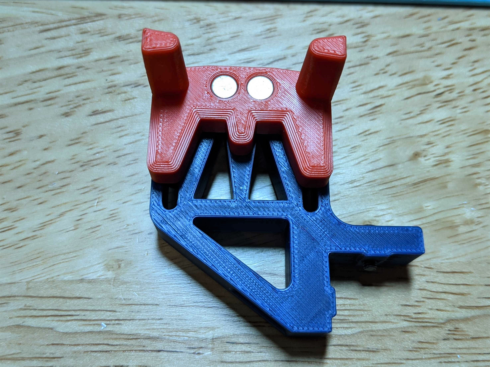
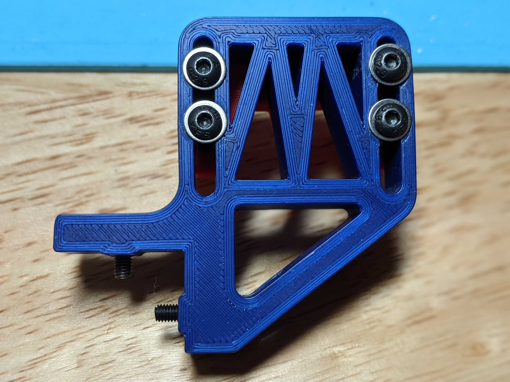
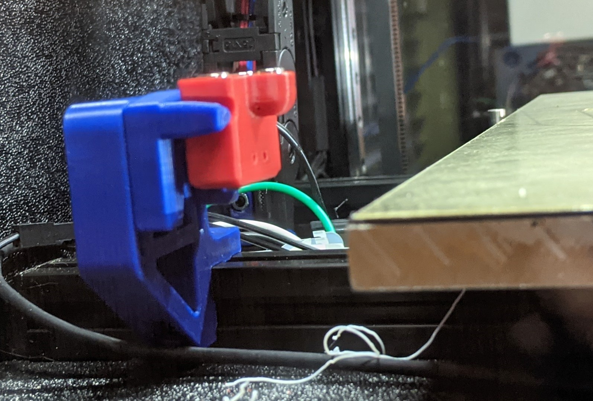
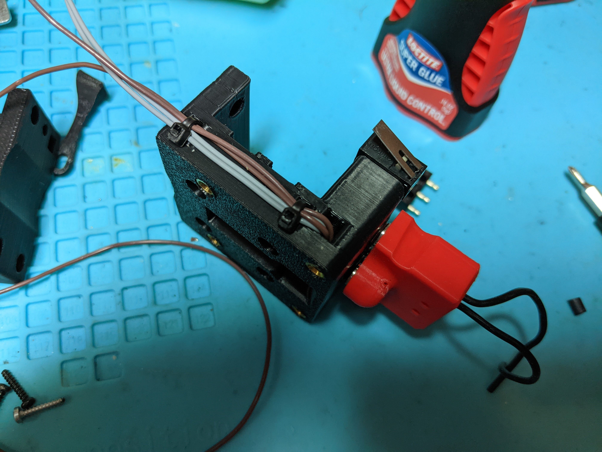

|  Link  | Description |
|--|--|
| [Readme](readme.md)  |  Mantis Description and Updates |
|  [Print Orientation](print_orientation.md)  |  Printing the parts  |
|  [BOM and Acknowledgements](bom_acknowledgements.md)  |  BOM, links to other repositories, acknowledgements  |
| [Carriage Assembly](carriage_assembly.md) | Building the MGN9, MGN12 Carriage, Hotend Mounts |
|  [Magprobe Assembly](magprobe.md)  |  Assembly of Mag Probe  |
|  [Firmware and Slicer Settings](firmware_slicer_settings.md)  |  Firmware and Slicer Settings |
| [Voron 1.8 and Trident](1.8_trident.md)| Notes on Voron 1.8 and Trident|
|  [Final Assembly](final_assembly.md)| Notes and Pictures of final assembly
|  [Long's Mantis Repository](https://github.com/mandryd/VoronUsers/tree/master/printer_mods/Long/Mantis_Dual_5015) | Long's Repository for Mantis.  Updates and newest stuff will be found here  |

Mag Probe 
============
- Assembly
  - Solder a short length of flexible wire to two m6x3 magnets then press the magnets into the holes.
  - When pressing in the magnets, I used a clamp and a flat surface to try to get the magnets flat.
  - Screw in two of the m2x10 or m2x12 self-tapping screws (silver ones on the red pictured magprobe below) prior to soldering the microswitch in. Take care not to damage the wires.
  - Solder the other ends of the wires to the outer prongs (NC) of the microswitch. Note the image with the black magprobe is an older version.

  - Press in the microswitch now and screw in two more m2x10 or m2x12 to secure the microswitch. If there is any play in the microswitch, use some superglue to remove the play.
  - Test fit the magprobe to the carriage and adjust the level of the probe using the m3x6 button head on the bottom of the carriage.
  - Insert magnets into dock arms and secure to bed extrusion or gantry extrusion.
  - You don’t have to remove your bat85 diode when wiring in the wires to the magnets on the carriage, just omit the 24v.
- Dock Type
  - Gantry Mounted
    - This is generally the most popular version of the mount.  It is easy to set up and you don't have to worry about your z-offset when attaching and docking the probe.  
    - Note that the red magprobe in these photos is the longer variant for rapido and crazy volcano.

  - Bed Mounted
    - Bed mounted dock also works well.  Just a matter of personal preference.

- Magprobe Config
  - This seems pretty daunting to do…but it's not as bad as you think.  Check out the klicky or annex macros linked below.  
  - I highly recommend you print extra dock arms while you are figuring this out—especially if you are doing bed extrusion mounted.
  - Don’t forget to home y before x in homing_override.
  - For smart macros
    - Annex repo for their magprobe at  https://github.com/Annex-Engineering/Annex-Engineering_Other_Printer_Mods/tree/master/All_Printers/Microswitch_Probe
    - Klicky probe repo at https://github.com/jlas1/Klicky-Probe

