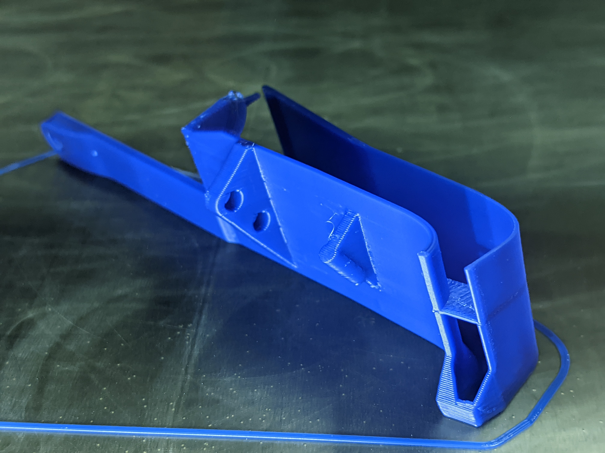
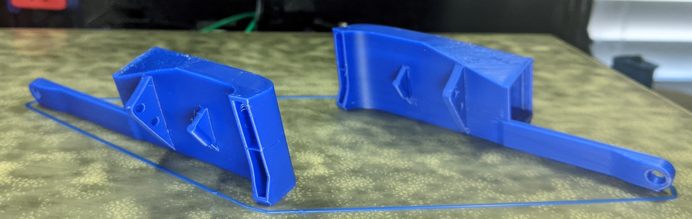

Print Orientation
============

Slicer Tips:
- Perimeters/Shells
  - 3-4 Perimeters and low infill is adequate.
  - Josh Murrah is using 3perim/40% on his toolhead used in speedruns.
  - I’ve been using 4 perimeters/15%
- Ducts
  - Check that this outlet divider is sliced in a sane way.
  - In superslicer, I find the “keep only bridges” option under "Perimeters & Shell” works well for the ducts

  - The ducts have some tough overhangs, so orient the part so the over hangs print the best for you. Prioritize good quality for the outlet. The 5015 mount surface will generally be rough, but that’s ok.

