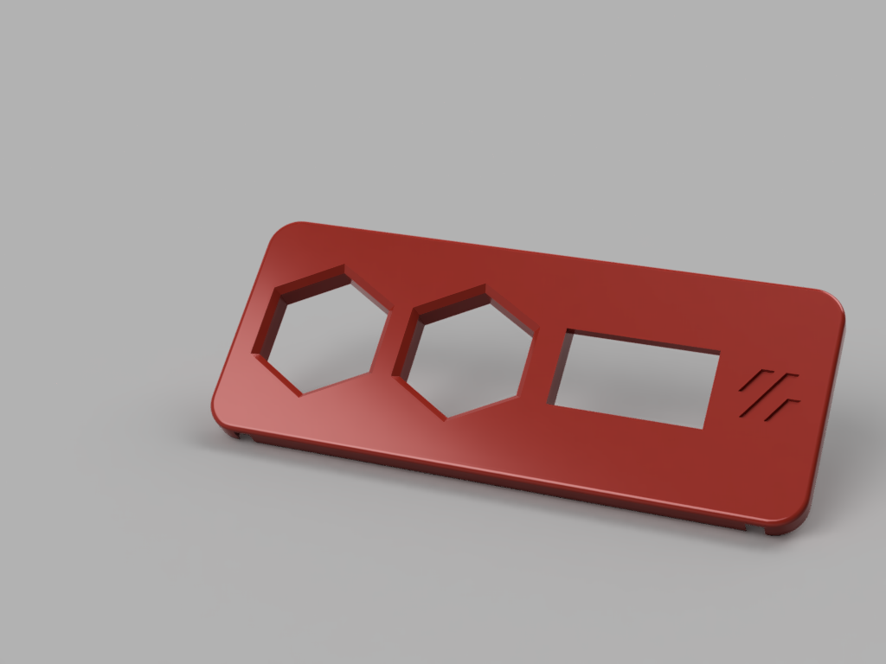

## SSD1306 Case Front Cover by Lukas#2722

This is a front cover replacement that uses a SSD1306 Display.

The holes are the same size in the skirt so you can mount the G-Code Buttons by meteyou https://github.com/VoronDesign/VoronUsers/tree/master/legacy_printers/printer_mods/meteyou/gcode_buttons

Notes:  
I didn't edit the backplate of the original design. I just used some side cutters and cut it out by hand.  
It mounts the same way as the original using heatset inserts.  

It also does not have the same shape as the original (there is no curve on the front face) that is just due to my lack in modelling experience.

